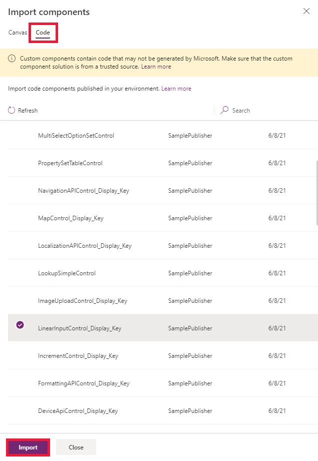
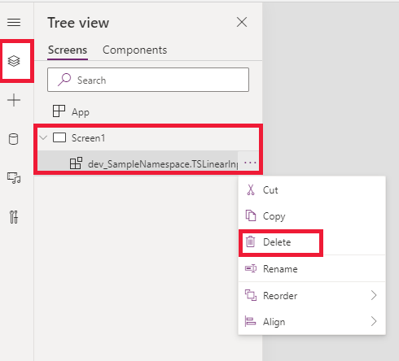

# Code components for canvas apps

Power Apps component framework enables app makers to create code components that can be used in their canvas apps. More information: [Power Apps component framework overview](overview.md) 

Power Apps component framework enables professional developers to create, import, and add code components to canvas applications using the Power Apps CLI.  Please be aware, certain control APIs may not be available in canvas Apps. We recommend you check each API to determine where it is available.  

## Security considerations

> [!WARNING]
> Code components contain code that may not be generated by Microsoft and can potentially access security tokens and data when rendered in Power Apps Studio. When adding code components to an app, make sure that the code component solutions are from a trusted source.  This vulnerability does not exist when playing the canvas application.  

When you open a canvas app in Studio that contains code components, a dialog shows a warning message about potentially unsafe code. Code components in the Power Apps Studio environment have access to security tokens and hence only components from the trusted sources should be opened. Administrators and system customizers should review and validate all code components before installing those components in an environment and making them available for makers to use in their applications.   

  

## Prerequisites

1. A Power Apps license is required. More information: [Power Apps component framework licensing](overview.md#licensing)
2. System Administrator privileges are required to enable the Power Apps component feature in the environment.

## Enable Power Apps component framework feature

To add code components to an app, you need to enable the Power Apps component framework feature in each environment where you want to use them. By default Power Apps component feature is enabled for model-driven apps. To enable an environment to use code components inside its apps:

1. Sign in to [Power Apps](https://powerapps.microsoft.com/).

2. Select the **Settings** icon and then select **Admin Center**.
    
    > [!div class="mx-imgBorder"]
    >  

3. Select the **Environments** tab in the left pane and select the environment where you want to enable this feature and then select **Settings**.

4. Under the **Products** tab, select **Features**.

   > [!div class="mx-imgBorder"]
   > 

5. From the list of available features, set the switch to **On** under **Power Apps component framework for canvas apps** and click **Save**.

6. Now, open the app where you want to add the code component and navigate to **File** > **Settings** and select **Advanced settings**.

   > [!div class="mx-imgBorder"]
   > 
   
7. Turn the **Components** switch to **On** under the **Experimental feature** section.

    > [!NOTE]
    > When creating new canvas apps, steps 6 & 7 is enabled by default.

## Implementing code components

After you enable the Power Apps component framework feature in your environment, you can start implementing the logic for code components.

 The [Create your first code component](implementing-controls-using-typescript.md) topic demonstrates the step-by-step process to create code components.

## Add components to a canvas app

To add code components to a canvas app:

1. Navigate to Power Apps Studio.
2. Create a new canvas app or edit an existing app to which you want to add the code component.

   > [!IMPORTANT]
   > Make sure the solution zip file containing code components is already [imported](../../maker/data-platform/import-update-export-solutions.md) into Microsoft Dataverse before you proceed to the next step.

3. In the left pane select **+** icon and then select **Get more components**. 
 
   > [!div class="mx-imgBorder"]
   > 

4. Select the **Code** tab, select a component from the list, and then select **Import**. 

    > [!div class="mx-imgBorder"]
    > 

5. Select the **+** icon on the left pane and expand the code components tab and select to add the sample component.

   > [!div class="mx-imgBorder"]
   > 

   > [!NOTE]
   > You can also add components by selecting **Insert** > **Custom** > **Import component**. This option will be removed in a future release, so we suggest using the flow described above.

6. In the **Properties** tab, you'll notice the code component properties displayed. 

   > [!div class="mx-imgBorder"]
   > 

   > [!NOTE]
   > Existing code components can be re-imported by updating the code component's manifest version if you want the properties to be available in the default **Properties** tab. Like in the past the properties will continue to be available in the advanced properties panel.

## Delete a code component 

To delete a code component from a canvas app:

1. Open the app where you have added the code component. 
1. Select the **Tree view** icon from the left pane and select the screen where you have added the code component. 
1. Select **ellipse (...)** next to the code component and select **Delete**.

   > [!div class="mx-imgBorder"]
   > 

1. Save the app to see the changes. 

## Update existing code components

Whenever you update the code components and want to see the runtime changes, you need to bump the `version` property in the manifest file. It is recommended to always bump  the version of the component whenever you make changes.

> [!NOTE]
> Existing code components are updated only when the app is closed or reopened in Power Apps Studio. When you reopen the app, it asks you to update the code components. Simply deleting the code components or adding the code component back into the app doesn't update the components.

## See also

[Power Apps component framework overview](overview.md) 
[Create your first code component](implementing-controls-using-typescript.md) 
[Learn Power Apps component framework](/learn/paths/use-power-apps-component-framework)

[!INCLUDE[footer-include](../../includes/footer-banner.md)]