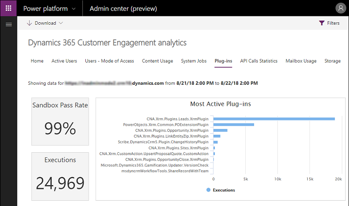

# Analyze plug-in performance

When you add business logic to your plug-in you should be aware of the impact your plug-ins will have on overall system performance.

## Time and resource constraints

There is a hard **2-minute time limit** for a Dataverse message operation to complete. This limit includes executing the intended message operation and all registered synchronous plug-ins. There are also limitations on the amount of CPU and memory resources that can be used by extensions. If the limits are exceeded an exception is thrown and the entire message operation will be cancelled (rolled back).

If the time limit is exceeded, an <xref:System.TimeoutException> will be thrown. If any custom extension exceeds threshold CPU, memory, or handle limits or is otherwise unresponsive, that process will be killed by the platform. At that point any current extension in that process will fail with exceptions. However, the next time that the extension is executed it will run normally.

> [!IMPORTANT]
> You cannot control how long the message operation or other synchronous registered plug-ins take to execute. You can only control how long your plug-in takes to execute based on its design and coding.
>
> Our general recommendation is to limit the time your plug-in takes to execute to no more than 2 seconds.
>
> If your plug-in requires more time to execute, consider registering your plug-in for asynchronous rather than synchronous execution. In fact, asynchronous execution should always be considered first when possible as it results in better application responsiveness and system scalability.

More information: [Best practices and guidance regarding plug-in and workflow development](best-practices/business-logic/)

## Monitor performance

Run-time information about plug-ins and custom workflow extensions is captured and stored in the [PluginTypeStatistic Table](reference/entities/plugintypestatistic.md). These records are populated within 30 minutes to one hour after the custom code executes. This table provides the following data points:

|**Column**|**Description**|
|--|--|
|AverageExecuteTimeInMilliseconds|The average execution time (in milliseconds) for the plug-in type. |
|CrashContributionPercent|The plug-in type percentage contribution to crashes. |
|CrashCount|Number of times the plug-in type has crashed. |
|CrashPercent|Percentage of crashes for the plug-in type. |
|ExecuteCount|Number of times the plug-in type has been executed. |
|FailureCount |Number of times the plug-in type has failed. |
|FailurePercent|Percentage of failures for the plug-in type. |
|PluginTypeIdName|Unique identifier of the user who last modified the plug-in type statistic. |
|TerminateCpuContributionPercent |The plug-in type percentage contribution to Worker process termination due to excessive CPU usage. |
|TerminateHandlesContributionPercent |The plug-in type percentage contribution to Worker process termination due to excessive handle usage. |
|TerminateMemoryContributionPercent|The plug-in type percentage contribution to Worker process termination due to excessive memory usage. |
|TerminateOtherContributionPercent|The plug-in type percentage contribution to Worker process termination due to unknown reasons. |

## Plug-in performance analytics

In addition to using a debugger and profiler to learn how your plug-in is performing at the code level, you can interactively obtain metrics as to the overall performance of your registered plug-ins in an organization through [Microsoft Dataverse analytics](/power-platform/admin/analytics-common-data-service).

Through the [Plug-in](/power-platform/admin/analytics-common-data-service#plug-ins) dashboard you can view metrics such as average execution time, failures, most active plug-ins, and more.

To access the dashboard, navigate to [Power Platform Admin Center](https://admin.powerplatform.microsoft.com/). Select **Analytics** > **Dataverse** > **Plug-ins**.

## See also

[Use plug-ins to extend business processes](plug-ins.md)  
[Tutorial: Debug a plug-in](tutorial-debug-plug-in.md)  
[Debug Plug-ins](debug-plug-in.md)

[!INCLUDE[footer-include](../../includes/footer-banner.md)]
