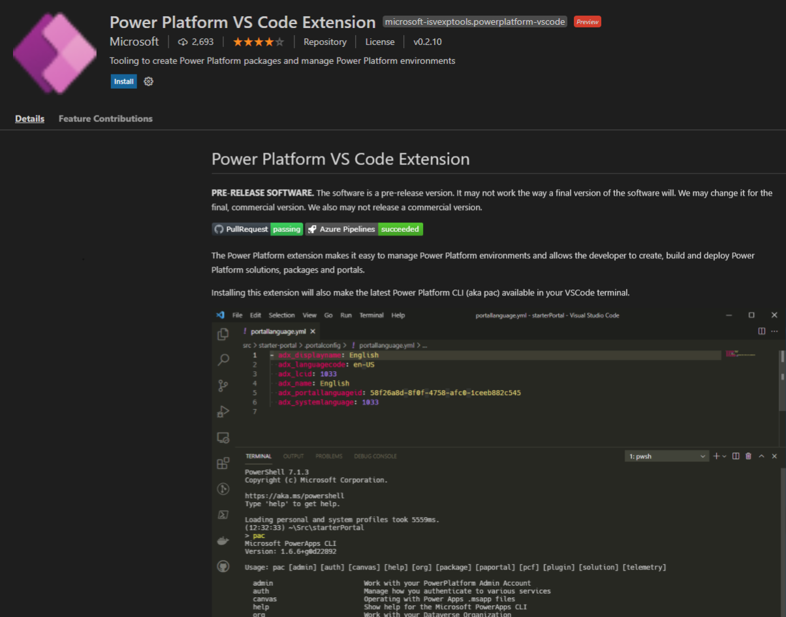

# What is Microsoft Power Platform CLI? 


> [!NOTE] 
> Effective June 2021, Microsoft Power Apps CLI is rebranded to Microsoft Power Platform CLI. More information: [Blog: Microsoft Power Platform is the best way for teams to build together](https://cloudblogs.microsoft.com/powerplatform/2021/05/25/microsoft-power-platform-is-the-best-way-for-teams-to-build-together/)<p/>Microsoft Power Platform CLI is now available for use in the GCC and GCC High (US Sovereign cloud) regions. Use the command `pac auth create` for help on the `--cloud` parameter to find out about supported US Sovereign cloud environments.

Microsoft Power Platform CLI is a simple, one-stop developer CLI that empowers developers and ISVs to perform various operations in Microsoft Power Platform related to environment lifecycle, authentication, and work with Microsoft Dataverse environments, solution packages, portals, code components, and so on.  

## Install Microsoft Power Platform CLI

You can use either of the following ways to install Microsoft Power Platform CLI.

### Using Power Platform VS Code Extension

Follow these steps to install Microsoft Power Platform CLI using Visual Studio Code:

1. Open [Visual Studio Code](https://code.visualstudio.com/).
1. Select **Extensions** icon from the **Activity** panel. In the search bar, enter **Power Platform**.
1. Select **Install**. Once the installation is finished, restart your Visual Studio Code to see the extension within the **Terminal** window.

   > [!div class="mx-imgBorder"]
   > 
   
> [!NOTE]
> Power Platform extension for Visual Studio Code updates automatically. 

1. You can also initiate the install into Visual Studio Code directly from [Marketplace]( https://aka.ms/ppcvscode) and it will launch Visual Studio Code and commence the extension installation.

### Standalone Power Platform CLI

To install standalone Power Platform CLI:

<!--1. Install [Npm](https://www.npmjs.com/get-npm) (comes with Node.js) or [Node.js](https://nodejs.org/en/) (comes with npm). We recommend LTS (Long Term Support) version 10.15.3 LTS because it seems to be the most stable.

1. Install [.NET Framework 4.6.2 Developer Pack](https://dotnet.microsoft.com/download/dotnet-framework/net462). 

1. If you don’t already have Visual Studio 2017 or later, follow one of these options:
   - Option 1: Install [Visual Studio 2017](/visualstudio/install/install-visual-studio?view=vs-2017) or later.
   - Option 2: Install [.NET Core 2.2 SDK](https://dotnet.microsoft.com/download/dotnet-core/2.2) and then install [Visual Studio Code](https://code.visualstudio.com/Download)-->
1. Download and install [Microsoft Power Platform CLI](https://aka.ms/PowerAppsCLI).

1. To take advantage of all the latest capabilities, update Microsoft Power Platform CLI tooling to the latest version by using this command (not applicable for Power Platform VS Code Extension):
    ```CLI
    pac install latest

    ```
> [!NOTE]
> - Currently, Microsoft Power Platform CLI is supported only on Windows 10 and Windows 11.
> - Power Platform Extension for VS Code is in public preview, and works on Windows 10, Windows 11, Linux, and MacOS.

## Common commands

This table lists some of the common commands used in the CLI.

|Command|Description|
|-------|-----------|
|[Admin](cli/reference/admin-command.md)|Commands for environment lifecycle features.|
|[Auth](cli/reference/auth-command.md)|Commands to [authenticate to Dataverse](../component-framework/import-custom-controls.md#connecting-to-your-environment).|
|[Canvas](cli/reference/canvas-command.md)|Commands for working with canvas app source files.|
|[Org](cli/reference/org-command.md)|Commands for working with Dataverse environments.|
|[Package](cli/reference/package-command.md)|Commands for working with [solution packages](/power-platform/alm/package-deployer-tool).|
|[Paportal](cli/reference/paportal-command.md)|Commands for working with [Power Apps portals (Preview)](../../maker/portals/power-apps-cli.md).|
|[PCF](cli/reference/pcf-command.md)|Commands for working with [Power Apps component framework](../component-framework/overview.md).|
|[Plugin](cli/reference/plugin-command.md)|Command to create a [plug-in](./plug-ins.md) project.|
|[Solution](cli/reference/solution-command.md)|Commands for working with [Dataverse solution projects](../../maker/data-platform/solutions-overview.md).|
|[Telemetry](cli/reference/telemetry-command.md)|Manages the telemetry settings.|

> [!TIP]
> For the complete list of supported commands, run the `pac` command or `pac` \<subcommand> - for example: `pac solution`.

## Uninstall Microsoft Power Platform CLI 

To uninstall Microsoft Power Platform CLI tooling, run the MSI from [here](/powerapps/developer/data-platform/powerapps-cli).

To uninstall the Visual Studio Code extension, follow the same steps as installing the extension, except this time select the uninstall button.

If you're a Private Preview participant and have an older version of CLI, follow these steps:

1. To find out where Microsoft Power Platform CLI is installed, open a command prompt and enter `where pac`.

1. Delete the PowerAppsCLI folder.

1. Open the Environment Variables tool by running the command `rundll32 sysdm.cpl,EditEnvironmentVariables` in the command prompt.

1. In the `User variable for...` section, double-click to select `Path` .

1. Select the row containing the PowerAppsCLI path, and then select **Delete** on the right side.

1. Select **OK** twice.


### See also

[Power Apps component framework](../component-framework/overview.md)


[!INCLUDE[footer-include](../../includes/footer-banner.md)]