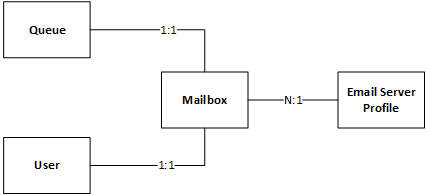

# Server-side synchronization tables

In Power Apps, server-side synchronization provides an interface between Microsoft Dataverse and one or more Exchange servers or POP3 servers for incoming email, and one or more SMTP or Exchange servers for outgoing email. It retrieves and evaluates emails for relevance to Dataverse and accordingly creates corresponding email activities in Dataverse. It also picks emails from Dataverse and sends them through the configured email server for users and queues. It also allows synchronization of appointments, contacts, and tasks with  Exchange Server 2010 and Exchange Server 2013.  
  
 With the centralized email configuration, the Dataverse table model allows having common user interface (UI) settings (like user name, password, email address, and synchronization methods) for users, queues, and forward mailboxes. Each user or a queue can have mailboxes, which can be monitored through either server-side synchronization or Microsoft Dynamics 365 for Outlook. The [EmailServerProfile](/powerapps/developer/data-platform/reference/entities/emailserverprofile) table represents the email server profile for an organization. The [Mailbox](/powerapps/developer/data-platform/reference/entities/mailbox) table represents the appointments, contacts, and tasks delivery method of the mailbox. Currently, the user table is restricted to have only one mailbox record per user and the queues table to have only one mailbox record per queue, as shown in the following illustration.  
  
   
  
 Server-side synchronization offers the following capabilities:  
  
- Process emails of a user and a queue using the email address, email delivery method, and credentials from the related mailbox record.  
  
- Process appointments, contacts, and tasks.  
  
- Use mailbox records to process emails for users and queues having the incoming delivery method set as Forward Mailbox.  
  
- Use information from a related email profile record to process emails for all mailboxes.  
  
- Prevent email processing for inactive mailboxes or for mailboxes that don't have an associated email profile.  
  
- Automatically relate an associated mailbox to the default email profile when a user or a queue is created with the email delivery method set as server-side synchronization.  
  
- Automatically track Microsoft Exchange emails in Power Apps for a user based on the folder-level tracking rules.  
  
### Related topics  
 [Configure folder level tracking rules](configure-exchange-folder-level-tracking-rules.md) 

[!INCLUDE[footer-include](../../includes/footer-banner.md)]