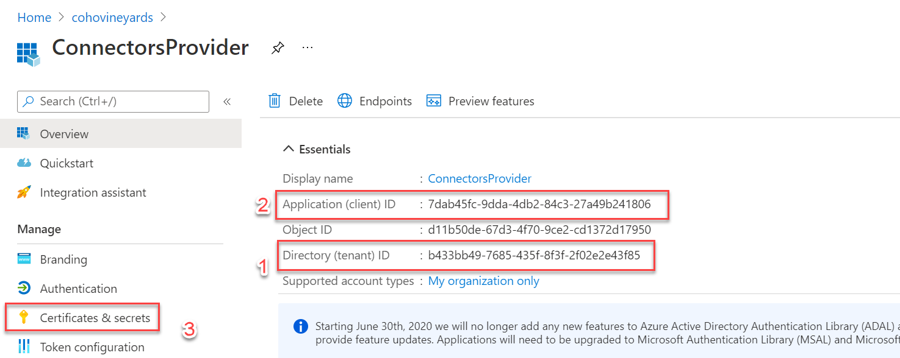
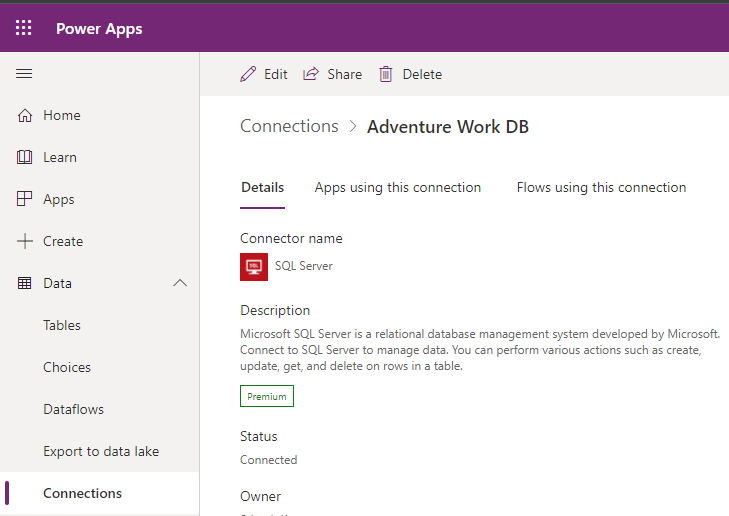
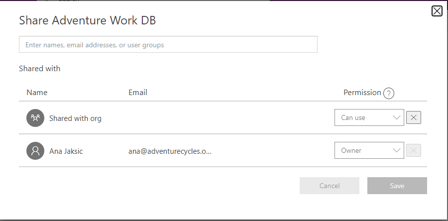
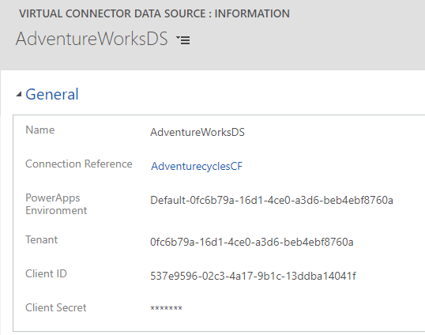
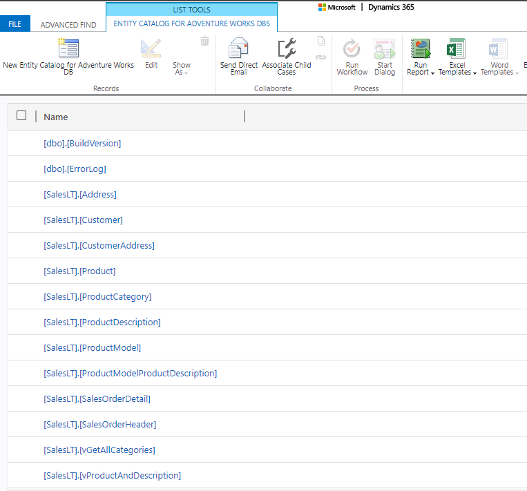
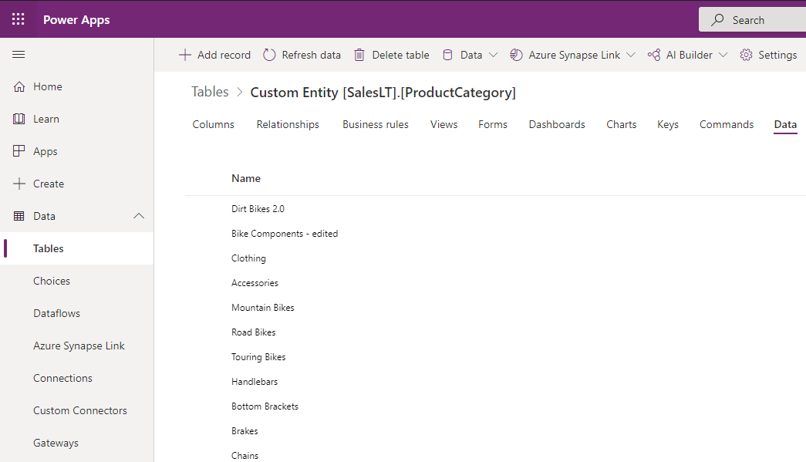
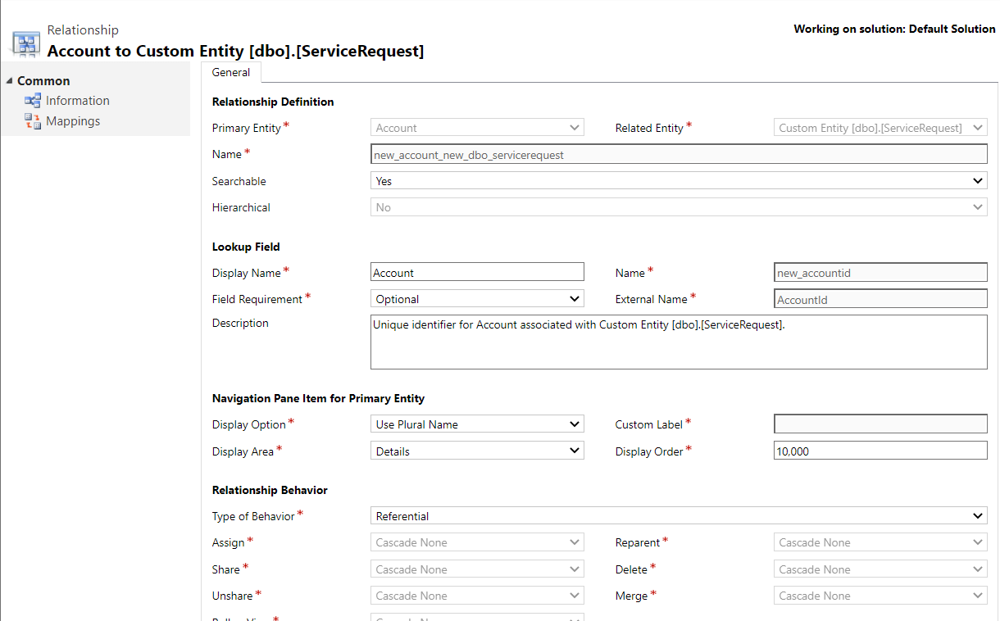
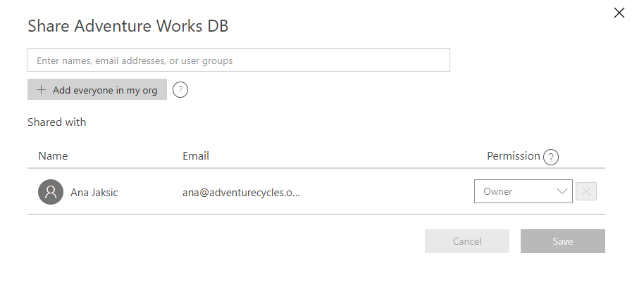

# Preview: Create virtual tables using the virtual connector

Virtual tables enable integrating data from external data sources by seamlessly representing that data as tables in Microsoft Dataverse, without data replication. Solutions built on Power Platform can leverage virtual tables as if they were native Dataverse tables. More information: [Get started with virtual tables](get-started-ve.md).

In this public preview release, we are adding support for creating virtual tables using the **SQL Server** connector. We will continue to expand and support other tabular connectors in subsequent releases. See the [connector reference for the SQL Server connector](https://docs.microsoft.com/connectors/sql/) for supported actions and limitations.

## Overview

Virtual connector provider extends Connectors allowing you to create virtual tables in Dataverse. When you establish a remote connection to an external source using a connector data source, the virtual connector provider automatically generates an entity catalog with a list of all the available tables by retrieving the metadata from the external data source.

The entity catalog does not persist any information and always represents the external data source’s current state. You can select entities from the entity catalog to create virtual tables. If you're working with multiple external data sources, an entity catalog is generated for each external source.

The underlying data source is key to allowing the provider to establish an authenticated remote connection to the external data. It uses a connection reference that stores pertinent details to the external source. This connection reference is subjective to the connector type. The information stored in the connection reference is specific to the data connector.

For example, the SQL connector will need the server information, database details, authentication method, username, password, and (optional) gateway connection details. Each external data source will need a new connection reference setup to create an instance of its entity catalog.

The connector permissions enforce the ability for organizational users to access and operate on the virtual table. The connection can be shared with one user or can be shared with the entire organization. This allows for users to access and operate on virtual tables using a shared connection.

Additionally, you need to create a service principal (Application ID) that will be used to authenticate with the provider. The service principal needs to be created in the tenant of the organization. The provider supports the use of Client ID and a Client Secret when setting up the data source. Refer to the prerequisite section below on how to setup a service principal.

Application Lifecycle Management (ALM) is supported for virtual tables created through virtual connectors. Virtual tables should be part of the managed solution along with the connection reference to distribute the solution. The solution can have other components, such as a model-driven app that uses virtual tables. When importing the solution into a new Dataverse environment, the data source should be updated to use a connection reference setup in the respective environment and client ID and secret.

For more information about Application lifecycle management (ALM) and Solutions,
see the articles:

- [Application lifecycle management (ALM) in Microsoft Power Platform](https://docs.microsoft.com/en-us/power-platform/alm/)

- [Solution Overview](https://docs.microsoft.com/en-us/powerapps/maker/data-platform/solutions-overview)

## Getting started with virtual connector provider

### Prerequisites

- Create a service principal (Application ID) that will be used to authenticate with the provider. The service principal needs to be created in the tenant of your Dataverse platform. For more details on how to register a service principal (Application ID), refer to: [Creating service principal from Azure portal](https://docs.microsoft.com/azure/active-directory/develop/howto-create-service-principal-portal).

- Create a secret for the registered application ID. You will need this information when you create a data source for the external data as part of setting up the virtual connector.

Please note down the following values from the Azure Portal. This will help in setting up the Virtual Table Data Source:

1. **Directory (tenant) ID:** A GUID value representing the Dataverse tenant in which you are setting up the virtual table.

2. **Application (client) ID:** A GUID value representing the service principal (application id) you created.

3. Click on the **Certificates & secrets** option to create a secret.

4. **Client Secret Value** – a unique secret value for the client you created.

> [!NOTE]
> You will only be able to see and copy the Client secret value when creating it. You will not be able to go back to the screen to copy the value. 

The screenshot below is a representation of what you will see in Azure Active Directory when you register a new Application (client).

## Create a virtual table using a SQL connector

1. Go to the [Microsoft AppSource](https://appsource.microsoft.com/) and search for “Virtual Connector” or select the link to download the provider: [Virtual connectors in Dataverse](https://appsource.microsoft.com/product/dynamics-365/mscrm.connector_provider?tab=Overview)

   

1. Select **Get it now**. In the sign in dialog, enter work or school account email. Agree to the terms and conditions and then select **Continue**. The Power Platform Admin Center will open automatically.

1. Select the environment where you want to install the solution. Once the installation is complete, you will see the **Virtual connectors in Dataverse** app installed under **Environments -\> [your environment name] -\> Dynamics 365 apps**.

   

1. You should also see the **Virtual Connector Provider** solution and other solutions enabled in the environment.

    

1. Go to [Power Apps](https://make.powerapps.com), select the environment in which you would like to setup the virtual table. In the left navigation pane, select **Data** and then select **Connections** to create a **data connection** using the SQL connector. Set SQL server specific details and the external database you want to connect.

    

1. Select the connection you created and share this connection with all users in your organization by selecting the **Share** action in the connection details view.

    

    > [!IMPORTANT] Sharing the connection with the organization is an important step. This allows for the service principal that was created in this tenant to have access to the connection. 

1. With the connection to the external data source established, you can now start creating **Connection Reference**. As the name suggests, a connection reference is a reference entity that provides a way for the Dataverse platform to access the connection information associated with the external data source. To create a connection reference:

   1. Go to **Solutions**.
   1. Select the **Default Solution** or any other solution you have in your environment to create the virtual table.
   1. Select **New** and then select **Connection Reference (preview).**
   1. Provide a name and select SQL data connection that was previously setup.

   

    > [!NOTE] You can also create a new data connection from this dialog. You will be presented with a list of connectors to choose from. Select the SQL Server connector for setting up a new connection.

1. Create a new **Virtual Entity Data Source** by navigating to **Advanced Setting -\> Administration -\> Virtual Entity Data Source**. Use the Virtual Connector Data Provider and the connection reference previously created, along with the Tenant ID, PowerApps environment ID, Client ID, and the Client Secret in this step.

    

    > [!NOTE] 
    > - If you have more than one Dataverse environment, enter the environment GUID in which you are setting up the virtual table data source in the PowerApps environment field. To find the environment specific GUID – copy the value from the URL as highlighted below.
    > - 
    > - If you have only one Default environment, note that you will have to include the full environment value in the PowerApps Environment field. This will include a “Default-“ prefix before the GUID
    > - 

1. With the connection reference and the virtual entity data source setup, an **Entity Catalog** is automatically generated. The **Entity Catalog** is specific to the data source and will list all the tables that are in the respective data source.

   You can view the **Entity Catalog** by selecting **Advanced Find** and using the **Look for:** field. The catalog will include a prefix “Entity Catalog for” followed by the connection reference (example: *Entity Catalog for Adventure Works DB*).

   > [!NOTE] 
   > - The creation of the entity catalog is an asynchronous process. Depending on your environment, this may take a few minutes. 
   > - The tables you see in the Entity Catalog are NOT virtual tables in themselves. You will need to select from this list of tables representing the external data to create the virtual table in Dataverse.

1. Find the **Entity Catalog** for your respective data connection and select the **Results** button to see all the external data source tables. You can also see the Entity Catalog by going to **Data -\> Tables** view and selecting the Data tab.

    

1. You can now **create a virtual table** by selecting any record from the entity catalog record and setting the Create or Refresh Entity field to “Yes”.  Set the **Primary Field** for the virtual table by select the appropriate column name listed. The drop-down lists all the columns of datatype string (nvarchar) that are eligible to be used as the primary field for the virtual table.

    

    Saving the record creates the virtual table. Once the virtual table is created, you can go back to **Advanced Find** and select the virtual table to retrieve all records.

    

    Here is the view of records in the virtual table from the Data tab in the **Data -\> Tables** view.

    

    Bulk creation of virtual tables is not supported currently. Even though the Entity Catalog allows you to select multiple entities.

    > [!IMPORTANT] 
    > - Virtual tables no longer require an associated GUID as a primary key with the virtual connector provider. 
    > - The provider automatically maps the primary key associated with the external data source when creating the virtual table. All CRUD operations can be performed on the generated virtual table. 

1. All fields in the external data are automatically mapped to Dataverse types that are support by the connector. You can review the virtual table details and make changes by navigating to **Settings -\> Customization – Entities** view.

   Review the [SQL Server Connector documentation](https://docs.microsoft.com/connectors/sql/) for the full list of [datatype mappings supported by SQL Server Connector](https://docs.microsoft.com/connectors/sql/#power-apps-data-type-mappings) by going to

Once you have created a virtual table, you can work with it much the same way as any other table. You can start defining the relationships with other tables
in the environment and use them in your Power Apps and Power Automate flows.

### Setting up virtual table relationship

Virtual tables are also enabled for relationships. You can setup 1:N, N:1, and N:N relationships. These relationships can be established between native: virtual tables and between virtual: virtual tables. You can only setup virtual: the virtual relationship between tables from the same virtual table provider. 

For instance, you cannot set up a relationship between a virtual table created using the OData virtual table provider and a virtual table created using the Virtual Connector provider.

#### Defining relationships in virtual tables

Virtual tables created using the virtual connector provider will automatically create all the columns that are represented in the external source table. This will also include columns on which relationships are defined. However, the relationship definition themselves will not be automatically created. You will have to define this relationship in Dataverse manually.

We will use an example to walk through the setup process. This example will create an N:1 relationship between a virtual table (**Service Request**) and a native table (**Account**). The column used to setup the relationship is **AccountId**. This field is the primary key in the Account table and is a foreign key in the Service Request table.

A representation of the **Service Request** virtual table is shown below. You will notice that the **AccountId** field, which is the columns used for relationship in the external source, is of type Multiple Line of Text. You need to have this field represented as a Lookup type to create a relationship.

1. Go to **Settings -\> Customization** and choose **Customize the System**.

2. In the left navigation pane of solution explorer, expand the **Entities** view and browse to the Service Request virtual table definition.

3. Select the **Fields** view and select the **AccountId** column and click **Delete**.

4. Choose **Delete** to confirm the deletion of this column.

5. To create the relationship, select the **N:1 Relationship** within the Service Request table.

6. Click **New Many-to-1 Relationship**.

7. Enter the following details to create the relationship between the Service Request virtual table and the Account table.

    1. In the **Relationship Definition** section – set the **Primary Entity** field value to **Account**.

    2. Optionally, if you want to edit the name of the relationship, you can do so in the **Name** field.

    3. In the **Lookup Field** section – set the **Display Name** to **Account.**

    4. The **Name** field will automatically populate with the lookup field
        name

    5. Set the **External Name** value to **AccountId** (matching the column name in your source table)

        

8. Refer to the fields for the **Service Request** virtual table, and you will notice that the **AccountID** field is not a **Lookup** type. This field can now
be added to forms and views to see all associated accounts for each of the service request record.

   

9. With the relationship established you can now create a new service request and pick accounts to associate them to.

   

#### Tips

-  Primary Key field should be included in a create form if you did not setup the field to increment during the design of the underlying source table automatically. You will have to enter a valid value in the primary key field for an insert operation to succeed.

- If entity catalog creation takes a long time, you can check the job completion status by going to **Settings -\> System Jobs** view.

- The easiest way to identify the PowerApps environment you are working in is from the URL. The value following the *https://make.powerapps.com/environments/* path is the GUID representing the environment.

## Known Limitations

- SQL data type bigint columns in the source table will be mapped as a decimal data type in Dataverse virtual tables. When platform support is available for bigint mapping to a whole number, previously created fields in the virtual table will need to be deleted, and new field should be created.

- Maximum length of characters allowed for a text field in a virtual table is 4000 characters. Suppose the destination table has the character set to greater than this value. In that case, any create/update operation exceeding the max character limit will result in a validation error, and the operation will fail.

- Query with entity reference to the virtual entity cannot exceed the 250 record limit. If you have a 1:N or N:N relationship with a virtual table,

## Troubleshooting

- You have configured the virtual entity data source, but the entity catalog did not get created

    **Solution:** One or more values you used when creating the virtual entity data source are incorrect. Please refer to the prerequisite section of this document and make sure you are copying the correct values from the Azure portal. You will need the Tenant ID, Application (Client) ID, the Client Secret value. Additionally, you will also need the PowerApp environment GUID when setting up the data source.

- When querying the entity catalog from the Power Apps maker portal, you see an error – *The remote server returned an error: (403) forbidden.*

    **Solution:** Make sure you have the service principal (Application ID)
    created in the respective tenant, and when creating the connection using the SQL connector, you have shared the connection with everyone in your org.
    To share the connection, select the connection and click Share. Then, click Add everyone in my org and save the connection.
    

    

-   When querying the entity catalog from the Power Apps maker portal, you see an error – *The given key was not present in the dictionary.*

    **Solution:** Check the values you have for the Tenant, Client ID, and Client Secret field when setting up the virtual table data source

### See also

[Get started with virtual tables (entities)](get-started-ve.md)

