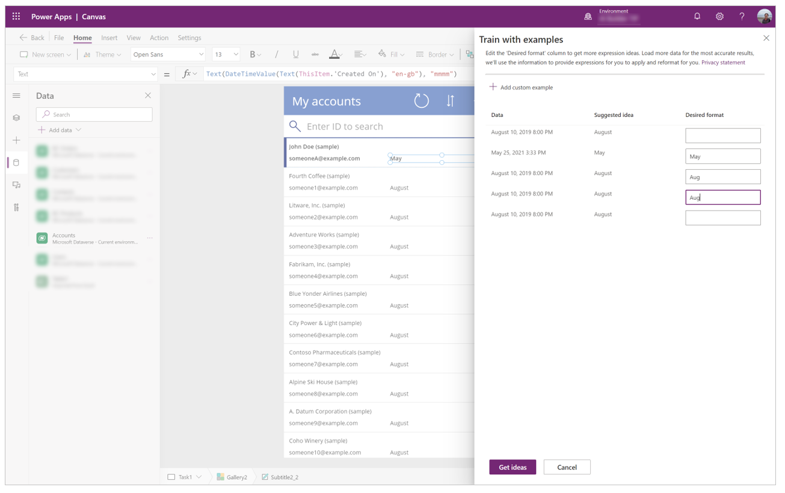

We all had the time when we struggled with manipulation of text when we’re building apps. Searching online for tips and examples, or tools to test RegEx patterns. Example to formula uses PROSE (Program Synthesis using Example) so you could now just give us one or a few desired outputs, then Power Apps can automatically generate the formula for you. 

### What’s supported 

- Converting a single date field in a table to a different format 
- Converting a single text field in a table to a different format 
- Works only for label text in Gallery 
- Should work for all languages and data connectors in all Power Apps supported regions.

### What’s not supported 
- Number manipulation 
- Manipulating text from multiple columns 
- Branching scenario, If/Else. 

### Examples
Let's use a simple app to show you how to use Example to formula. You can follow [Create from blank](data-platform-create-app-scratch) to create a sample app. In the following example, I am using the sample table in Dataverse, called "Accounts". It is available to you by default if you choose to install sample data when you create your environment. If you don't have this table, you can use your own data source as well.

#### Manipulating dates display in gallery
1. Select your target label, in the following example, I will use ‘Created On’. Click on the Ideas pane and you will see a screen like the following. 

2. Enter your desired output in the text box. For example, I changed "March 22, 2020 3:19 PM" to "March", so it will only show me the month, press Enter 
3. You will find a formula generated for you, click on it  
TrimEnds(Left(Text(ThisItem.'Created On'), Match(Text(ThisItem.'Created On'), "\p{Zs}*\ \p{Zs}*").StartMatch + Len(Match(Text(ThisItem.'Created On'), "\p{Zs}*\ \p{Zs}*").FullMatch) - 1)) 
4. It will be applied to the fx bar and you can check the rest items in your gallery to see if the formula did the manipulation you want. 

#### Manipulating text display in gallery
1. Select your target label, in the following example, I will use email. Click on the Ideas pane.
2. Enter your desired output in the text box. For example I changed "test@test.com" to "test@", press Enter 
3. You will find a formula generated for you, click on it 
TrimEnds(Left(ThisItem.Email, Match(ThisItem.Email, "\p{Zs}*@\p{Zs}*").StartMatch + Len(Match(ThisItem.Email, "\p{Zs}*@\p{Zs}*").FullMatch) - 1)) 
4. It will be applied to the fx bar and you can check the rest items in your gallery to see if the formula did the manipulation you want. 

### Train with examples
When the formula doesn’t meet your needs or there’s no formula suggestion, you can try to provide more examples for the model to learn so it could try to provide you a better suggestion. 

1. In the following date case, if you try to change the date display to only the first 3 letters of the month, and you provided one example, it may not be able to give you a result. 
2. Click **Train with examples** under the Answers pane, and give more examples in the side pane. Note you don’t need to fill in all the boxes, just give a few more different examples so the model can learn. 

3. If you have an example that’s not listed, you can also click **Add custom example** on the top 
4. After you have finished adding examples, you can click **Get ideas**. This time Ideas pane is able to give you a suggestion of formula, click and apply to see if it meets your needs. 
Mid(Left(Text(ThisItem.'Created On'), 3), Match(Text(ThisItem.'Created On'), "[\p{Lu}\p{Ll}]+").StartMatch) 
