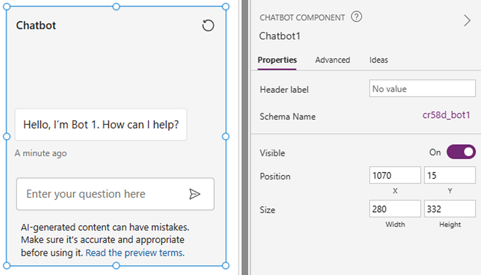

# Add a chatbot control to a canvas app (preview)

[This article is prerelease documentation and is subject to change.]

Add a Chatbot control to your canvas apps and embed a published [Power Virtual Agents](/power-virtual-agents/fundamentals-what-is-power-virtual-agents) chatbot to assist your end-users with a variety of requests&mdash;from providing simple answers to common questions to resolving issues requiring complex conversations. 

With AI chatbots, you can create an extended tree of answers to support your users. With boosted conversations in Power Virtual Agents chabots you can use generative AI assistance to generate prompts and obtain answers from designated sources, including external documents or publicly available websites.

You can design the Chabot control by giving it a name, change the size of the control window, and position it anywhere on the screen.

> [!div class="mx-imgBorder"]
> 

> [!IMPORTANT]
>
> - This is a preview feature. This capability is in gated preview, and you'll need to apply for consideration to take part in the trial. To apply, go to [Limited preview request](https://forms.office.com/Pages/ResponsePage.aspx?id=v4j5cvGGr0GRqy180BHbR2LogRPRiTJDo1Rd8KnmcFRUMzlLTDZVQlJKSzNIWkVCMzE0VDFYVzk2QS4u).
>
> - Preview features aren’t meant for production use and may have restricted functionality. These features are available before an official release so that customers can get early access and provide feedback.
>
> - For more information, go to our [preview terms](https://go.microsoft.com/fwlink/?linkid=2189520).
>
> - This capability is in process of rolling out, and may not be available in your region yet.
>
> - This capability  may be subject to usage limits or capacity throttling.
> 
> - For information and prerequisites for this preview, see [AI overview (preview)](ai-overview.md)

## Prerequisites 

- To add the Chatbot control, you need to create and publish a bot on the [Power Virtual Agents web app](/power-virtual-agents/fundamentals-what-is-power-virtual-agents-portal).  You can create any bot such as an AI bot or a new generative AI enriched Power Virtual Agents bot.
- You need the bot schema name to add it to the Chatbot control properties. The get the schema name, in Power Virtual Agents, open the bot you want to use. In the navigation menu, go to **Settings** > **Details**. Select the **Advanced** tab and note the **Schema name**.

## Turn on the Chatbot control

With your [canvas app open for editing](edit-app.md):

1. On the command bar, select **Settings**.
2. Select **Upcoming features**.
3. From the **Preview** tab, set the toggle for **Chatbot component** to **On**.

   > [!div class="mx-imgBorder"]
   > !

## Add a control with a bot

With your [canvas app open for editing](edit-app.md):

1. On the app authoring menu, select **Insert**.
2. Expand the **Input** menu and then select **Chatbot (preview)**). Place the chatbot control where you want to add it on the screen. 

   > [!div class="mx-imgBorder"]
   > 

2. In the Chatbot propertites pane, enter the Power Virtual Agents bot schema name in the **Schema Name** field.

    You can change the name, the position, and size of the control.

### Key properties 

The following are the main control properties: 

- **Schema name**:  The schema name property must be entered to connect your published Power Virtual Agents bot to your canvas app. For more information on how to get the Schema name, see [Prerequisites](add-ai-chatbot.md#prerequisites) section in this article.

- **Header label**: This is the name of the bot that your end-user will see. If don't enter a header label, it will be **Chatbot**.

  > [!div class="mx-imgBorder"]
  > 

Use the other properties or move the control on the screen to set position and size of the control on the screen. 

## Limitations

- The Power Virtual Agents bot must be published so it can be added to canvas apps using the Chatbot control.
- You can only embed a bot with no user authentication.

## See also

[Power Virtual Agents preview quickstart (preview)](/power-virtual-agents/preview/quickstart)

[AI-based boosted conversations overview](/power-virtual-agents/nlu-gpt-overview)

[Use the Copilot control](add-ai-copilot.md)

[!INCLUDE[footer-include](../../includes/footer-banner.md)]
