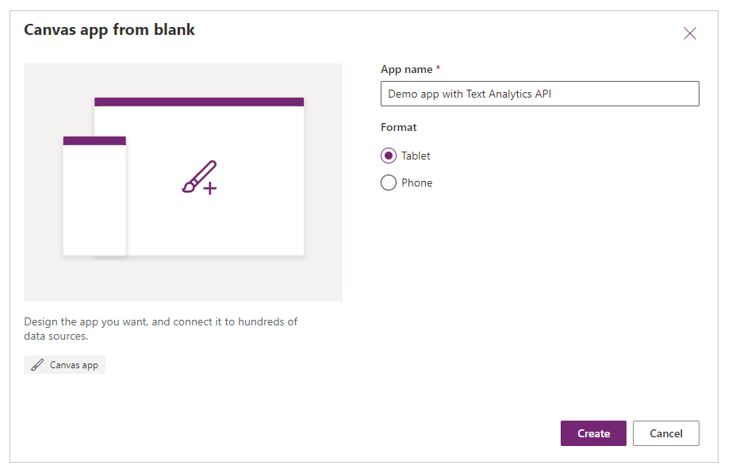
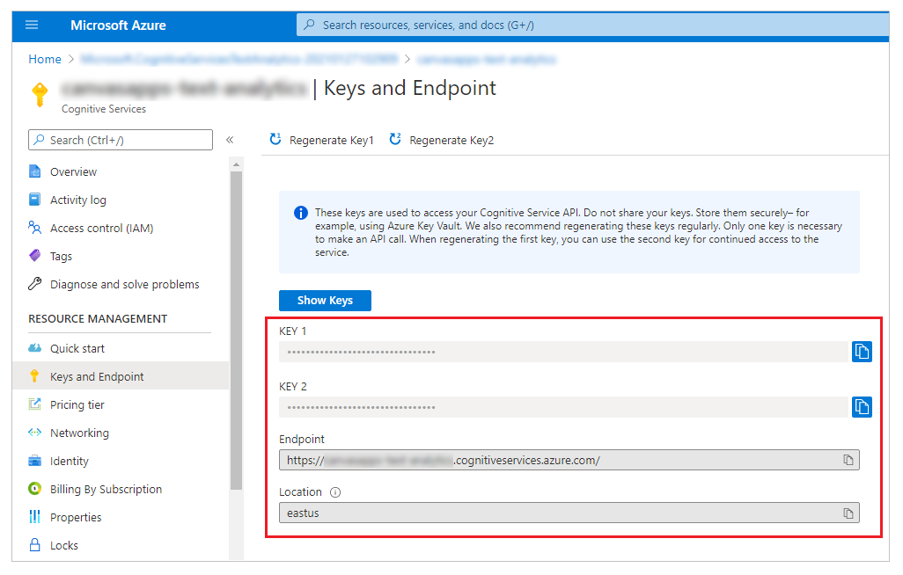

# Use Cognitive Services in Power Apps

This article shows you how to build a basic canvas app that uses the [Azure Cognitive Services Text Analytics API](https://docs.microsoft.com/azure/cognitive-services/text-analytics/overview) to analyze text. We'll show you how to set up the Text Analytics API, and connect to it with the [Text Analytics connector](https://docs.microsoft.com/connectors/cognitiveservicestextanalytics/). Then we'll show you how to create a canvas app that calls the API.

> [!NOTE]
> If you are new to building apps in Power Apps, we recommend reading [Create an app from scratch](get-started-create-from-blank.md) before diving into this article.

## Introduction to Azure Cognitive Services

Azure Cognitive Services are a set of APIs, SDKs, and services available to make your applications more intelligent, engaging, and discoverable. These services enable you to easily add intelligent features – such as emotion and video detection; facial, speech and vision recognition; and speech and language understanding – into your applications.

We'll focus on "language understanding" for this article, working with the Text Analytics API. This API enables you to detect sentiment, key phrases, topics, and language from your text. Let's get started by trying out a demo of the API, then signing up for a preview version.

## Prerequisites

Before you begin building a canvas app using the Text Analytics API, you must prepare the Text Analytics resource. For more details, go to [Text Analytics API prerequisites](https://docs.microsoft.com/azure/cognitive-services/text-analytics/quickstarts/client-libraries-rest-api#prerequisites).

## Build the app

Now that you have the Text Analytics API up and running, you connect to it from Power Apps, and build an app that calls the API. This is a single screen app that demonstrates the Text Analytics API in action with a canvas app. Let's get started on building this!

> [!TIP]
> In this tutorial, you'll learn about creating a demo app with a few properties and values from the output using the Text Analytics API operations. You can use similar method to create your own app to show more or all such properties and values for the Text Analytics API operations.

### Create the app and add a connection

Create a blank phone app and add a connection with the **Text Analytics** connector.

1. Go to [Power Apps](https://make.powerapps.com).

1. Select **Canvas app from blank**.

    

1. Enter app name.

1. Choose a layout for the app. For this demo, we'll use **Tablet** layout.

    

1. Select **Data** from the left pane.

1. Search for **Text Analytics** connection.

    

1. Enter **Account Key**, and **Site URL** values.

    

    You can find the **Account Key** and **Site URL** from the **KEY** and **Endpoint** values respectively using the Azure portal.

    

1. Select **Connect**.

Your app is now connected to the Cognitive Services resource of Text Analytics API type in Azure.

### Design the app

In this section, you'll design the app controls, and the formulas required to work with the Text Analytics API. After you've completed the app design, this is how it'll look:


> [!TIP]
> To learn about how to add controls and formulas to the controls in detail, see [Add and configure controls](add-configure-controls.md).

1. Select  from the left pane.

1. Select **Text label**.

1. Change the label properties with the following configuration.

    | Property Name | Value |
    | - | - |
    | Text | "Text Analytics" |
    | Size | 36 |
    | Color | RGBA(255, 255, 255, 1) |
    | Fill | RGBA(56, 96, 178, 1)|

1. Resize the label as below.

    

1. Add 

1. Change **Text** for this label to *Text Analytics*.


Follow the steps below to create this screen. If a control name is specified, that name is used in a formula in the next section.

1. On the **Home** tab, click or tap **New Screen**, then **Scrollable screen**. 

2. On **Screen2**, select **[Title]** and change it to **Text Analysis**.

3. Add a **Label** control for the introductory text.

4. Add a **Text input** control, so you can enter text to analyze. Name the control **tiTextToAnalyze**. The app should now look like the following image.
   
    

5. Add three **Check box** controls, so you can choose which API operations to perform. Name the controls **chkLanguage**, **chkPhrases**, and **chkSentiment**.

6. Add a button, so you can call the API after selecting which operations to perform. The app should now look like the following image.
   
    

7. Add three **Label** controls. The first two hold results from the language and sentiment API calls; the third is just an introduction for the gallery at the bottom of the screen.

8. Add a **Blank vertical gallery** control, then add a **Label** control to the gallery. The gallery holds results from the key phrases API call. The app should now look like the following image.
   
    

9. In the left pane, select **Screen1** > ellipsis (**. . .**) > **Delete** (you don't need this screen for the app).

We're keeping this app simple to focus on calling the Text Analytics API, but you could add things - like logic to show and hide controls based on the check boxes selected, error handling if the user doesn't select any options, and so on.

### Add logic to make the right API calls
OK, you have a nice-looking app, but it doesn't do anything yet. You'll fix that in a moment. But before we dive into the details, let's understand the pattern that the app follows:

1. The app makes specific API calls based on the check boxes selected in the app. When you click or tap **Analyze text**, the app makes 1, 2, or 3 API calls.

2. The app stores data that the API returns in three different [collections](working-with-variables.md#use-a-collection): **languageCollect**, **sentimentCollect**, and **phrasesCollect**.

3. The app updates the **Text** property for two of the labels, and the **Items** property for the gallery, based on what's in the three collections.

With that background, let's add the formula for the **OnSelect** property of the button. This is where all the magic happens.

```powerapps-dot
If( chkLanguage.Value = true,
    ClearCollect( languageCollect, 
        TextAnalytics.DetectLanguageV2(
            {
                text: tiTextToAnalyze.Text
            }
        ).detectedLanguages.name
    )
);

If( chkPhrases.Value = true,
    ClearCollect( phrasesCollect, 
        TextAnalytics.KeyPhrasesV2(
            {
                language: "en", 
                text: tiTextToAnalyze.Text
            }
        ).keyPhrases
    )
);

If( chkSentiment.Value = true,
    ClearCollect( sentimentCollect, 
        TextAnalytics.DetectSentimentV2(
            {
                language: "en", 
                text: tiTextToAnalyze.Text
            }
        ).score
    )
)
```

There's a bit going on here, so let's break it down:

* The **If** statements are straightforward – if a specific check box is selected, make the API call for that operation.

* Within each call, specify the appropriate parameters:

  * In all three calls, you specify **tiTextToAnalyze.Text** as the input text.

  * In **DetectLanguage()**, **numberOfLanguagesToDetect** is hard-coded as 1, but you could pass this parameter based on some logic in the app.

  * In **KeyPhrases()** and **DetectSentiment()**, **language** is hard-coded as "en", but you could pass this parameter based on some logic in the app. For example, you could detect the language first, then set this parameter based on what **DetectLanguage()** returns.

* For each call that is made, add the results to the appropriate collection:

    * For **languageCollect**, add the **name** of the language that was identified in the text.

    * For **phrasesCollect**, add the **keyPhrases** that were identified in the text.

    * For **sentimentCollect**, add the sentiment **score** for the text, which is a value of 0-1, with 1 being 100% positive.

### Display the results of the API calls
To display the results of the API calls, reference the appropriate collection in each control:

1. Set the **Text** property of the language label to: `"The language detected is " & First(languageCollect).name`.
   
    The **First()** function returns the first (and in this case only) record in **languageCollect**, and the app displays the **name** (the only field) associated with that record.

2. Set the **Text** property of the sentiment label to: `"The sentiment score is " & Round(First(sentimentCollect.Value).Value, 3)*100 & "% positive."`.
   
    This formula also uses the **First()** function, gets the **Value** (0-1) from the first and only record, then formats it as a percentage.

3. Set the **Items** property of the key phrases gallery to: `phrasesCollect`.
   
    You're now working with a gallery so you don't need the **First()** function to extract a single value. You reference the collection, and the gallery displays the key phrases as a list.

## Run the app

Now that the app is finished, run it to see how it works: click or tap the run button in the upper right corner . In the following image, all three options are selected, and the text is the same as the default text on the Text Analytics API page.


If you compare the output of this app to the Text Analytics API page at the beginning of this article, you see that the results are the same.

We hope you now understand a little more about the Text Analytics API, and you've enjoyed seeing how to incorporate it into an app. Let us know if there are other Cognitive Services (or other services in general) that you would like us to focus on in our articles. As always, please leave feedback and any questions in the comments.


[!INCLUDE[footer-include](../../includes/footer-banner.md)]