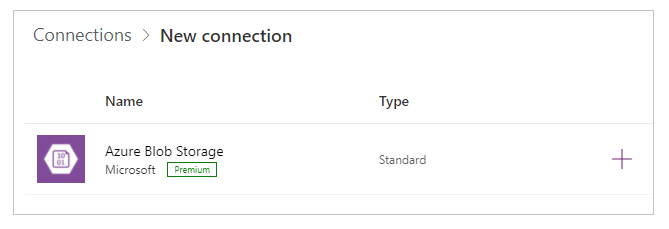
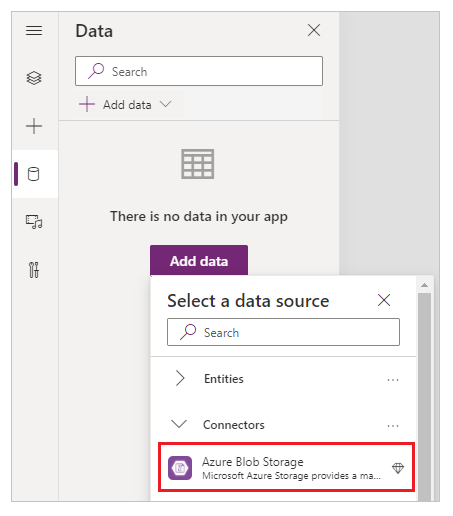
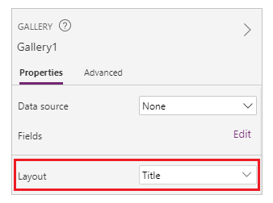
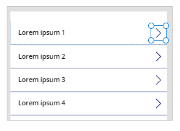
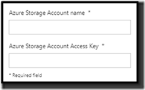
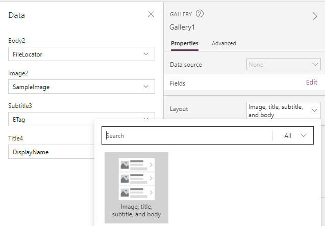
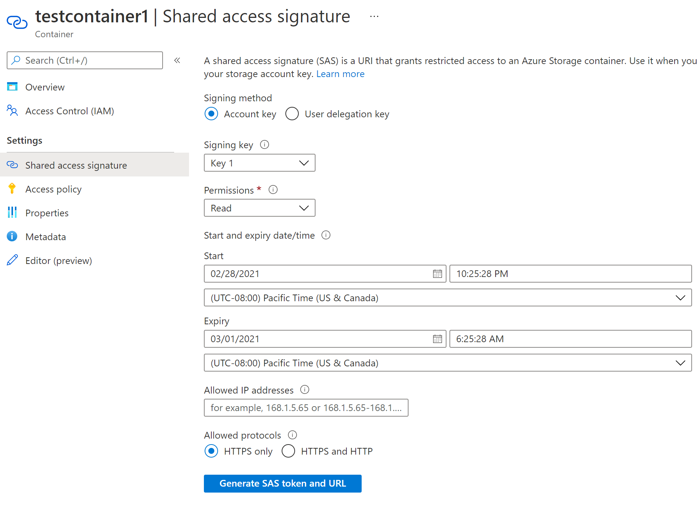

# Connect to Azure Blob Storage from Power Apps

Power Apps can connect to [Azure Blob Storage](https://docs.microsoft.com/azure/storage/blobs/storage-blobs-introduction). You can upload files such as Word, Excel, or multimedia images, audio or video using the [Azure Blob Storage connector for Power Apps](https://docs.microsoft.com/connectors/azureblob/).

When you design a canvas app that connects to Azure Blob Storage, the app uses the blob storage account name and key to connect. After you share the app with others, users can use the connection configured inside the app to upload files to Azure Blob Storage without the need to share blob storage name and keys with the app users.

In this article, you'll learn how to create a canvas app that connects to Azure Blob Storage, and add controls to the app that allow you to upload different types of files to the connected blob storage.

> [!NOTE]
> To learn more about other types of cloud storage options with Power Apps (such as OneDrive, OneDrive for Business, Google Drive, Dropbox, Box), go to [Connect to cloud storage from Power Apps](cloud-storage-blob-connections.md).

## Prerequisites

Before you begin, create and configure a [BlockBlobStorage account](https://docs.microsoft.com/azure/storage/blobs/storage-blob-create-account-block-blob?tabs=azure-portal). You can also use legacy BlobStorage account, though not recommended. More information: [Types of storage accounts in Azure Blob Storage](https://docs.microsoft.com/azure/storage/common/storage-account-overview)

## Create Azure Blob Storage connection

Power Apps requires a connection to Azure Blob Storage to be created for the app to connect to the storage. 

To create the Azure Blob Storage connection:

1. Sign in to [Power Apps](https://make.powerapps.com).

1. On the left-pane, expand **Data**.

1. Select **Connections**.

1. Select **New connection**.

1. Select **Azure Blob Storage**.

    

1. Copy and paste the account name, and access key.

    

    For more information about how to copy account name and access key, go to [View account access keys in Azure](https://docs.microsoft.com/azure/storage/common/storage-account-keys-manage?tabs=azure-portal#view-account-access-keys).

1. Select **Create**.

Your connection to the Azure Blob Storage is now configured and ready to use with canvas apps.

## Create canvas app with Azure Blob Storage

Now that you have the connection with Azure Blob Storage created, let's create a canvas app that connects to this storage.

> [!NOTE]
> In this section, you'll create a sample app with sample controls, functionality and layout design. Depending on your business requirement, you can create the app with a different structure, or customize differently.

1. Sign in to [Power Apps](https://make.powerapps.com).

1. On the left-pane, select **Create**.

1. Select **Canvas app from blank**.

1. Enter app name, such as "Sample app for Azure Blob Storage".

1. Select a layout for the app. For this tutorial, we'll choose **Phone**.

1. Select **Create**.

1. Inside the Power Apps Studio, on the left-pane, select .

1. Select **Add data**.

1. From the list of connectors, select **Azure Blob Storage**.

    

1. Select **Insert** -> **Gallery** -> **Blank vertical**.

1. From the right-side of the screen, on the property pane, select the layout drop-down and choose a layout. For this tutorial, we'll choose **Title**.

    

1. Select first  inside the gallery, and delete it.

    

1. From the right-side of the screen, on the property pane, select the drop-down for data source, and choose **Azure Blob Storage**.

    

1. Set the **Items** property of the gallery to:

    ```powerapps-dot
    AzureBlobStorage.ListRootFolderV2().value
    ```

    

    This operation lists blobs in the Azure Blob Storage root folder. More information: [List blobs in root folder](https://docs.microsoft.com/connectors/azureblob/#list-blobs-in-root-folder)

1. Select **Insert** -> **Gallery** -> **Blank vertical** to add another blank vertical gallery.

1. Move the gallery below the gallery you added earlier that shows the list of containers.


## **Canvas app setup for Azure Blob Storage**

In this section, let's build a canvas app that you can use to display and upload images from/to your Blob storage. We will use two galleries - the first one to browse a container, and the second one to display the files in the selected
container. Additionally, we will use a few controls to show files in the blob storage to end users.

Follow these steps to use the Azure Blob Storage connector in your app:

-   Create a new Canvas app

-   Add the Azure Blob Storage connector to your app by going
    to **View** \> **Data Sources**.

-   Search and select **Azure Blob Storage** connector and fill in with the details you created from previous step.

    

-   Add a new blank vertical gallery by going
    to **Insert** \> **Gallery** \> **Blank vertical**

    -   Change the layout to **Title** gallery, by clicking on the gallery and then going to the right **Properties** panel and clicking on **Layout** to change it.
    

    -   Set the Items property of the gallery to:

            AzureBlobStorage.ListRootFolderV2().value

        This will show you the highest-level containers that are available to store / retrieve your files

    -   If you do not have any items to show, you can download the Microsoft Azure Storage Explorer
        (<https://azure.microsoft.com/en-us/features/storage-explorer>) which
        will allow you to log in and add containers

-   Add another new blank vertical gallery by going
    to **Insert** \> **Gallery** \> **Blank vertical**

    -   Set the **Layout** to Image, title, subtitle and body

    -   Set the Items property to:
        
            AzureBlobStorage.ListFolderV2(Gallery1.Selected.Id).value

    -   Change the following items in the data panel

        -   Body to **Path**

        -   Subtitle to **MediaType**

        -   Title to **DisplayName**

        

    -   Click on the first image in the gallery and set it to
    – AzureBlobStorage.GetFileContent(ThisItem.Id) or 
    "*https://YourStorageAccountName.blob.core.windows.net*" & ThisItem.Path

    -   You can use the MediaType to pass the path and URL to any type of supported control in Power Apps such as:

        -   PDF Viewer

        -   Image

        -   Audio

        -   Video

    Update **YourStorageAccountName** with your actual storage account name
            if you used that option. This option is only available if you set your blob storage to public access.  If your blob storage container is locked down (which is the default and recommended) then you can use the **GetFileContent** method.

## **Upload Files to Blob Storage**

Your app can now display files from blob storage on a gallery. Now let’s add a way for users to upload new files to blob storage.

-   Add an upload control to send a file to your blob storage by going
    to **Insert** \> **Media** \> **Add Picture**

-   Add a Text Input control to name the file by going to **Insert** \> **Text** \> **Text Input**

-   Add a button for the user to click on it to upload the file by going to **Insert** \> **Button**

    -   On the **OnSelect** property of the button, add:
        
            AzureBlobStorage.CreateFile("myfiles",TextInput1.Text, UploadedImage1.Image)

        Update '**myfiles**'with the directory you want your files to be uploaded to

 
        
 
### **Refreshing Galleries connected to Azure Blob Storage**

The Blob Storage connector does not auto refresh when data in it is updated. To solve this, add the following:

-   To the button **OnSelect** property:

        ClearCollect(TopLevelList, AzureBlobStorage.ListRootFolderV2().value)

-   To the screen **OnVisible** property:

        ClearCollect(TopLevelList, AzureBlobStorage.ListRootFolderV2().value)

-   Update the first gallery you created that contains the high-level folders

        Set the **Items** property to **TopLevelList**


You can now try out the interaction with blob storage by playing the app, uploading a file, providing a file name (with extension) in the Text Input field and click on the upload button.
Do not forget to change the popup window filter to **All Files** (button right) if you are trying this out from a browser.


 
## **Using your files in an app**

In this section, let's explore how to display the uploaded files back to end users. You can check the Media type or file extension to show or hide several types of controls on your canvas apps.

Try using these based on the example:

- **PDF Document Property**:

        If(".pdf" in Gallery2.Selected.Path, AzureBlobStorage.GetFileContent(Gallery2.Selected.Id))

- **Image Property**:

        If("image/" in Gallery2.Selected.MediaType,AzureBlobStorage.GetFileContent(Gallery2.Selected.Id))

- **Video Media Property**:

        If("video/" in Gallery2.Selected.MediaType,AzureBlobStorage.GetFileContent(Gallery2.Selected.Id))

- **Audio Media Property**:

        If("audio/" in Gallery2.Selected.MediaType,AzureBlobStorage.GetFileContent(Gallery2.Selected.Id))

-  In case you don't have a control to display a certain type of document, you can display a custom message such as "Document not available in Power Apps". Add a Label control and set the Text property to “Document not available in Power Apps” and use this on the Visible property:

        If("video/" in Gallery2.Selected.MediaType \|\| "image/" in Gallery2.Selected.MediaType \|\| "audio/" in Gallery2.Selected.MediaType \|\| ".pdf" in Gallery2.Selected.Path,false,true)


## **Security for Azure Blob Storage files**

Securing files uploaded to blob storage is our next topic. Each container in Blob Storage can have a different Public Access Level assigned to it. In Microsoft Azure Storage Explorer, you can click on a blob storage container to go to the actions tab on the bottom left of the screen and view your access settings.


The first setting (no public access) will restrict access from viewing/downloading the file even if the user has the URL to that file. If you want to lock down your files online, this is the setting you need to select. If you select the first option and click Apply, you will notice the app may not display any images.


In your canvas app, if you are using GetFileContent like we did above for PDF files AzureBlobStorage.GetFileContent(Gallery2.Selected.Id), the files will continue to display. Instead, if you have hardcoded the storage account name in the URL, you will need to set up a **Shared Access Signature** in order to secure the files and allow your app to show the files to users. This will assign a key to all the files in your container and will not allow them to be shown unless a special key is appended to the URL. Follow the below steps to set up **Shared Access Signature**


- In Microsoft Azure Storage Explorer(Azure Portal), navigate to the blob storage container and select **Shared Access Signature** from settings

- Set the **expiry time** to a date in future and click on **Generate SAS token and URL**. The key will not work beyond the selected date.

- Copy the **Blob SAS token** to use it in your app. In the canvas app, append the **Blob SAS token** to any blob storage document URL that you would like to display. Even though you can do append the URL directly in the app, this is not a recommended approach. Instead, store the key in a different data source and use that data source to insert into the key.

    

    For example, in the gallery that is showing images to your users, you will need to change the Image property of that image:

    From: 

        “https://**YourStorageAccountName**.blob.core.windows.net" & ThisItem.Path

    To: 

        “https://**YourStorageAccountName**.blob.core.windows.net" & ThisItem.Path & “**?token**”

If you need to lock down your files and have a URL you can send to an outside customer, you can use the **CreateShareLinkByPath** function. This will lock down the file to a period you can define and generates a URL that can be accessed by users outside of your app.

To try out the **CreateShareLinkByPath** function do the following:

-   Click on the first record in the gallery showing all your files

-   Add a button to the gallery (if you have added it correctly, you will see one button per record)

-   Add the following to the **OnSelect** of the button:

        Launch(AzureBlobStorage.CreateShareLinkByPath(ThisItem.Path).WebUrl)

    You can provide optional parameters such as the **ExpiryTime** to set a timeout for the file. An example would look like:

        Launch(AzureBlobStorage.CreateShareLinkByPath(ThisItem.Path,{ExpiryTime:DateValue("1/1/2050")}).WebUrl)

With the above steps, you can create or update apps to include Azure Blob Storage files. You can lock down the files if required and display supported files to end users in Power Apps.
 

## **Sharing a canvas app which uses Azure Blob Storage connector**

After creating the app, the next step is to share it with the team. With Azure Blob Storage connector, when an app is shared, the app users can use the connector automatically without having to bring their own key to access the blob storage.  


## **Data sources supported with Azure Blob Storage Connector**

With the Azure Blob Storage connector you cannot add Excel as a data source. Instead, you can use the following connectors that support Excel as a connection:

-   One Drive

-   Box

-   DropBox

-   Google Drive


## **Additional Resources**

As you add Azure Blob Storage connector to your apps, you can leverage all the power of the Azure Platform. For our developer friends, here are a few examples of additional resources that
might be helpful:

-   Auto generate thumbnails: <https://github.com/Azure-Samples/function-image-upload-resize>

-   Azure Functions with blog
    storage: <https://docs.microsoft.com/en-us/azure/azure-functions/functions-bindings-storage-blob>