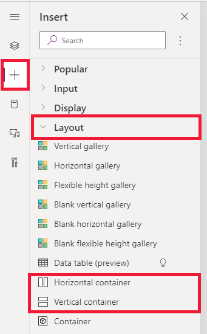

# Vertical container control in Power Apps

Vertical container control determines the position of the child components so that you never have to set X, Y for a component inside the container.

## Description

**Vertical container** control distributes the available space to its child components based on the settings, as well as determines alignment of the child components.

## Properties

**[BorderColor](properties-color-border.md)** – The color of a control's border.

**[BorderStyle](properties-color-border.md)** – Whether a control's border is **Solid**, **Dashed**, **Dotted**, or **None**.

**[BorderThickness](properties-color-border.md)** – The thickness of a control's border.

**[Color](properties-color-border.md)** - The color of the container control.

**[Fill](properties-color-border.md)** – The background color of a control.

**[Height](properties-size-location.md)** – The distance between a control's top and bottom edges.

**Direction** - Defines in what direction the container layouts its child components. **Horizontal** and **Vertical**.

**Justify (vertical)** - Defines how child elements are aligned with the primary axis. **Start**, **End**, **Center**, **Space Between**.

**Align (horizontal)** - Defines how child components are positioned in the container, in the off axis (opposite from `LayoutDirection`). **Start**, **Center**, **End**, **Stretch**.

**Gap** - Defines the space between containers child components in pixels. 

**Horizontal Overflow** - Defines whether the container shows scrollbars or remove content when it is too large to fit. **Scroll** and **Hide**.

**Vertical Overflow** - Defines whether the container shows scrollbars or remove content when it is too large to fit. **Scroll** and **Hide**.

**Wrap** -  Defines whether the content wraps to a new row or column when it cannot fit.

**Align in container** - Defines how the individual component is aligned to the parent. The default value, **Set by container**, inherits the value from the parent’s `LayoutAlignItems` property, while other properties can be used to customize the alignment for the individual child component. **Set by container**, **Start**, **End**, **Center**, and **Stretch**.  

**Fill portions** - Defines how the individual component grows when there is more screen real-estate assigned to its parent.  The number represents the portion of the extra space given to the component out of all the available extra space claimed by children of its parent.  For example, if child A has `Fill portions` set to 1 and child B has `Fill portions` set to 2, child A gets 1/3 of the extra space available while child B gets 2/3 of the extra available space.

**Minimum width** - Represent the minimum size of the component in the direction of the `Fill portions` (that is, the parent’s `Direction`).

**[PaddingBottom](properties-size-location.md)** – The distance between text in a control and the bottom edge of that control.

**[PaddingLeft](properties-size-location.md)** – The distance between text in a control and the left edge of that control.

**[PaddingRight](properties-size-location.md)** – The distance between text in a control and the right edge of that control.

**[PaddingTop](properties-size-location.md)** – The distance between text in a control and the top edge of that control.

**[Visible](properties-core.md)** – Whether a control appears or is hidden.

**[Width](properties-size-location.md)** – The distance between a control's left and right edges.

**[X](properties-size-location.md)** – The distance between the left edge of a control and the left edge of its parent container (screen if no parent container).

**[Y](properties-size-location.md)** – The distance between the top edge of a control and the top edge of the parent container (screen if no parent container).

## Example

1. Create a [blank canvas app](../create-blank-app.md) with **Tablet** layout.
1. Select **Settings** > **Display** and disable **Scale to fit**, **Lock aspect ratio**, and **Lock orientation** and select **Apply**. 
1. Now from the **Insert** panes in the left sidebar, under **Layout** tab, select **Vertical container**. 

   > [!div class="mx-imgBorder"]
   > 

1. Set the following properties to occupy the full available space of the screen:
   1. X = 0
   1. Y= 0
   1. Width = Parent.Width
   1. Height = Parent. Height

1. Add few buttons, text inputs, media, icons, and select **F5** to see how the app adjusts to the screen changes.

[!INCLUDE[footer-include](../../../includes/footer-banner.md)]