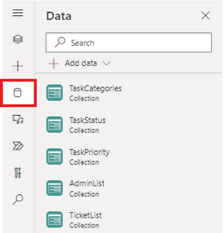
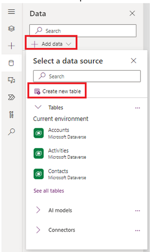
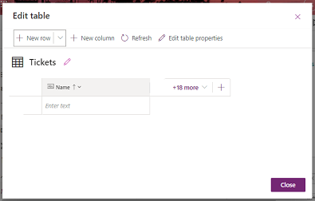
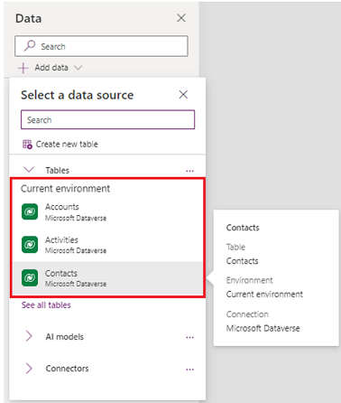
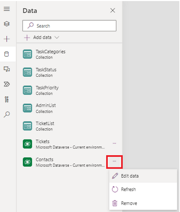
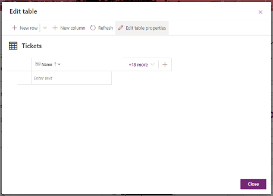
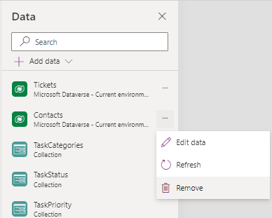

# Create and edit a table using the table designer

[This article is pre-release documentation and is subject to change.]

Create and edit a Dataverse tables in canvas apps using the table designer inside [Power Apps Studio](power-apps-studio.md). You can also work with the data that's in the table without leaving the app that you're working on.

> [!IMPORTANT]
> - This is a preview feature that is available for everyone to use.

## Create a table

1. Open a [new](data-platform-create-app.md) or an [existing](edit-app.md) app in Power Apps Studio.

2. In the app authoring menu, select **Data**.

   > [!div class="mx-imgBorder"]
   > 

3. On the **Data** pane, select **Add Data** &gt; **Create new table**.  
    
   > [!div class="mx-imgBorder"]
   > 

   > [!NOTE]
   > If the **Create new table** button is disabled then review the [**Required permissions and limitations**](create-edit-tables.md#required-permissions-and-limitations) section below.

4. On the **Create a table** dialog box, enter a name for the table.

   You can also expand the **Advanced settings** to update the plural name for the table. For example, a table name can be Ticket, and the plural table name can be Tickets.

   > [!div class="mx-imgBorder"]
   > 

5. When you're done, select **Create** to create the table.

   The table designer will open when the newly created table is ready for editing.

    > [!div class="mx-imgBorder"]
    > 

## Edit an existing table

Once a Dataverse table is created, you can start editing the table. You can also add existing Dataverse tables to your app and edit those tables using the table designer.

1. From the app authoring menu, select **Data**.

2. On the **Data** pane, select **Add data**.

3. In the **Select a data source** dialog box, select a table to add to your app from the list of existing Dataverse tables.

   > [!div class="mx-imgBorder"]
   > 

4. On the newly added table select, **More actions** &gt; **Edit data**.

   > [!div class="mx-imgBorder"]
   > 

5. The selected table is ready for editing in the table designer.

    > [!NOTE]
    > Some system tables may not be available for editing, or some editing actions may be disabled.

## Edit the table properties

When the table designer opens, select **Edit table properties**.

 > [!div class="mx-imgBorder"]
 > 

You can edit the following table properties.

| **Property**            | **Description**                                                                                   |
|-------------------------|---------------------------------------------------------------------------------------------------|
| **Display name**        | This is the singular name for the table that will be shown in the app. This can be changed later. |
| **Plural display name** | This is the plural name for the table that will be shown in the app. This can be changed later.   |
| **Description**         | Provide a meaningful description of the purpose of the table.                                     |

Select **Enable Attachments** to append notes and files to records for this table.

Select the **Primary column** tab if you want to change the **Display Name** or **Name** of the primary column. The primary column is used by lookup fields when establishing relationships with other tables.

Select **Advanced options** to display additional properties that are optional for a table.

| **Property** | **Description** |
|-------------------------|-------------------------|
| **Schema name** | By default, the schema name is automatically created for you based on the display name, but you can change it. The schema name can't contain spaces and includes the customization prefix for the Dataverse solution publisher. You can't change this after the table is saved. |
| **Type** | Select the type of table. Use standard for most tables. Activity tables are a special table that can only be owned by a user or team, but can't be owned by an organization. Virtual tables require the table be populated with data from an external source. |
| **Record ownership** | Switch the table type to Activity table to create tables that can manage tasks. The type of **Ownership** defines who can perform operations on a record. |
| **Choose a table image** | You can choose whether to display an image for the table. This image is displayed in Power Apps in some design areas. Notice that the image doesn't appear in apps using the table. To display images in apps, use the image column. More information: [Image columns](../data-platform/types-of-fields.md#image-columns) |
| **Color** | Set a color to be used for the table in model-driven apps. |
| **Apply duplicate detection rules** | If duplicate detection is enabled for your organization, enabling this allows you to create duplicate detection rules for this table. |
| **Track changes** | Enables data synchronization in a performant way by detecting what data has changed since the data was initially extracted or last synchronized. |
| **Provide custom help** | When selected, set a **Help URL** to control what page users will see when they select the help button in the application. Use this to provide guidance specific to your company processes for the table. |
| **Audit changes to its data** | When auditing is enabled for your organization, this allows for changes to table records to be captured over time. When you enable auditing for a table, auditing is also enabled on all its fields. You can select or clear fields that you want to enable auditing on. |
| **Leverage quick create form if available** | After you've created and published a Quick Create Form for this table, people will have the option to create a new record using the Create button in the navigation pane. More information: [Create and design model-driven app forms](../model-driven-apps/create-design-forms.md)  When this is enabled for a custom activity table, the custom activity will be visible in the group of activity entities when people use the **Create** button in the navigation pane. However, because activities don't support quick create forms, the main form will be used when the custom table icon is selected. |
| **Creating a new activity** | Associate activities to records for this table. |
| **Doing a mail merge** | App users can use this table with mail merge. |
| **Setting up SharePoint document management** | After other tasks have been performed to enable document management for your organization, enabling this feature allows for this table to participate in integration with SharePoint. |
| **Can have connections** | Use the connections feature to show how records for this table have connections to records of other tables that also have connections enabled. |
| **Can have a contact email** | Send emails using an email address stored in one of the fields for this table. If a **Single Line of Text** column with format set to email doesn't already exist for this table, a new one will be created when you enable sending email. |
| **Have an access team** | Create team templates for this table. |
| **Can be linked to feedback** | Let app users write feedback for any table record, or rate table records within a defined rating range. More information: [Configure a table for feedback/ratings](../data-platform/configure-entity-feedback.md) |
| **Appear in search results** | Enable so that table records can be included in search results when using an app. |
| **Can be taken offline** | Makes data in this table available while the Power Apps application isn't connected to a network. |
| **Can be added to a queue** | Use the table with queues. Queues improve routing and sharing of work by making records for this table available in a central place that everyone can access. |

## Add and edit columns

You can create and edit columns in the table editor. For more information, see [How to create and edit columns](../data-platform/create-edit-fields.md).

## Editing other table properties

For more advanced table editing scenarios, using the table hub is required. Some examples of these kinds of edits are table relationships, keys, and deleting the table. More information see, [Create and edit tables using Power Apps](../data-platform/create-edit-entities-portal.md)

## Add and edit data

The table designer for canvas apps allows you to add new rows to a Dataverse table or edit rows inside Power Apps Studio using the table designer. You can start typing directly into the grid or select, **New row**. For more information, see [Create your first table](/power-apps/teams/create-first-app.md#create-your-first-table)

## Remove a table

To remove a table from your app, select **More options** to the right of the table name then select, **Remove**.

> [!NOTE]
> When you remove a table, the table is removed and not deleted.

> [!div class="mx-imgBorder"]
> 

## Required permissions and limitations

- To create a table in Dataverse, the environment must have a Dataverse database provisioned. You must have system customizer or system administrator permissions within the environment where you'd like to build a table. If these conditions are not met, the **Create New Table** button is disabled.

- You can only create and edit tables in the current Dataverse environment. If you changed your Dataverse environment using the environment picker, then the **Create new table** and **Edit table** options is disabled.
