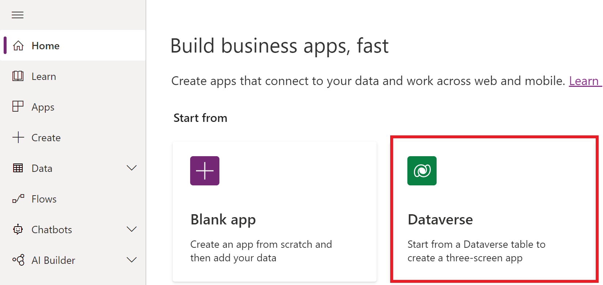

# Create a canvas app with data from Microsoft Dataverse

In Power Apps, create a canvas app based on a list of sample accounts in [Dataverse](../data-platform/data-platform-intro.md). In this app, you can browse all accounts, show details of a single account, and create, update, or delete an account.

If you're not signed up for Power Apps, [sign up for free](https://make.powerapps.com?utm_source=padocs&utm_medium=linkinadoc&utm_campaign=referralsfromdoc) before you start.

Watch this short video that shows you how to create a canvas app quickly using Dataverse tables.
> [!VIDEO https://www.microsoft.com/videoplayer/embed/RWIUJy]

## Prerequisites

To follow this quickstart, you must be assigned to the [Environment Maker](/power-platform/admin/database-security#predefined-security-roles) security role, and you must [switch to an environment](/power-platform/admin/working-with-environments) in which a database in Dataverse has been created, contains data, and allows updates. If no such environment exists and you have administrative privileges, you can [create an environment](/power-platform/admin/environments-administration#create-an-environment) that meets this requirement.

## Create an app

1. Sign in to [Power Apps](https://make.powerapps.com?utm_source=padocs&utm_medium=linkinadoc&utm_campaign=referralsfromdoc) and, if necessary, [switch environments](/power-platform/admin/working-with-environments).

1. Under **Start from data**, and select **Microsoft Dataverse**.

    

1. If this is you first time, you're prompted to create a connection to Microsoft Dataverse. Select **Create** this connection. Otherwise, under **Choose a table**, select **Accounts**, and then select **Connect**.

1. If the **Welcome to Power Apps Studio** dialog box appears, select **Skip**.

Your app opens to the browse screen, which shows a list of accounts in a control called a gallery. Near the top of the screen, a title bar shows icons for refreshing the data in the gallery, sorting the data in the gallery alphabetically, and adding data to the gallery. Under the title bar, a search box provides the option to filter the data in the gallery based on text that you type or paste. 

By default, the gallery shows an email address, a city, and an account name. As you'll see in [Next steps](data-platform-create-app.md#next-steps), you can customize the gallery to change how the data appears and even show other types of data.

## Save the app
You'll probably want to make more changes before you use this app or share it with others. As a best practice, save your work so far before you proceed.

1. Select **Settings**.

1. Set the app name to **AppGen**, change the background color to deep red, and change the icon to a checkmark.

1. Set the app name to **AppGen**, and select **Save**.

1. Close the settings dialog.

1. Near the left edge, select **Save as** and then, in the lower-right corner, select **Save**.

## Next steps

In this quickstart, you created an app to manage sample data about accounts in Dataverse. As a next step, customize the gallery and other elements of the default browse screen to better suit your needs.

> [!div class="nextstepaction"]
> [Customize a gallery](customize-layout-sharepoint.md).

[!INCLUDE[footer-include](../../includes/footer-banner.md)]