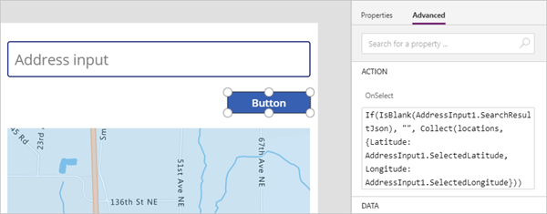
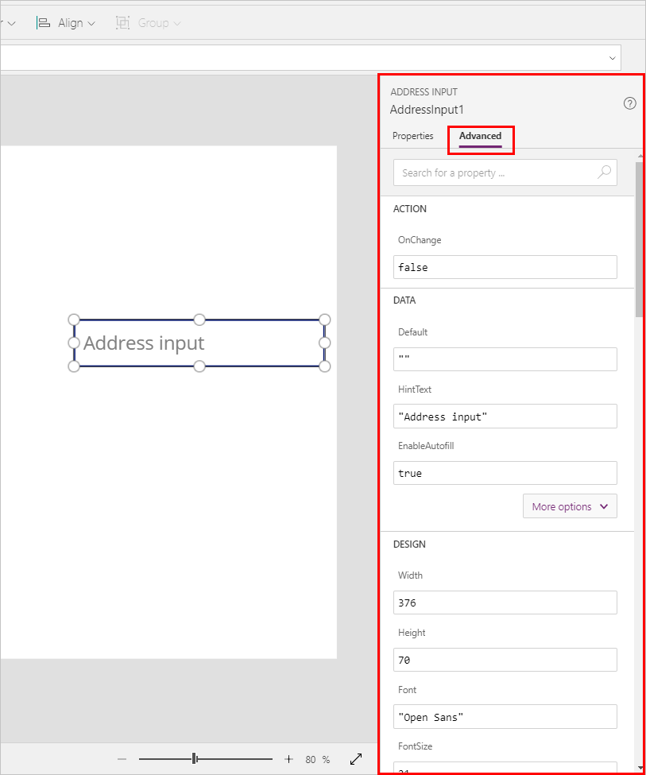

# Address input component 

Entering addresses can be frustrating and error-prone, particularly in mobile scenarios. 

The address input component lets you see dynamic address suggestions as you type. Using fuzzy matching logic, the component suggests multiple potential address matches that the user can select&mdash;making it quicker and easier to enter accurate addresses.

The component returns the address as structured data, allowing your application to extract information like city, street, municipality, and even latitude and longitude. The data is in a format friendly to many locales and international address formats.

To use the component, you need to [enable geospatial features for the environment](geospatial-overview.md#enable-the-geospatial-features-for-the-environment).

Make sure you also [review the prerequisites for using geospatial components](geospatial-overview.md#prerequisites).

## Use the component

Insert the component into your app as you normally would for any other control or component.

With an app open for editing in [Power Apps Studio](https://create.powerapps.com):

1. Open the **Insert** tab. 

2. Expand **Input**.

3. Select the component **Address input (preview)** to place it in the center of the app screen, or drag it to position it anywhere on the screen.

You can modify the component by using a number of [properties](#input-properties).

### Set a default search radius

By default, the component will search around the user's location (providing the user has consented for the app to access their location). However, you can refine the default search area to help narrow or change initial results when users input an address.

1. On the **Properties** pane, set the **Search within radius** switch to **On**.

1. Enter a longitude, latitude, and radius (in meters).

The component will start searching at the latitude and longitude, out to the distance specified in the radius field.

### Use the map component with the input address component

You can save addresses that a user inputs into the address component as a data collection. You can then retrieve these addresses and display them in [the map component](geospatial-component-map.md).

1. App the map component and the input address component to your app.
2. On the **Insert** menu, select **Button** and move it into your app.
3. Go to the **Advanced** tab on the **Properties** pane. Under **OnSelect**, enter the following:

    ```json
    If(IsBlank(AddressInput1.SearchResultJson), "", Collect(locations, {Latitude: AddressInput1.SelectedLatitude, Longitude: AddressInput1.SelectedLongitude}))
    ```

    This causes the button to save the current latitude and longitude to a collection named *locations*, as long as the search results are not blank

    

4. Select the map component, and go to the **Advanced** tab on the **Properties** pane.

5. Set the following properties:

    - **Items** as *locations*
    - **ItemLatitudes** as *locations.Latitude*
    - **ItemsLongitudes** as *locations.Longitude*

Each time a user selects the button, the result from the address input component will be added to the map as a new pin.

### Input properties

The following properties are on the component's **Address Input** pane on the **Properties** and **Advanced** tabs.



Some properties are only available on the **Advanced** tab, in the **More options** section.

| Property | Description | Type | Location |
| - | - | - | - |
| Search result limit | The number of suggested addresses the component displays. | Integer | Properties |
| Search within radius | Whether the component should suggest addresses within the user-defined **Radius** of the **Latitude** and **Longitude**. | Boolean | Properties |
| Latitude | The latitude of the center point used to geo-bias address suggestions. Requires **Search within radius** to be on. | Decimal from &ndash;180 through 180 | Properties |
| Longitude | The longitude of the center point used to geo-bias address suggestions. Requires **Search within radius** to be on. | Decimal from &ndash;180 through 180 | Properties |
| Radius | The radius, in meters, around **Latitude** and **Longitude** to constrain the address suggestions. Requires **Search within radius** to be on. | Decimal | Properties |
| Language | The language the address suggestions are returned in | String | Properties |
| Country set | Comma-separated list of countries to constrain the address suggestions to, in ISO 3166 alpha-2 country codes. For example, **US, FR, KW** | String | Properties |

### Output properties

The component outputs various properties when a user interacts with it inside an app. You can use these outputs in other components or to customize the experience. 

The following table lists the output properties available.

| Property | Description |
| -- | -- |
| UserInput | Text the user has typed in the input box. |
| SelectedLatitude | Latitude of the user-selected address in the input field. |
| SelectedLongitude | Longitude of the user-selected address in the input field. |
| SearchResultJson | The search result (based on the UserInput property), displayed as a string in JSON format. |
| FreeformAddress | Selected address from the list of suggested addresses. |
| LocalName | An address component which represents the name of a geographic area or locality that groups a number of addressable objects for addressing purposes, without being an administrative unit. |
| PostalCode | Postal code. |
| ExtendedPostalCode | Extended Postal Code. |
| CountryCode | Country code. |
| Country | Country. |
| CountryCodeISO3 | Country code in ISO alpha-3 format. |
| CountrySubdivisionName | Country subdivision name. |
| StreetName | Street name. |
| StreetNumber | Street number. |
| Municipality | Municipality. |
| MunicipalitySubdivision | Municipality subdivision. |
| CountryTertiarySubdivision | Country tertiary subdivision. |
| CountrySecondarySubdivision | Country secondary subdivision. |
| CountrySubdivision | Country subdivision. |


### Additional (common) properties

**[Default](./controls/properties-core.md)** – The initial value of a control before it's changed by the user.

**[Text](./controls/properties-core.md)** – Text that appears on a control or that the user types into a control.

**[BorderColor](./controls/properties-color-border.md)** – The color of a control's border.

**BorderRadius** – The radius of a control's border.

**[BorderStyle](./controls/properties-color-border.md)** – Whether a control's border is **Solid**, **Dashed**, **Dotted**, or **None**.

**[BorderThickness](./controls/properties-color-border.md)** – The thickness of a control's border.

**[Color](./controls/properties-color-border.md)** – The color of text in a control.

**[DisplayMode](./controls/properties-core.md)** – Whether the control allows user input (**Edit**), only displays data (**View**), or is disabled (**Disabled**).

**[DisabledBorderColor](./controls/properties-color-border.md)** – The color of a control's border if the control's **[DisplayMode](./controls/properties-core.md)** property is set to **Disabled**.

**[DisabledColor](./controls/properties-color-border.md)** – The color of text in a control if its **[DisplayMode](./controls/properties-core.md)** property is set to **Disabled**.

**[DisabledFill](./controls/properties-color-border.md)** – The background color of a control if its **[DisplayMode](./controls/properties-core.md)** property is set to **Disabled**.

**[Fill](./controls/properties-color-border.md)** – The background color of a control.

**[FocusedBorderColor](./controls/properties-color-border.md)** – The color of a control's border when the control is in focus.

**[FocusedBorderThickness](./controls/properties-color-border.md)** – The thickness of a control's border when the control is in focus.

**[Font](./controls/properties-text.md)** – The name of the family of fonts in which text appears.

**[FontWeight](./controls/properties-text.md)** – The weight of the text in a control: **Bold**, **Semibold**, **Normal**, or **Lighter**.

**[Height](./controls/properties-size-location.md)** – The distance between a control's top and bottom edges.

**Hint text** – Light-gray text that appears in an input-text control if it's empty.

**[HoverBorderColor](./controls/properties-color-border.md)** – The color of a control's border when the user keeps the mouse pointer on that control.

**[HoverColor](./controls/properties-color-border.md)** – The color of the text in a control when the user keeps the mouse pointer on it.

**[HoverFill](./controls/properties-color-border.md)** – The background color of a control when the user keeps the mouse pointer on it.

**[Italic](./controls/properties-text.md)** – Whether the text in a control is italic.

**[LineHeight](./controls/properties-text.md)** – The vertical distance between lines of text&mdash;for example, between items in a list.

**[OnChange](./controls/properties-core.md)** – How the app responds when the user changes the value of a control (for example, by adjusting a slider).

**[PaddingBottom](./controls/properties-size-location.md)** – The distance between text in a control and the bottom edge of that control.

**[PaddingLeft](./controls/properties-size-location.md)** – The distance between text in a control and the leftmost edge of that control.

**[PaddingRight](./controls/properties-size-location.md)** – The distance between text in a control and the rightmost edge of that control.

**[PaddingTop](./controls/properties-size-location.md)** – The distance between text in a control and the top edge of that control.

**[PressedBorderColor](./controls/properties-color-border.md)** – The color of a control's border when the user taps or clicks that control.

**[PressedColor](./controls/properties-color-border.md)** – The color of text in a control when the user taps or clicks that control.

**[PressedFill](./controls/properties-color-border.md)** – The background color of a control when the user taps or clicks that control.

**[Size](./controls/properties-text.md)** – The font size of the text that appears on a control.

**[Strikethrough](./controls/properties-text.md)** – Whether a line appears through the text that appears on a control.

**[TabIndex](./controls/properties-accessibility.md)** – Keyboard navigation order in relation to other controls.

**[Tooltip](./controls/properties-core.md)** – Explanatory text that appears when the user hovers over a control.

**[Underline](./controls/properties-text.md)** – Whether a line appears under the text that appears on a control.

**[Visible](./controls/properties-core.md)** – Whether a control appears or is hidden.

**[Width](./controls/properties-size-location.md)** – The distance between a control's leftmost and rightmost edges.

**[X](./controls/properties-size-location.md)** – The distance between the leftmost edge of a control and the leftmost edge of its parent container (or screen, if the control has no parent container).

**[Y](./controls/properties-size-location.md)** – The distance between the top edge of a control and the top edge of the parent container (or screen, if the control has no parent container).

## Other geospatial components

To visualize and interpret location data, use the **[Interactive map](geospatial-component-map.md)** component.
