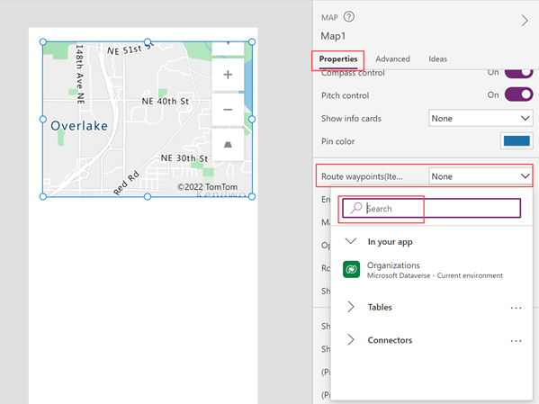
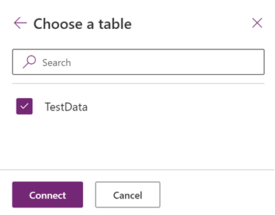

# Insert waypoint pins and draw routes between them (Preview)

[!INCLUDE[Preview disclaimer](../../includes/cc-beta-prerelease-disclaimer.md)]

You can load a table that contains a dataset of waypoints into the map component. The component will then place pins on the map for each waypoint, and it can draw routes between the waypoints.

The component has options to reorder the waypoints or rearrange the route to improve travel time or travel distance.

## Prerequisites
1. Create a Canvas app and make sure it meets the [Geospatial prerequisites](geospatial-overview.md#prerequisites). 
2. In your app, [insert a map](geospatial-component-map.md#use-the-component). 

## Add waypoint data from an Excel workbook

Your data source needs to contain a named table with the following columns that should then be mapped to the associated property in the component's **Advanced** pane.

While all properties are optional, either the address field or the longitude and latitude fields must be provided so that the waypoint locations can be found.

| Column description | Maps to property | Required
| -- | -- | --
| Label for the waypoint | RouteWaypointsLabels | Optional
| Longitude of the waypoint | RouteWaypointsLongitudes | Optional
| Latitude of the waypoint | RouteWaypointsLatitudes | Optional
| Address of the waypoint | RouteWaypointsAddresses | Optional

The following Excel table shows the required columns:

   

You can copy the following sample data to test this functionality:

| Name | Longitude | Latitude
| -- | -- | --
| Work | -122.156481 | 47.663448
| Meet up | -122.221037 | 47.57137
| Swimming | -122.144133 | 47.600373
| Tennis | -122.137265 | 47.616115

1. Copy and paste the table into a new data source. In this example, we are using an Excel workbook.  

1. Select one of the cells, and then on the Home tab in the ribbon, select **Format as Table** and choose any style, and then **OK**.

    

1. Select the table, and then go to the **Table Design** tab on the ribbon. Enter a name for the table under **Table Name:**, for example *TestData*.

    

1. Save the workbook.

1. Open or create a new app in Power Apps, and insert the map component.

1. On the **Properties** pane, select the **Route waypoints(Items)** field and then search for *excel* and select **Import from Excel**.

   

1. Locate the Excel workbook and then select **Open**. Select the table that contains the information, **TestData**, and then **Connect**.

    

1. On the **Properties** pane, go to the **Advanced** tab.

1. Set the following properties:

    - **RouteWaypointsLabels** as *"Name"*
    - **RouteWaypointsLatitudes** as *"Latitude"*
    - **RouteWaypointsLongitudes** as *"Longitude"*
    - **RouteWaypointsAddresses** as *"Address"* (Optional, if your dataset has an address field. Note that Address can be used in place of Latitude and Longitude in any rows where Latitude and Longitude are not set)

>[!Note]
>Address is interchangable with Latitude and Longitude. If Latitude and Longitude are provided, then Address will not be used. If only Address is provided, then Latitude and Longitude are not necessary.

1. The map component will now show each row in the table as a pin, labeled with its *Name* as defined in the Excel table, and numbered in the same order as the given dataset.

   

## Draw routes between the waypoints
To draw routes between the waypoints on the map and customize how the route is calculated, you need to configure the following settings:

1. Open the **Properties** pane with a map selected.

1. Switch this toggle to **On**:
    -  **Enable routing**
    
1. The component will now draw routes between the waypoints on the map.

   

>[!Note]
>By default, the component will reorder the middle waypoints to decrease travel time or travel distance. The first and last waypoints are considered the origin and destination and cannot be reordered. Waypoint order can be kept locked by switching the **Maintain waypoint order** toggle to **On**. 

### Properties

The following properties can configure how the route is calculated or:

| Property | Description | Type | Location
| - | - | -
| Enable routing | Whether routes are drawn between waypoints | Boolean | **Properties** (also in **Advanced** as **UseRouting**)
| Maintain waypoint order | If true, the component will reorder the waypoints to optimize the route based on the **Optimize route** setting. If false, the component will maintain the order that the waypoints have in the dataset, and the **Optimize route** setting will only affect the drawn route. | Boolean | **Properties** (also in **Advanced** as **RouteMaintainOrder**)
| Optimize route | Whether to optimize the route to decrease travel time or decrease travel distance. | Enumeration (None, Distance, Time) | **Properties** (also in **Advanced** as **RouteOptimization**)
| Route travel mode | Whether the route will be travelled by car or by truck. | Enumeration (Car, Truck) | **Properties** (also in **Advanced** as **RouteTravelMode**)

### Output Properties

The component outputs various properties when the route changes. These properties are all placed in the **RouteDirection** object. The **OnRouteDirectionChange** event is a good way to use the output in other components or to customize the experience.
    
| Property | Description | Type | Location
| - | - | -
| OnRouteDirectionChange | How the app responds when the route is changed | Event | Advanced
| RouteDirection | Object describing all of the routing outputs:<ul><li>LengthInMeters - Number representing the length in meters of the entire route</li><li>TravelTimeInSeconds - Number representing the expected travel time in seconds of the entire route</li><li>RouteGeoJSON - String containing the route in GeoJSON format</li><li>RouteLegs - Table describing properties of each leg of the route:<ul><li>Index - Number representing the route leg's order in the route</li><li>LengthInMeters - Number representing the length in meters of the route leg</li><li>TravelTimeInSeconds - Number representing the expected travel time in seconds of the route leg</li><li>StartLabel - String representing the label of the route leg's start point</li><li>StartLatitude - Number representing the latitude of the route leg's start point</li><li>StartLongitude - Number representing the longitude of the route leg's start point</li><li>StartAddress - String representing the address of the route leg's start point</li><li>EndLabel - String representing the label of the route leg's end point</li><li>EndLatitude - Number representing the latitude of the route leg's end point</li><li>EndLongitude - Number representing the longitude of the route leg's end point</li><li>EndAddress - String representing the address of the route leg's end point</li></ul><li>OrderedWaypoints - Table describing properties of each waypoint in the route after ordering the waypoints:<ul><li>Index - Number representing the waypoint's order in the route</li><li>Label - String representing the label of the waypoint</li><li>Latitude - Number representing the latitude of the waypoint</li><li>Longitude - Number representing the longitude of the waypoint</li><li>Address - String representing the address of the waypoint</li></ul></ul> | Object | Not applicable (output property only)
