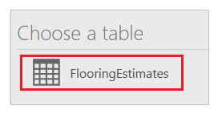

# Create a canvas app with data from an Excel file

In this topic, you'll create your first canvas app in Power Apps using data from an Excel table. You'll select an Excel file, create an app, and then run the app that you create. Every created app includes screens to browse records, show record details, and create or update records. By generating an app, you can quickly get a working app using Excel data, and then you can customize the app to better suit your needs. 

If you don't have a license for Power Apps, you can [sign up for free](../signup-for-powerapps.md).

## Create the app

Depending upon whether you have the [new look](intro-maker-portal.md#new-look) or [classic look](intro-maker-portal.md#classic) turned on, select the appropriate tab below to know more.

# [New look](#tab/home-new-look)

Upload an Excel file from your computer then, an app will be created for you.

To follow this topic exactly, download the [Flooring Estimates](https://download.microsoft.com/download/5/7/f/57fc6c55-6bb0-479b-a5c5-98fa08ee9efd/FlooringEstimates.xlsx) file in Excel, and save it in on your device.

1. Sign in to [Power Apps](https://make.powerapps.com?utm_source=padocs&utm_medium=linkinadoc&utm_campaign=referralsfromdoc).
2. From the home screen select, **Start with data** > **Upload an Excel file**.
3. Choose **Select from device** and browse to the location where you have the Excel file and upload it.
4. When the table is created, select a column name or the table name to edit the properties to suit your needs. 
5. Select **Row ownership** and choose how you want to manage row owership.
6. When you're done, select **Create app**.

# [Classic](#tab/home-classic)

The Excel file must be in a cloud-storage account, such as OneDrive, Google Drive, or Dropbox. This topic uses OneDrive for Business. The method in this article uses the latest version of the connector. To learn about different methods and how they affect the version of connector being used, see [Popular connectors - connect to Excel from Power Apps](connections/connection-excel.md).

To follow this topic exactly, download the [Flooring Estimates](https://download.microsoft.com/download/5/7/f/57fc6c55-6bb0-479b-a5c5-98fa08ee9efd/FlooringEstimates.xlsx) file in Excel, and save it in your [cloud storage account](connections/cloud-storage-blob-connections.md).

1. Sign in to [Power Apps](https://make.powerapps.com?utm_source=padocs&utm_medium=linkinadoc&utm_campaign=referralsfromdoc).

1. Under **Start from**, select **Excel**.

    :::image type="content" source="media/get-started-create-from-data/start-from-data.png" alt-text="Select Excel.":::

1. If you don't have a **OneDrive for Business** connection already, you'll be prompted to create. Select **Create** to create the connection.

1. Select **OneDrive for Business** connection.

    :::image type="content" source="media/get-started-create-from-data/odfb-tile.png" alt-text="Select OneDrive for Business connection.":::

1. Browse to the location where you have the Excel file&mdash;**FlooringEstimates.xlsx** in this example.

1. Under **Choose a table**, select the table&mdash;**FlooringEstimates** in this example, and then select **Connect**.

    
    

 ---

## Run the app

1. Select the play icon near the upper-right corner to  **Preview the app**.

1. Filter the list by typing one or more characters in the search box.

    For example, type or paste **Honey** to show the only record for which that string appears in the product's name, category, or overview.

1. Add a record:

    1. Select **New record**.

    1. Add whatever data you want, and then select the checkmark button to save your changes.
  
1. Edit a record:

    1. Select the record that you want to edit.

    1. Select the pencil icon.

    1. Update one or more fields, and then select the checkmark icon to save your changes.

        As an alternative, select the cancel icon to discard your changes.

1. Delete a record:

    1. Select the record that you want to delete.

    1. Select the trash icon.

        
## Next steps

Customize the default browse screen to better suit your needs. For example, you can sort and filter the list by product name only, not category or overview.

> [!div class="nextstepaction"]
> [Customize a default browse screen](customize-layout-sharepoint.md).

[!INCLUDE[footer-include](../../includes/footer-banner.md)]
