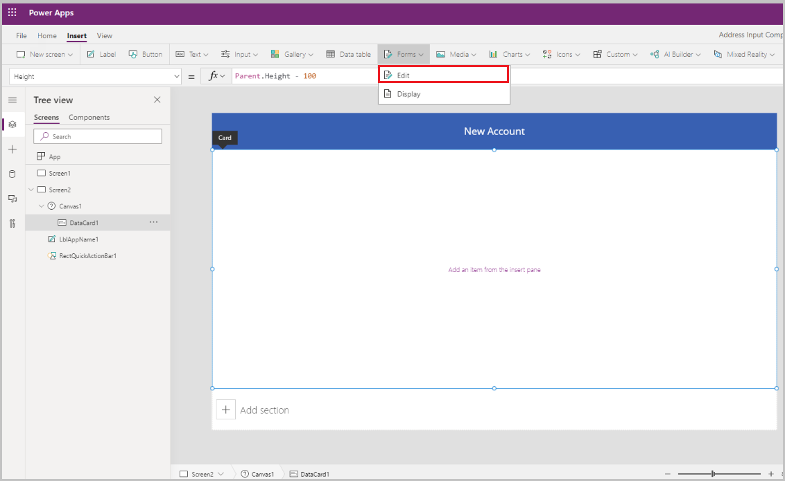
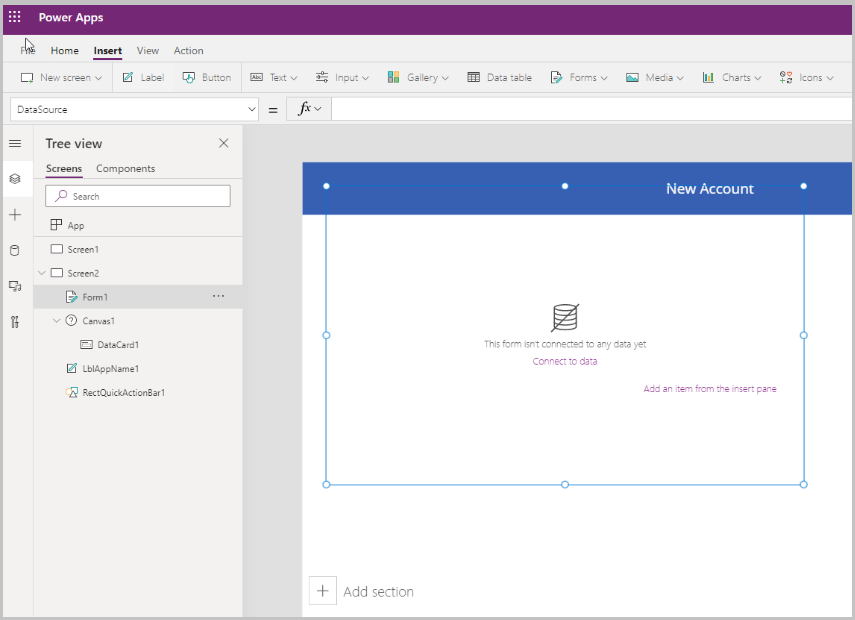
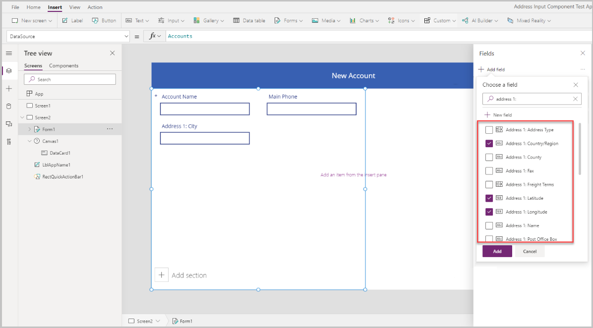
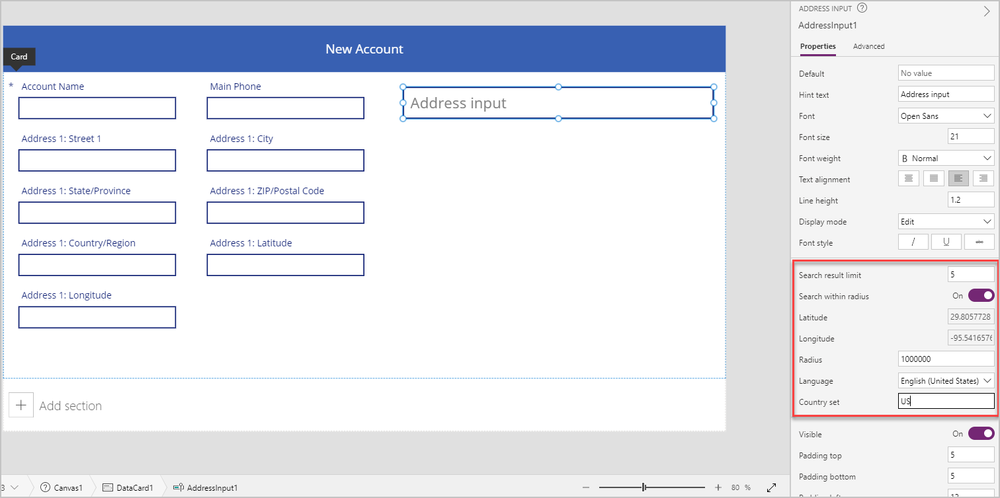
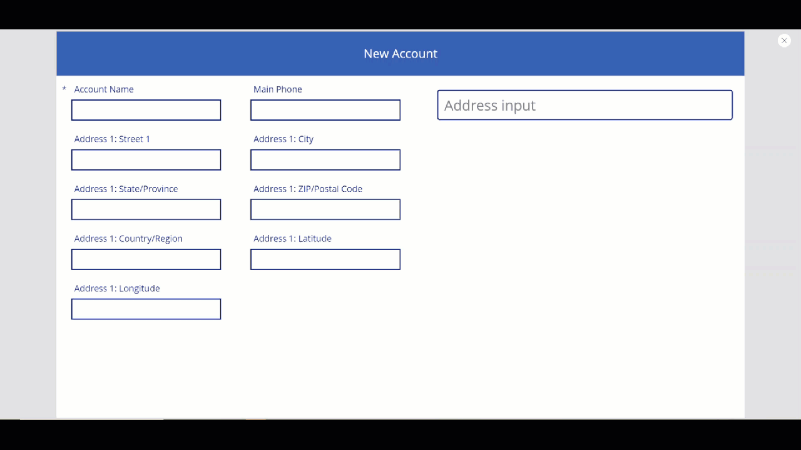
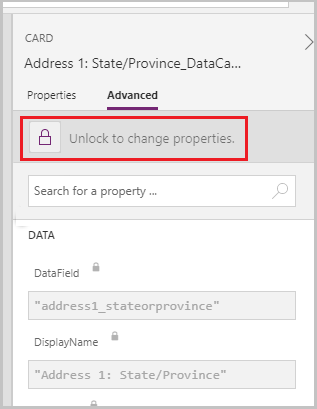
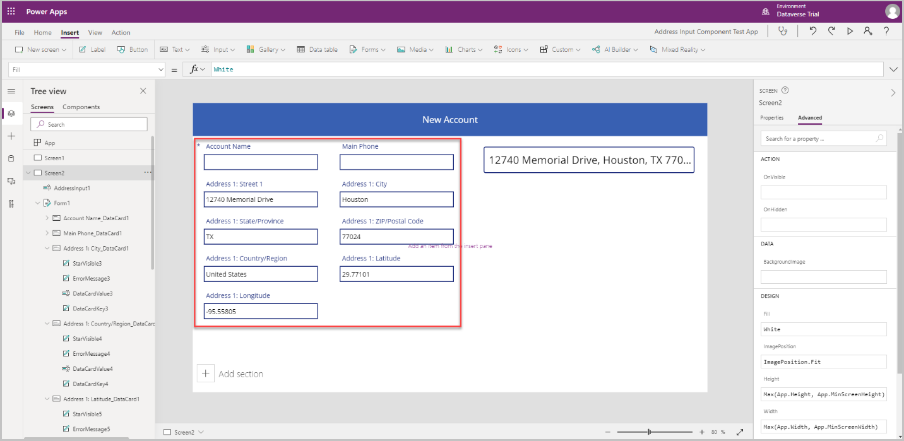
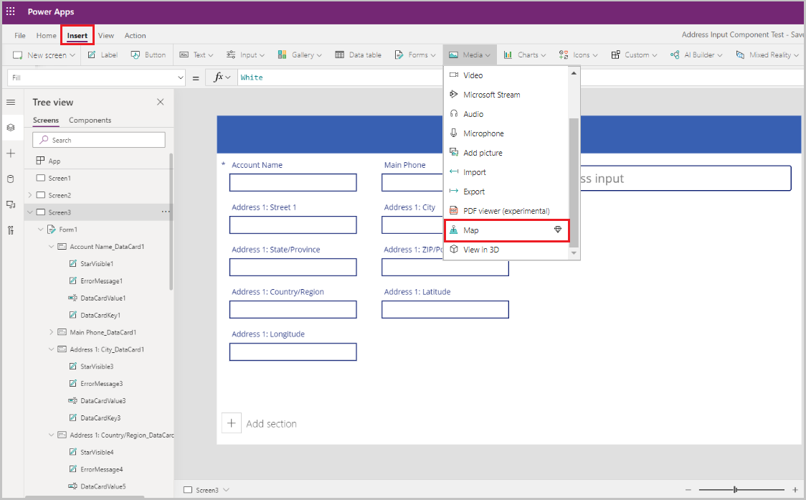
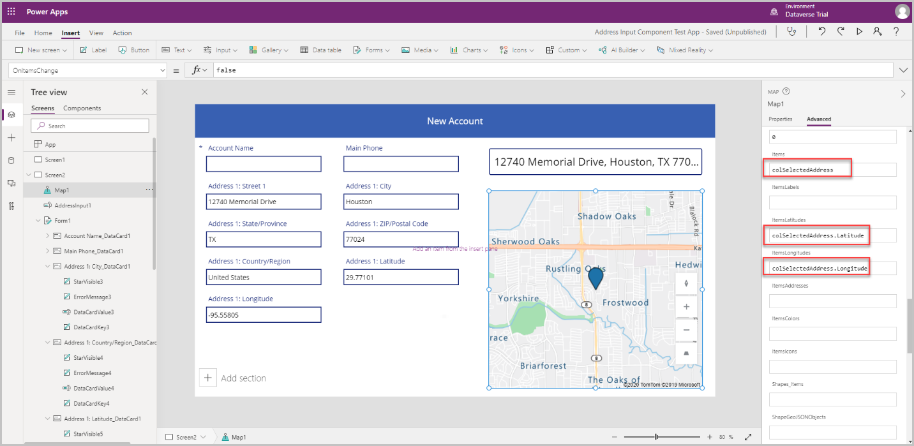
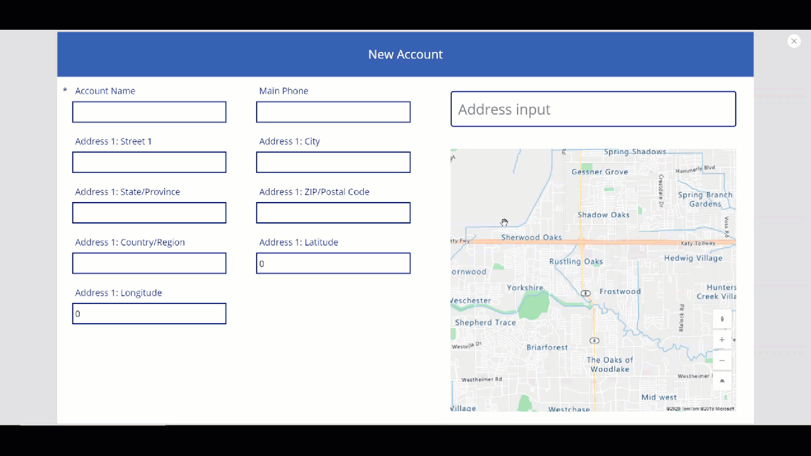

# Create an app with address input and map controls

There are many scenarios where users are expected to enter addresses in an app. Historically, there have been multiple fields capturing each element of an address where the user provides the street address, city and the postal code, and selects state. Entering addresses can be frustrating and error-prone, particularly in mobile scenarios.

The address input control presents the user with dynamic address suggestions as they type. Using fuzzy matching logic, the control suggests multiple potential address matches from which the user can select&mdash;making it quicker and easier to enter accurate addresses.

The control returns the address as structured data, allowing the application to extract information like city, street, municipality, and even latitude and longitude. The data is in a format friendly to many locales and international address formats.

To use the control, you need to enable the [Geospatial Services](/../geospatial-overview.md#enable-the-geospatial-features-for-the-environment) for the environment.

- Watch this video to learn how to use the address input control:
    > [!VIDEO https://www.microsoft.com/videoplayer/embed/RWLPQg]


- Watch this video to learn how to use the map control:
    > [!VIDEO https://www.microsoft.com/videoplayer/embed/RWLAkd]

In this article, we'll learn how to use the address input control in canvas apps.

## Prerequisites

To complete this lesson, you'll need a Power Apps environment with a Microsoft Dataverse database. If you don't have a license, you can sign up for the [Power Apps Developer Plan](../../developer-plan.md) or use a [Power Apps trial](../../signup-for-powerapps.md).

## Create a trial environment

An environment in Power Apps is a space to store, manage, and share your organization’s business data, apps, chatbots, and flows. It also serves as a container to separate apps that might have different roles, security requirements, or target audiences.

Each environment can have one Dataverse database.

To make sure that you have what you need to complete this lesson, we're going to create a new environment that includes a Dataverse database. This is a 30-day trial that will go away at the end of the 30 days, but you can upgrade it to a sandbox or production environment if you want to keep it.

We're going to create a trial environment that will include a Dataverse database, and the sample data used in this topic.

1. Go to [Power Platform admin center](https://admin.powerplatform.microsoft.com/) in a web browser.

1. Select **Environments**.

1. Select **New**.

1. Enter a name, for example "Dataverse Trial".

1. Select **Trial** for the environment type.

1. Toggle **Create Database** to **Yes**.

1. Select **Next**.

    :::image type="content" source="media/mobile-apps-address-map/create-a-trial-environment-1.png" alt-text="Create a trial environment.":::

1. Toggle **Deploy Sample Apps and Data** to **Yes**.

1. Select **Save**.

Your trial environment will now be created, including a Dataverse database and sample data in Dataverse tables.

## Enable the Geospatial Services for the environment

Before we can use the Geospatial Services in canvas apps, an admin must enable access to the features for the environment where we want to create the app.

To learn about how to enable **Geospatial services** in your environment, see [Enable the geospatial features for the environment](../geospatial-overview.md#enable-geospatial-features-for-the-environment).

## Build a canvas app

In this lesson, we'll start with creating an app and then, we'll create a header control to use within the app to standardize the look and feel of the header on different screens.

1. Create a [blank canvas app](../create-blank-app.md) in the environment you created [earlier](#create-a-trial-environment).

1. Select **Insert** > **New Screen** > **Scrollable** to add a new screen.

    :::image type="content" source="media/mobile-apps-address-map/build-a-canvas-app-5.png" alt-text="Select scrollable.":::

1. Change the label text to "New Account".

    

1. Select **Insert** > **Forms** > **Edit** to add a form to the screen.

    

    The form control gets added

    

1. Update the following properties of the form:

    | Property    | Value        |
    |-------------|--------------|
    | Data source  | Accounts     |
    | Columns     | 2            |
    | DefaultMode | `FormMode.New` |
    
1. Select **Edit** next to fields to add more fields to the form, and select the following address fields:

    - Address 1: Street 1
    - Address 1: City
    - Address 1: State
    - Address 1: Zip/Postal Code
    - Address 1: Country/Region
    - Address 1: Latitude
    - Address 1: Longitude

    

1. Adjust the order of the fields as shown below.

    

## Address Input control

In this section, we'll add the **Address Input** control to the app.

1. Select **Insert** > **Input** > **Address Input** to add the control to the screen.

    

1. Move the control to the top-right side of the screen.

    

### Configure properties for the Address Input control

In this section, we'll review and if necessary, set various properties of the address control. There are a few **Address Input** control-specific properties.



| **Property**         | **Description**                                                                                                                                                                                                                |
|----------------------|--------------------------------------------------------------------------------------------------------------------------------------------------------------------------------------------------------------------------------|
| Search result limit  | The number of suggested addresses the control displays. We've set it to 5 in this example, so not more than five addresses will show up in search.                                                                              |
| Search within radius | Whether the control should suggest addresses within the user-defined **Radius** of the **Latitude** and **Longitude**. We've set it to **Yes** in this example.                                                                      |
| Latitude             | The latitude of the center point used to geo-bias address suggestions. Requires **Search within radius** to be on. We've set it to the formula `Location.Latitude` in this example to return the latitude of the current location.   |
| Longitude            | The longitude of the center point used to geo-bias address suggestions. Requires **Search within radius** to be on. We've set it to the formula `Location.Longitude` in this example to return the latitude of the current location. |
| Radius               | The radius, in meters, around **Latitude** and **Longitude** to constrain the address suggestions. Requires **Search within radius** to be **On**. We've set it to 100000 in this example.                                           |
| Language             | The language the address suggestions are returned in. We've left it with the default - "English (United States)".                                                                                                              |
| Country set          | Comma-separated list of countries to constrain the address suggestions to, in ISO 3166 alpha-2 country codes. Examples: "US", "FR", "KW". We've it as US in this example.                                                     |

### Configure output properties for the Address Input control

The control outputs various properties when a user interacts with it inside an app. You can use these outputs in other controls or to customize the experience.

The following table lists the output properties available.

| **Property**                | **Description**                                                                                                                                                                         |
|-----------------------------|-----------------------------------------------------------------------------------------------------------------------------------------------------------------------------------------|
| UserInput                   | Text the user has typed in the input box.                                                                                                                                               |
| SelectedLatitude            | Latitude of the user-selected address in the input field.                                                                                                                               |
| SelectedLongitude           | Longitude of the user-selected address in the input field.                                                                                                                              |
| SearchResultJson            | The search result (based on the UserInput property), displayed as a string in JSON format.                                                                                              |
| FreeformAddress             | Selected address from the list of suggested addresses.                                                                                                                                  |
| LocalName                   | An address control that represents the name of a geographic area or locality that groups multiple addressable objects for addressing purposes, without being an administrative unit. |
| PostalCode                  | Postal code.                                                                                                                                                                            |
| ExtendedPostalCode          | Extended Postal Code.                                                                                                                                                                   |
| CountryCode                 | Country code.                                                                                                                                                                           |
| Country                     | Country.                                                                                                                                                                                |
| CountryCodeISO3             | Country code in ISO alpha-3 format.                                                                                                                                                     |
| CountrySubdivisionName      | Country subdivision name.                                                                                                                                                               |
| StreetName                  | Street name.                                                                                                                                                                            |
| StreetNumber                | Street number.                                                                                                                                                                          |
| Municipality                | Municipality.                                                                                                                                                                           |
| MunicipalitySubdivision     | Municipality subdivision.                                                                                                                                                               |
| CountryTertiarySubdivision  | Country tertiary subdivision.                                                                                                                                                           |
| CountrySecondarySubdivision | Country secondary subdivision.                                                                                                                                                          |
| CountrySubdivision          | Country subdivision.                                                                                                                                                                    |

When you run the app and start typing an address, it will show addresses that match the entered value and are located only within 100,000 meters of the current location. Also, notice that it doesn't show more than five address suggestions at a time when you start typing in the address.



Using the above control, we'll capture the address in the address fields of the form to create a new account. This step is useful so that the user doesn't have to type in each of the address elements individually.

We'll set the data card values to the appropriate property value from the address input.

> [!TIP]
> The default values of the data card might be locked. To unlock them, select the data card and go to the **Advanced properties**, and then select **Unlock to change properties**.



|Data card  |Value  |
|---------|---------|
|Address 1: Street 1     |  `AddressInput1.StreetNumber & " " & AddressInput1.StreetName`       |
|Address 1: City     |   `AddressInput1.Municipality`      |
|Address 1: State/Province     |   `AddressInput1.CountrySubdivision`      |
|Address 1: Zip/Postal Code     |   `AddressInput1.PostalCode`      |
|Address 1: Country/Region Datacard     |   `AddressInput1.Country`      |
|Address 1: Latitude     |   `AddressInput1.SelectedLatitude`      |
|Address 1: Longitude     |   `AddressInput1.SelectedLongitude`      |

Example for **Address 1: Street 1** data card:


The form gets populated with all the address fields when an address is selected in the **Address Input** control.



## Map control

In this section, we'll see how to add the **Map** control on the app to show the selected location on the map.

1. Before adding the **Map** control, we need to create a collection to capture the address from the address input – this collection will be used as the data source for the map.

    On the **OnAddressSelect** property of the **Address Input** control, enter the following formula to create a collection that captures the address data.

    ```powerapps-dot   
    ClearCollect(
        colSelectedAddress,
        {
            Street: AddressInput1.StreetNumber & " " & AddressInput1.StreetName,
            City: AddressInput1.Municipality,
            State: AddressInput1.CountrySubdivision,
            Zip: AddressInput1.PostalCode,
            Country: AddressInput1.Country,
            Latitude: AddressInput1.SelectedLatitude,
            Longitude: AddressInput1.SelectedLongitude
        }
    )
    ```

    

1. Select an area outside of the **Address Input** control, and select **Insert** > **Media** > **Map** to add the map control to the screen.

    

1. Select the collection as the data source.

    

1. Move the map below the address input section.

    

### Configure properties for the Map control

In this section, we'll review and if necessary, set various properties of the map control.

The following table lists the properties available.

| **Property**                            | **Description**                                                                                                                                                                                                                                       |
|-----------------------------------------|-------------------------------------------------------------------------------------------------------------------------------------------------------------------------------------------------------------------------------------------------------|
| Data source(Items)                      | Data source (table) that lists a predefined set of longitudes and latitudes to display as map pin on the map when it's loaded. Map each of the columns in your data by using the *ItemAddresses*, *ItemLongitudes*, *ItemLatitudes*, and *ItemLabels*. |
| Use default location                    | Whether the map initializes at a default location set by the user.                                                                                                                                                                                    |
| Default longitude                       | Longitude the map would go to when it's loaded if **Use default location** is enabled.                                                                                                                                                                    |
| Default latitude                        | Latitude the map would go to when it's loaded if **Use default location** is enabled.                                                                                                                                                                     |
| Default zoom level                      | Zoom level the map would be set to when it's loaded if **Use default location** is enabled.                                                                                                                                                               |
| Show current location                   | Whether the map should display the current location of the user.                                                                                                                                                                                      |
| Current location latitude               | The latitude of the current location of the user if **Show Current Location** is enabled.                                                                                                                                                                 |
| Current location longitude              | The longitude of the current location of the user if **Show Current Location** is enabled.                                                                                                                                                                |
| Satellite view                          | Whether the style of the map is a satellite view or a road view.                                                                                                                                                                                      |
| Cluster pins                            | Whether the map pins are clustered.                                                                                                                                                                                                                   |
| Zoom control                            | Whether the zoom control appears on the map.                                                                                                                                                                                                        |
| Compass control                         | Whether the compass control appears on the map.                                                                                                                                                                                                     |
| Pitch control                           | Whether the pitch control appears on the map.                                                                                                                                                                                                       |
| Pin color                               | The color of the pins.                                                                                                                                                                                                                                |
| ItemsLabels                             | A column in Items with the strings you want to use as labels for the pins.                                                                                                                                                                            |
| ItemsAddresses                          | A column in Items with the strings that represent the location of the pins.                                                                                                                                                                           |
| ItemsLongitudes                         | Name of the column in the table in your data source with floating-point numbers that represent the longitude position of the pins.                                                                                                                    |
| ItemsLatitudes                          | Name of the column in the table in your data source with floating-point numbers that represent the latitude position of the pins.                                                                                                                     |
| ItemsColors                             | Color of the pins.                                                                                                                                                                                                                                     |
| ItemsIcons                              | Icon of the pins.                                                                                                                                                                                                                                      |
| Items                                   | Name of the table in your data source that contains all the records that you want to plot in the map by using pins. Each row must have an entry for the label, longitude, and latitude for each row.                                                  |
| OnMapClick                              | How the map responds when any location is selected.                                                                                                                                                                                                    |
| OnSelect                                | How the app responds when a map pin is selected.                                                                                                                                                                                                      |
| OnLoad                                  | How the app responds when the map finishes loading.                                                                                                                                                                                                   |
| OnItemsChange                           | How the app responds when the map pins change.                                                                                                                                                                                                        |
| Show info cards                         | Whether the informational cards appear on the pins of the map.                                                                                                                                                                                            |
| Show shapes                             | Whether the shapes in **Shapes_Items** appear on the map.                                                                                                                                                                                                 |
| Show shape labels                       | Whether the labels appear on the shapes of the map.                                                                                                                                                                                                   |
| Enable shape drawing                    | Whether the drawing tools control appears on the map.                                                                                                                                                                                               |
| Enable shape deleting and label editing | Whether shapes can be deleted and their labels can be edited on the map.                                                                                                                                                                              |
| Shapes_Items                            | Name of the table in your data source that contains all the records with the GeoJSON objects that you want to show in the map as shapes.                                                                                                                  |
| ShapeGeoJSONObjects                     | Name of the column in the table in your data source with strings that represent the GeoJSON objects of the shapes.                                                                                                                                    |
| ShapeLabels                             | A column in **Shapes_Items** with the strings you want to use as labels for the shapes.                                                                                                                                                                   |
| ShapeColors                             | Color of the shapes.                                                                                                                                                                                                                                  |
| OnShapeSelected                         | How the app responds when a shape on the map is selected.                                                                                                                                                                                             |
| OnShapeCreated                          | How the app responds when a shape on the map is created.                                                                                                                                                                                              |
| OnShapeEdited                           | How the app responds when a shape on the map is edited.                                                                                                                                                                                               |
| OnShapeDeleted                          | How the app responds when a shape on the map is deleted.                                                                                                                                                                                              |

### Configure output properties for the Map control

The Map control outputs various properties when a user interacts with it inside an app. You can use these outputs in other controls or to customize the experience.

The following table lists the output properties available.

| **Property**         | **Description**                                                                                                                                                                               |
|----------------------|-----------------------------------------------------------------------------------------------------------------------------------------------------------------------------------------------|
| CenterLocation       | Center location of the map as either `.Latitude` or `.Longitude`. The output will be an integer. For example, calling `Map1.CenterLocation.Latitude` will output a single integer such as "47.60357". |
| Selected             | The selected pin on the map.                                                                                                                                                                  |
| SelectedItems        | The selected pin or pins of the selected cluster on the map.                                                                                                                                  |
| GeocodedItems        | The geo-coded locations of the pins on the map.                                                                                                                                                |
| ClickedLocation      | The last clicked location on the map as either `.Latitude` or `.Longitude`.                                                                                                                       |
| Shapes_Selected      | The record of the selected shape from **Shapes_Items**.                                                                                                                                       |
| Shapes_SelectedItems | The records of the selected overlapping shapes from **Shapes_Items**.                                                                                                                         |
| SelectedShape        | The selected shape on the map with `.Perimeter` and `.Area`.                                                                                                                                      |
| DeletedShape         | The last deleted shape on the map with `.Perimeter` and `.Area`.                                                                                                                                |
| GeoJSON              | The list of shapes on the map in Feature Collection GeoJSON format.                                                                                                                           |

To drop a pin on the address entered in the address input, we'll use the collection we created on the **OnAddressSelect** property and use that in the map control.

| Property       | Value                        |
|----------------|------------------------------|
| Items          | `colSelectedAddress`           |
| ItemsLatitudes | `colSelectedAddress.Latitude`  |
| ItemsLongitude | `colSelectedAddress.Longitude` |



Some of the properties of the pin can be customized per location pin are explained below:

1. **ItemsColors** - To update the color of the pin to a different color for each location, add a column to the collection **Color: Red**, and use that in the **ItemsColors** data property of the **Map** control.

1. **ItemsLabels** - To update the label of the pin to a different label showing the address for each location, add a column to the collection **Label:AddressInput1.FreeformAddress**, and use that in the **ItemsLabels** data property of the **Map** control.

1. **ItemsIcons** - To change the icon of the pin for each location, add a column to the collection and use that in the **ItemsIcons** data property of the **Map** control. In this example, we'll add a triangle icon with the formula as `Icon: triangle`.

    > [!TIP]
    > For the complete list of icons, go to [List of image templates](/azure/azure-maps/how-to-use-image-templates-web-sdk#list-of-image-templates).

    ```powerapps-dot
    ClearCollect(
        colSelectedAddress,
        {
            Street: AddressInput1.StreetNumber & " " & AddressInput1.StreetName,
            City: AddressInput1.Municipality,
            State: AddressInput1.CountrySubdivision,
            Zip: AddressInput1.PostalCode,
            Country: AddressInput1.Country,
            Latitude: AddressInput1.SelectedLatitude,
            Longitude: AddressInput1.SelectedLongitude,
            Label: AddressInput1.FreeformAddress,
            Color: Red,
            Icon: Triangle
        }
    );
    ```

After adding these to the collection, go to the **Advanced** tab of the **Map** control, and update the **ItemsColors**, **ItemsLabels** and **ItemsIcons** properties.


Run the app in preview mode to test. The map shows the location selected in the address input with a triangle icon and the address shows up as a label on the map.



### See also

[Interactive map control](../geospatial-component-map.md)
