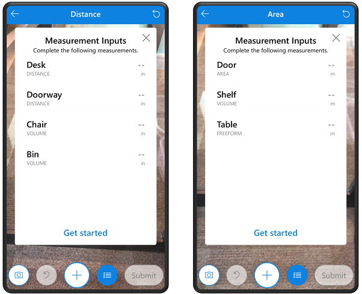
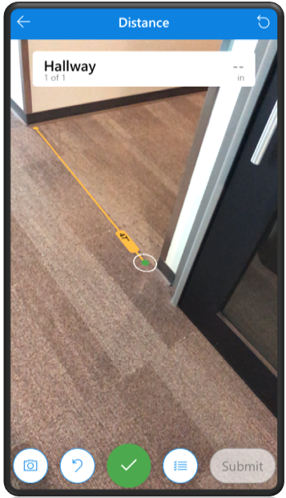
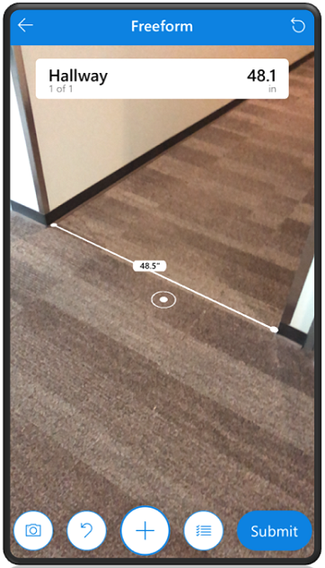
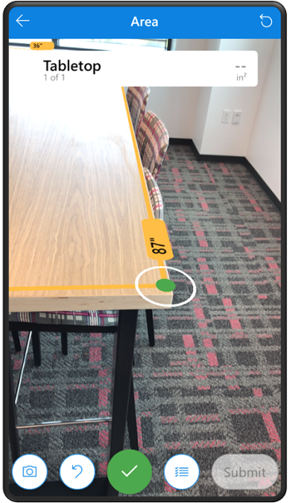
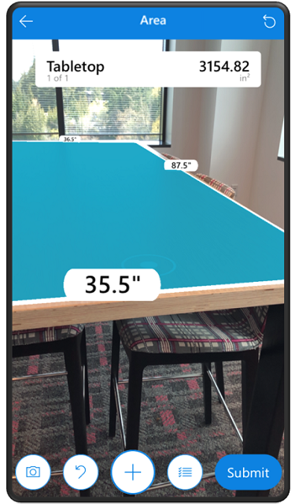
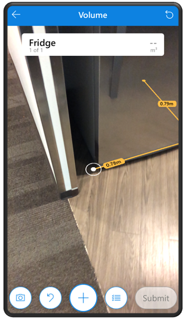
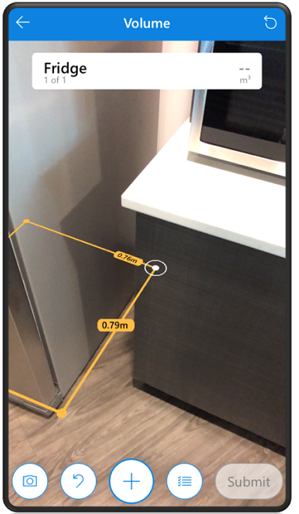
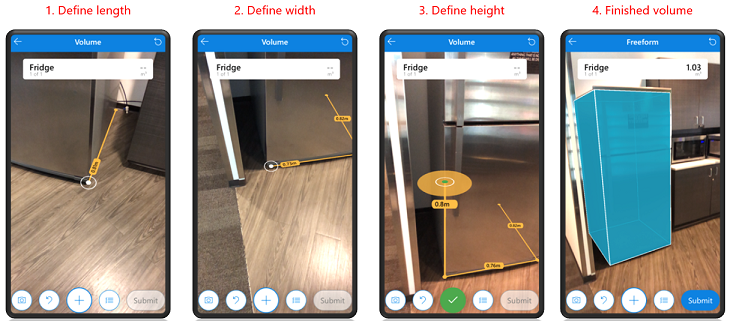
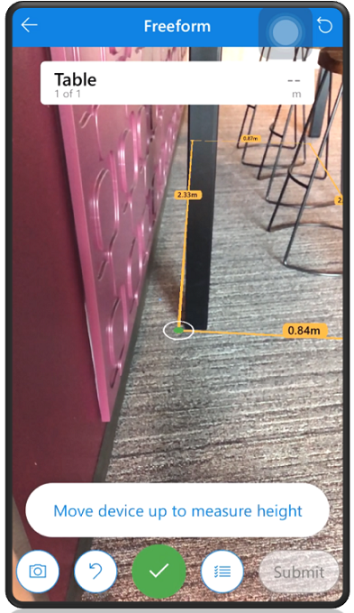

# Measure your space in mixed reality

Measure the distance, area, and volume of your physical space using your device camera.

To use the measurement feature, your app maker needs to enable the [Measure in MR](mixed-reality-component-measure-distance.md) control for your canvas app.

   > [!div class="mx-imgBorder"]
   > 

Legend

1. **Camera**: Take a picture of your current view. The picture can be used by your 
canvas app but isn't viewable when you're in the mixed reality experience.
2. **Undo**: Delete the last measurement and take the measurement again.
3. **Add**: TBD
4. **List**: Opens a list with details of the items you have measured. 
5. **Submit**: When you're done taking a measurement, use the Submit button to close the mixed reality experience and send your measurement to your canvas app. The button is grayed out if there's no measurements or when you're in the process of taking measurements. 
6. **List**: Opens a list with details of the items you have measured. 
7. **Reset**: Removes the current 3D object so you can add a new object.
8. **Exit**: Leave the mixed reality experience and return to your canvas app.

## Prerequisites

Before you can start taking measurements, follow these steps to enter basic information about your space.

1. Open your canvas app and select the **Measure in MR** button.
2. At the top select the measurement list or select the list button.
 
   > [!div class="mx-imgBorder"]
   > 

3. On **the Measurement Inputs** screen, enter the required measurements such as wall distance and desk area.
   
   > [!div class="mx-imgBorder"]
   > 

4. When you're done, select the close button.

## Take a measurement

1. Open your canvas app and select the **Measure in MR** button.

2. Select the camera button and then follow the instructions on your screen.

3. Keep moving your device until it vibrates, and white dots appears. The white dot with a circle is the starting point of your measurement.

4. Select  to start a new measurement. Then follow these steps depending on the type of area that you're measuring:

   - **Distance**
     1. Select  and then slowly move the dot to where you want the measurement to end. 
     2. Select the checkmark button to finish the measurement. 
    
        > [!div class="mx-imgBorder"]
        > 
       
      3. Select **Submit** to save the final measurement.
         > [!div class="mx-imgBorder"]
         > 
   
   - **Area**
      1. Select  to add points and outline the area that you want to measure.
         > [!div class="mx-imgBorder"]
         > 

      2. Connect the last dot to the first dot to complete the measurement. When you're done, select the checkmark button.
         > [!div class="mx-imgBorder"]
         > 

      3. Select **Submit** to save the final measurement.
         > [!div class="mx-imgBorder"]
         > 

    - **Volume** 
      1. Select  to add points and outline the base of the volume that you want to measure.
         > [!div class="mx-imgBorder"]
         > 
      
      2. Connect the last dot to the first dot to complete the measurement. 
         > [!div class="mx-imgBorder"]
         > 

      3. Move your device upwards and select the desired height and then select the checkmark button. 
         > [!div class="mx-imgBorder"]
         >  
        
       4. Select **Submit** to save the final measurement.
          > [!div class="mx-imgBorder"]
          >   
     
          > [!NOTE]
          > If your app has **Box Draw** enabled then you can only measure volume by a rectangular prism. To take this measurement select four points; three to draw the base and one for the height.  
            

    - **Freeform** 
       1. Select  to measure distance, multi-segment, area, and volume all together. 
       2. Connect the last dot to the first dot to complete the measurement.
          > [!div class="mx-imgBorder"]
          >   
     
      4. To complete the measurement, keep the dot at the last point you added and then select **Submit**.
          > [!div class="mx-imgBorder"]
          >   
                 
          The same rectangle can be part of a volume measurement. Instead of selecting the last point you added, rotate your phone upwards to select a height and then select **Submit**.
           > [!div class="mx-imgBorder"]
           > 

          > [!NOTE]
          > If your app has **Box Draw** enabled, then you can only measure in freeform in a rectangular area and volume.

## Keeping track of your measurements

When you take measurements, you can always go back and review your measurements.

1. At the top select the measurement list or select the list button.
   
   > [!div class="mx-imgBorder"]
   > 

2. Select the arrow next to measurement to view more details.
   
   > [!div class="mx-imgBorder"]
   > 

3. On the **Measurement Inputs** screen, you can do the following:

    - Select a measurement to remeasure it or remove the measurement from the list.

    - Select the delete button to clear a measurement.

    - Select the close button or list button to continue measuring where you left off.
     > [!div class="mx-imgBorder"]
     > 

