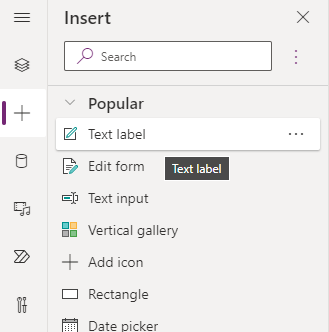
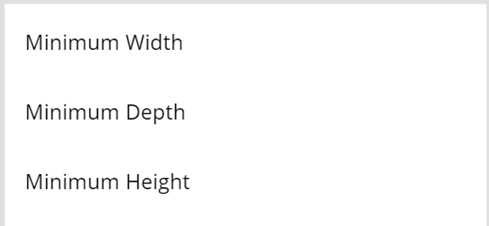
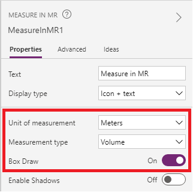
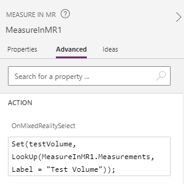
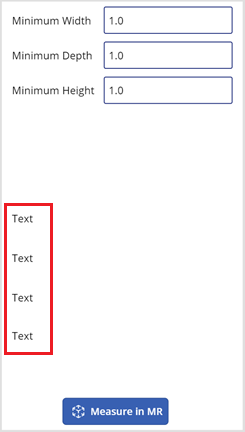

# Test for object fit using Measure in MR
Using the [Measure in MR](mixed-reality-component-measure-distance.md) control you can create a spatial test filter to validate whether an object with known width, depth, and height dimensions will fit in a space. This topic will guide you through creating a test app that you can use to validate fit using the **Measure in MR** control, including: 
- Inserting the **Measure In MR** component into an application to measure volumes
- Setting up **Expected Measurements (Items)** to help users maintain context in the MR experience
- Creating a spatial test filter using the **Bounding Width**, **Bounding Width**, and **Height** properties from the measurement outputs

## Prerequisites

- Create a blank canvas app ready for editing.
  - Go to the [Power Apps Studio](https://create.powerapps.com) and, under the **Start with a blank canvas or a template** section, select **Phone layout** on the **Blank app** tile.

> [!TIP]
> The MR components work best in well-lit environments with flat-textured surfaces. When establishing tracking, point the device at the surface you would like to track and slowly pan the device from right to left in broad arm motions. If tracking fails, exit and enter the MR view to reset the tracking and try again.
>
> LIDAR-enabled devices will also result in better tracking.

## Set up minimum dimensions input fields

First, we’ll set up the dimensions to validate for fit.

1. Open the **Insert** tab, and insert three **Text labels** into the application.

2. Change their **Text** properties to `"Minimum Width"`, `"Minimum Depth"`, and `"Minimum Height"` respectively.

3. Open the **Insert** tab again.
4. Expand **Input** and insert 3 **Text Input Fields**, and position them next to the three labels inserted above.
5. In the **Properties** pane for each Text Input field rename them to `minWidth`, `minDepth`, and `minHeight` respectively.
6. Set the **Format** to **Number** and set the **Default** value `1.0` for each Text Input field.


## Insert and bind the Measure in MR component

Next, we’ll set up the Measure in MR component to allow users to capture measurements in MR, and bind the output value to apply to the filter.

1. Open the **Insert** tab.
2. Expand **Mixed Reality**.
3. Select the component **Measure in MR** and place it at the bottom of the application.

4. Select the component by clicking on it and open the **Properties** Panel.
5. Set **Measurement Type** to **Volume** from the drop down menu.
6. Set **Units of Measurement** to either **Feet** or **Meters**.

7. Under the **Advanced** pane or the **Formula Bar** at the top of the screen find the Items property and set it to: `["Test Volume"]`
8. Also under the **Advanced** pane or the **Formula Bar** at the top of the screen find the **ItemsLabels** property and set it to: `"Value"`.


9. Finally, in the **Advanced** pane set the OnMixedRealitySelect property to: `Set(testVolume, LookUp(MeasureInMR1.Measurements, Label = "Test Volume"))`;


## Perform fit testand display result
1. Open the **Insert** tab, and insert 4 more **Text labels**

2. Set the first label’s **Text** property to:
```
If(IsBlankOrError(testVolume), "No Measurement captured",
    If(testVolume.Height >= Value(minHeight.Text) &&
        ((testVolume.BoundingWidth >= Value(minWidth.Text) && testVolume.BoundingDepth >= Value(minDepth.Text)) ||
        (testVolume.BoundingWidth >= Value(minDepth.Text) && testVolume.BoundingDepth >= Value(minWidth.Text))),
    "Fit Test Succeeded", "Fit Test Failed"))
```

3. Set the text property for the third label to: `Concatenate("Bounding Width: ", Text(testVolume.BoundingWidth))`
4. Set the text property for the fourth label to: `Concatenate("Bounding Depth: ", Text(testVolume.BoundingDepth))`
5. Set the text property for the fifth label to: `Concatenate("Bounding Height: ", Text(testVolume.Height))`


Now, enter the preview mode and click on the MeasureInMR button, and you should see the labels above get populated with data. You can test that the binding works as expected by changing values in the three text input fields above to verify that the filter is working. The values for **Bounding Width** and ***Bounding Depth** should be interchangeable and may be swapped when performing the test. After saving and publishing the application you can open it on a Mixed Reality enabled device to test whether an object with the typed in dimensions will fit within the bounds of any measurement captured.

This sample application only tests for a single set of user specified dimensions, but this could be expanded to work as a filter for a data collection by adapting the formula to a **Filter** predicate. For example, lets say our app contains a data collection named Products which has three columns Width, Depth, and Height corresponding to each product's dimensions. To filter the collection to only those that would fit within a measured volume we can apply the following formula:
```
If(IsBlankOrError(testVolume), Products,
    Filter(Products, testVolume.Height >= Height &&
        ((testVolume.BoundingWidth >= Width && testVolume.BoundingDepth >= Depth) ||
        (testVolume.BoundingWidth >= Depth && testVolume.BoundingDepth >= Width));
```

> [!NOTE]
> The **BoundingWidth**, and **BoundingDepth** properties represent the smallest possible rectangular prism that can fully encapsulate a measurement object. For irregularly shaped measurements it is possible that this will be an overestimate of the enclosed region, so this spatial filtering should be used as an estimate to help validate or narrow down results.

## Other mixed-reality controls

- View 3D content with the **[View in 3D](mixed-reality-component-view-3d.md)** component.
- Measure distance, area, and volume with the **[Measure in mixed reality](mixed-reality-component-measure-distance.md)** component.
- Create and view predefined 3D shapes with the **[View shape in mixed reality](mixed-reality-component-view-shape.md)** component


[!INCLUDE[footer-include](../../includes/footer-banner.md)]
