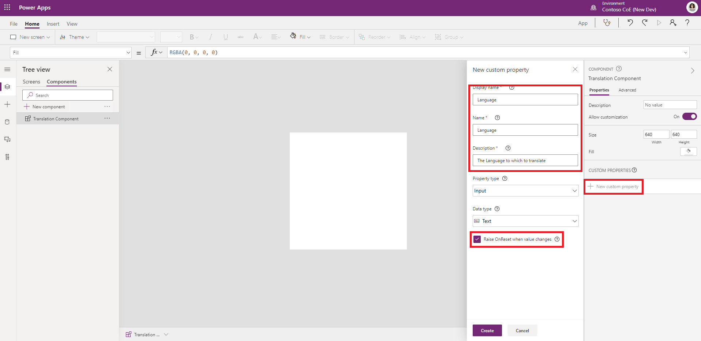
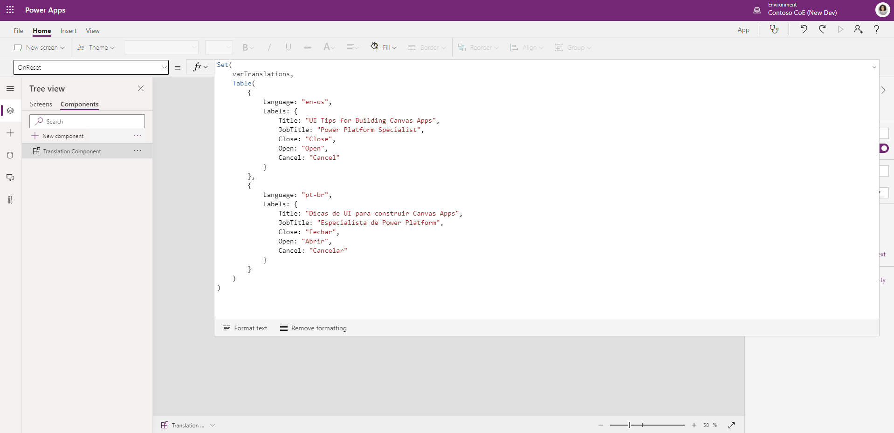

# Build a multi-language app
> [!IMPORTANT] This approach uses a feature of canvas apps that is still in public preview. For more information, see [Create a component for canvas apps](https://docs.microsoft.com/en-us/powerapps/maker/canvas-apps/create-component)

Build a multi-language canvas app by leveraging canvas app components and translations based on a language selected by the user or based on the user's localized language. In this article we'll describe an approach to creating multi-language apps that makers can use to provide their users with a localized experience. The approach uses canvas app components to make translations available across the entire app using a uniform formula syntax. 

## Create the Translation Component

In your app create a new **Canvas Component** using the canvas editor. Give the component a name such as “Translation Component”

Create 2 custom properties as follow:

1. **Language**: An input property of Data type Text that will receive the current LCID (Locale ID) of the logged in user. 
   
   - Select the option “Raise OnReset when value changes”, since this will call the formula on the OnReset event of the component that we will write later.

   

1. **Labels**: An output property of type Table that will expose the translated labels based on the input LCID property.

   

Once 2 properties are created, create a Table that will be the dictionary of all translations. To do this, declare a Table variable on the **OnReset** event of the component as follows

`Set(
    varTranslations,
    Table(
        {
            Language: "en-us",
            Labels: {
                Title: "UI Tips for Building Canvas Apps",
                JobTitle: "Power Platform Specialist",
                Close: "Close",
                Open: "Open",
                Cancel: "Cancel"
            }
        },
        {
            Language: "pt-br",
            Labels: {
                Title: "Dicas de UI para construir Canvas Apps",
                JobTitle: "Especialista de Power Platform",
                Close: "Fechar",
                Open: "Abrir",
                Cancel: "Cancelar"
            }
        }
    )
)`

The table should have an entry for each language that your app supports and each entry will have a **Labels** property that will contain the translated content of all possible buttons, inputs and labels in your app.

Now change the formula of the output property **Labels** as follows:

> [!NOTE] The formula above will find the right translation entry based on the input **Language**. In the case where the language was not set, the formula will use the current logged in user's language as the filter, hence the usage of [Coalesce](https://docs.microsoft.com/en-us/powerapps/maker/canvas-apps/functions/function-isblank-isempty) function.

`LookUp(
    varTranslations,
    Language = Lower(
        Coalesce(
            Self.Language,
            Language()
        )
    )
).Labels`

## Use the Translation Component in a Canvas App

To use the Translation Component in your app, add the component to the app, make it invisible, and pass the value of the **Language** to the input property of the **Translation Component**. Then, on every control in your app that needs to be translated according to the current user's language, instead of using a static text as the label, use the formula **TranslationComponent.Labels.[ControlName]** where [ControlName] is the name of the control defined in the dictionary.

With this approach, whenever the user changes the language, the app will automatically change the text of all buttons, inputs, labels etc. as shown below:

