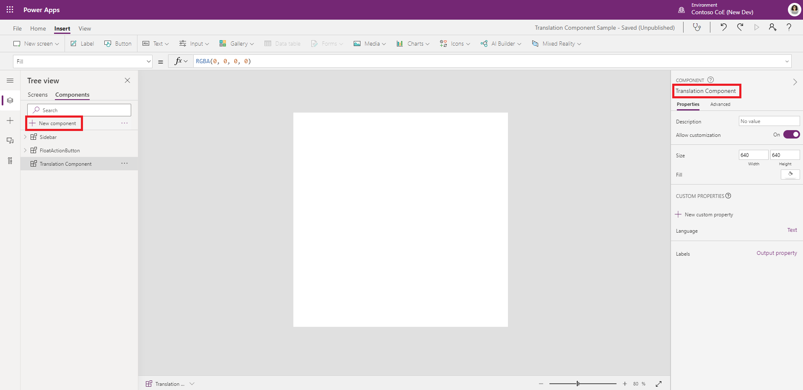
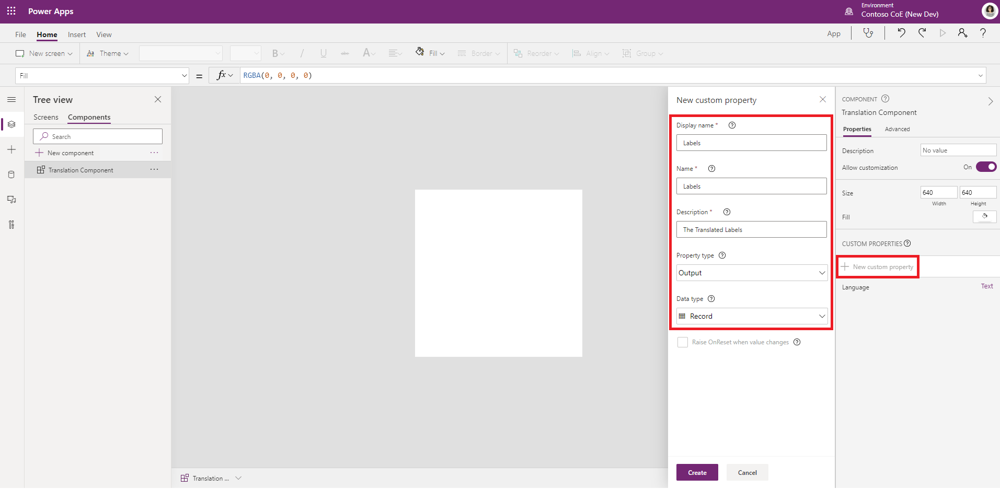
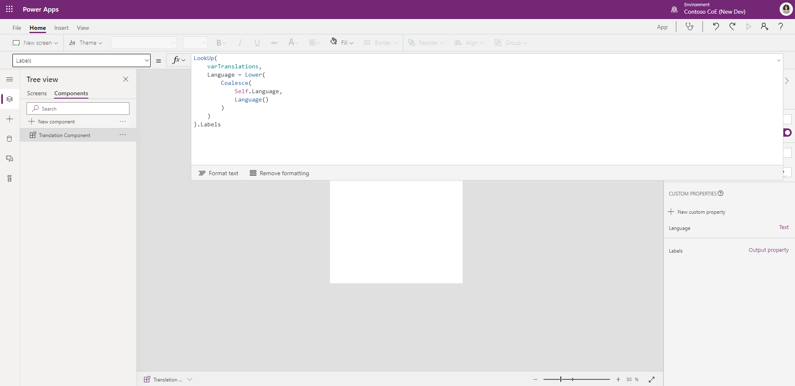
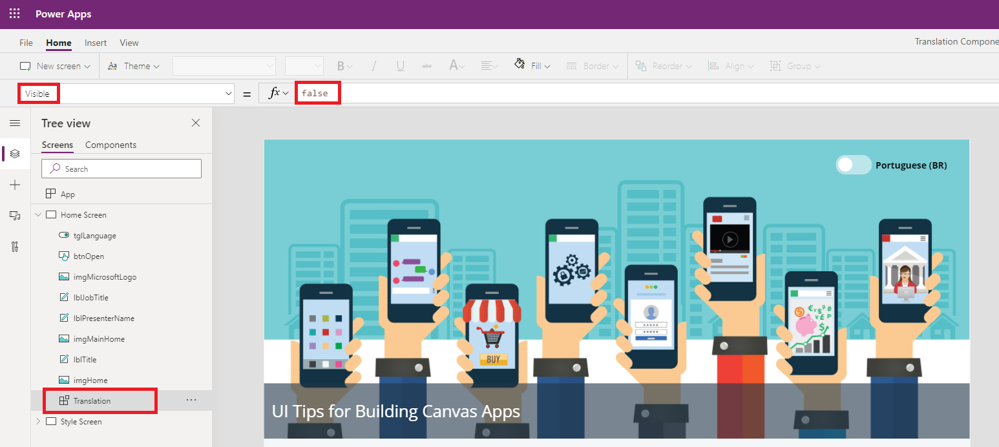
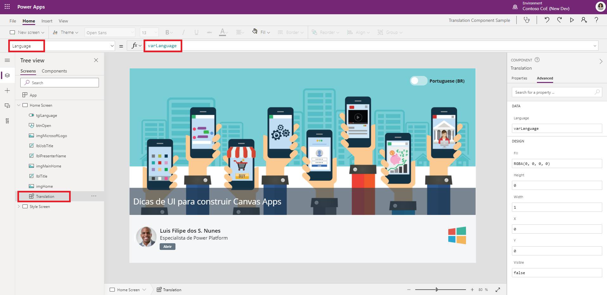

# Build a multi-language app

In this article, you'll learn how to create a multi-language app with localized experience. With this method, you can use canvas app components and make translations available in an app using a uniform formula syntax.

> [!IMPORTANT]
> The method described in this article use components for canvas apps which is in public preview. For more information, see [Create a component for canvas apps](create-component.md)

## Create a translation component

When working with a multi-language app, the first step is to create a reusable component for translation. In this component, you'll store 

1. In your app create a new **component** using the canvas editor. Give the component a name such as “**Translation Component**”

   

1. Create the Input and Output parameters for your component, as follows: 

   - **Language**: An input property that will receive the current LCID (Locale ID) of the logged-in user. 
   
      - Select the Data type "Text"

      - Select the option “Raise OnReset when value changes”, since this will call the formula on the OnReset event of the component that we will write later.

      
   
   - **Labels**: An output property of type Table that will expose the translated labels based on the input LCID property.

      

1. Next, create a table that will be the dictionary of all translations. To do this, declare a table variable on the **OnReset** event of the component as follows:

   

   ```
   Set(
    varTranslations,
    Table(
        {
            Language: "en-us",
            Labels: {
                Title: "UI Tips for Building Canvas Apps",
                JobTitle: "Power Platform Specialist",
                Close: "Close",
                Open: "Open",
                Cancel: "Cancel"
            }
        },
        {
            Language: "pt-br",
            Labels: {
                Title: "Dicas de UI para construir Canvas Apps",
                JobTitle: "Especialista de Power Platform",
                Close: "Fechar",
                Open: "Abrir",
                Cancel: "Cancelar"
            }
        }
    )
   )
   ```

   The table should have an entry for each language that your app supports. Each entry will have a **Labels** property that will contain the translated content of all possible buttons, inputs and labels in your app.

1. Now change the formula of the output property **Labels** as follows:

   

   > [!NOTE] 
   > The formula will find the right translation entry based on the input **Language**. In the case where the language was not set, the formula will use the current user's language as the filter, hence the usage of the [Coalesce](https://docs.microsoft.com/powerapps/maker/canvas-apps/functions/function-isblank-isempty) function.

   ```
   LookUp(
    varTranslations,
    Language = Lower(
        Coalesce(
            Self.Language,
            Language()
        )
    )).Labels
    ```

## Use the Translation Component in a Canvas App

To use the translation component in your app

1. Add the component to the app and set the Name to "**Translation**".

   

1. Set the component **Visible** to **false**
   
   
1. Pass the value of the **Language** to the input property of the **translation component**. In this case we have a toggle control that sets a variable called `varLanguage` to the language selected by the user.

   

1. On every control in your app that needs to be translated, instead of using static text as the label, use the formula `Translation.Labels.[ControlName]` where [ControlName] is the name of the control defined in the dictionary.

   

With this approach, whenever the user changes their language, the app will automatically change the text of all buttons, inputs, labels etc. as shown below

