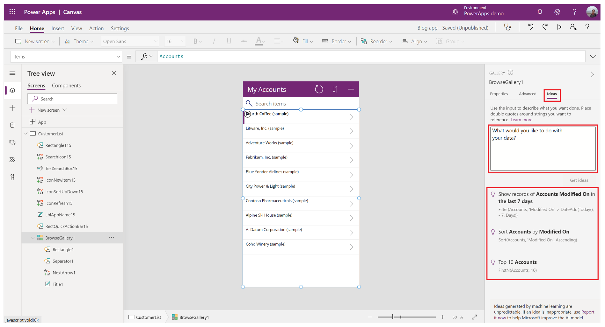
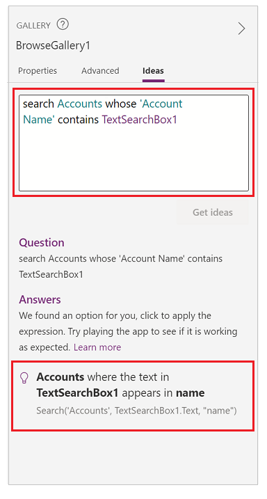

# Tutorial: Transform natural language to Power Fx formulas (Preview)

[This article is pre-release documentation and is subject to change.]

> [!IMPORTANT]
> - This is a preview feature.
> - Preview features aren’t meant for production use and may have restricted functionality. These features are available before an official release so that customers can get early access and provide feedback.

Power Apps Ideas feature currently supports only **Gallery** and **Data table** controls for the **Items** property, and it's trained for the [Microsoft Dataverse](/connectors/commondataserviceforapps/) connector. So, if you've a gallery bound to a Dataverse table, and are about to compose a formula for its **Items** property, you can benefit from Power Apps Ideas.

To begin, let’s take a look at a simple app to see how we can use the Power Apps Ideas to help write formulas.

You can follow the steps mentioned in [Create a canvas app from Microsoft Dataverse](data-platform-create-app.md) to generate that app using **Accounts** table from Dataverse.

1. Select **BrowseGallery1,** which is bound to the **Accounts** table.

1. Go to the property pane on the right-side of the screen, and select the **Ideas** tab.   You'll see a large textbox with a few default examples.

1. Select one of the default suggestions to check how it works, or start to type in your own query in natural language such as English (en-us).

    

1. When typing, try to be precise about the table names, column names, and conditions you want to use. For example, `search Accounts whose 'Account Name' contains TextSearchBox1”, “show Accounts whose ‘Created On’ is earlier than 7 days ago”`. After done typing, hit the "Enter" key on the keyboard, or select anywhere outside the input box.

1. You'll see one or more formula suggestions produced. Let’s use the example above `search Accounts whose 'Account Name' contains TextSearchBox1`. You'll see that the formula suggestion produced includes two parts:

    1. **Accounts** where the text in **TextSearchBox1** appears in **name**. This is trying to explain what the suggested formula is doing&mdash;so that it's easier for users who aren't familiar with Power Fx to understand the result. The names of the components used in the app are shown in bold.

    1. The formula suggestion in this scenario is `Search('Accounts', TextSearchBox1.Text, "name")`.

        

1. When you select any suggested idea for a formula, the formula gets updated automatically and runs so you can check the result in your app. You can then decide whether to keep the selected formula, or modify it.

## Best practices

To get the best results, here are some tips that you can follow when writing the plain natural language query in the Ideas pane.

- Enter the complete context in the query. For example, if you need to filter a table by some conditions, be precise about which table to filter, which column to filter by, and what conditions need to be met.
- Use IntelliSense as much as possible. IntelliSense could help the AI model recognize context, and understand data types better.
- Double quote the text string you want to filter or search for. This will help the model recognize the target string better and provide a more accurate formula suggestion.

## More examples

Consider the following examples to inspire from while working with Power Apps Ideas.

| Scenario | Description | Ideas example |
| --- | --- | --- |
|**Sort your table** |Sort by a single column |sort Accounts by 'Account Name'|
| | |sort Accounts by 'Account Name' A-Z|
| | |sort Accounts by 'Account Name' Z-A|
| |Sort by a few columns|sort Accounts by 'Account Name' and 'Created On'|
| | |sort Accounts by 'Account Name' A-Z and 'Created On' latest on top|
| |Sort existing tables |sort 'Gallery3' by 'Account Name' z to a|
|**Filter or search table by some conditions**|A number condition|'Accounts' with length of 'Account Name' bigger than 10|
| |A date condition|'Accounts' whose 'Created On' is last year, 'Accounts' whose 'Modified On' is within 7 days of 'Created On'|
| |A text condition|'Accounts' whose 'Account Name' contains "test"|
| |A few conditions|'Accounts' whose s Name' contains "test" and 'Status' is Active|
| |Search table by user input|search 'Accounts' by 'Account Name' in 'TextInput1'|
| |Find a single record|find the first record in 'Accounts' where 'Account Name' contains "test"|
| |Find records on the top or the bottom of the table|Top 10 Accounts|
| | |Last 10 Accounts|

## Next steps

[Tutorial: Train with examples](power-apps-ideas-train-examples.md)

### See also

- [Formula reference](formula-reference.md)
- [Power Apps Ideas overview (Preview)](power-apps-ideas.md)
