# Understand Power Apps Studio

You can use Power Apps Studio to design, build, and manage your canvas app.

## Overview of Power Apps Studio

:::image type="content" source="media/studio/pa-studio.png" alt-text="Screenshot showing the Power Apps Studio user interface." lightbox="media/studio/pa-studio-1.png":::

1. [Power Apps Studio modern command bar](#1--power-apps-studio-modern-command-bar): Dynamic command bar that shows a different set of commands based on the control selected.

1. [App actions](#2--app-actions): Options to rename, share, run the app checker, add comments, preview, save, or publish the app.

1. [Properties list](#3--properties-list): List of properties for the selected object.

1. [Formula bar](#4--formula-bar): Compose or edit a formula for the selected property with one or more functions.

1. [App authoring menu](#5--app-authoring-menu): Selection pane to switch between data sources and insert options.

1. [App authoring options](#6--app-authoring-options): Details pane with options relevant to the selected menu item for authoring the app.

1. [Canvas/screen](#7--canvasscreen): Primary canvas for composing the app structure.

1. [Properties pane](#8--properties-pane) - properties list for the selected object in UI format.

1. [Settings and virtual agent](#9--virtual-agent): Go to the settings or get help building your app from a virtual agent.

1. [Screen selector](#10--screen-selector): Switch between different screens in an app.

1. [Change canvas screen size](#11--change-canvas-screen-size): Change the size of the canvas during an authoring experience in Power Apps Studio.

Let's understand each option in Power Apps Studio in detail.

## 1 – Power Apps Studio modern command bar

Power Apps Studio options are available on the command bar. The options are relevant to the current session and app-related settings.

:::image type="content" source="media/studio/pa-studio-options.png" alt-text="Screenshot that shows the command bar menu with lots of development options." lightbox="media/studio/pa-studio-options.png":::

### Modern command bar

The modern command bar displays the relevant set of commands depending on the control that is selected.

:::image type="content" source="media/studio/pa-studio-command-bar.gif" alt-text="Moving image that shows how the command bar changes depending on which control is selected." lightbox="media/studio/pa-studio-command-bar.gif":::

The command bar changes when one of the following controls or objects is selected:

1. App object
2. Screen
3. Button
4. Shape
5. Icon
6. Blank form
7. Form with data
8. Blank gallery
9. Gallery with data
10. Label
11. Text input
12. Date picker

When more than one type of control is selected, the command bar shows the common commands between the selected controls.

#### Back

Takes you back to the build hub, closing the current Power Apps Studio session.

#### Undo and redo

:::image type="content" source="media/studio/pa-undo-redo.png" alt-text="Screenshot that shows where the undo and redo controls are located in the command bar.":::

- **Undo**: Undo the last action.
- **Redo**: Repeat the last action.

#### Cut, copy, and paste

:::image type="content" source="media/studio/pa-studio-cut-copy-paste.png" alt-text="Screenshot that shows where the cut, copy, and paste controls are located in the command bar.":::

- **Cut**: Cut the selection, and store it in the clipboard.
- **Copy**: Copy the selection, and store it in the clipboard.
- **Paste**: Paste the last cut or copied selection from the clipboard.

#### Insert

:::image type="content" source="media/studio/pa-insert-controls.png" alt-text="Screenshot that shows where the two insert controls are located. One is in the command bar and the other control (plus sign) is in the navigation menu.":::

The **Insert** menu is available from the command bar and from the app authoring menu.

Insert shows all the popular objects or controls that you can add on the selected screen in your canvas app. You can also expand other choices or use the components option to insert controls from a component library.

To insert controls on the canvas, you can drag the control to the canvas or select the control.

##### Popular controls

| **Name**      | **Description**                                                                                      |
|-----------------|------------------------------------------------------------------------------------------------------|
|*Text label* | A box that shows data such as text, numbers, dates, or currency. |
|*Edit form*|Display, edit, or create a record in a data source.|
|*Text input*|A box that shows text.|
|*Vertical gallery*|A control that contains other controls and shows a set of data.|
|*Rectangle*|A rectangular shape to configure the canvas appearance.|
|*Date picker*|A control that the user can select to specify a date.|
|*Button*|A control that the user can select to interact with the app.|

For more information about the controls that you can insert, and their properties and definitions, go to [Controls and properties in canvas apps](reference-properties.md).

#### Add data

> [!div class="mx-imgBorder"] 
> 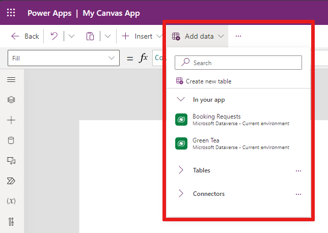

- Select any other existing tables from the current environment.
- Search and select a connector, such as **SharePoint** or **SQL Server**.

#### New screen layouts

> [!div class="mx-imgBorder"] 
> 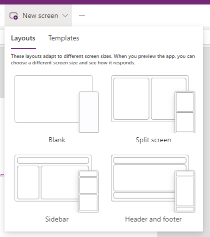

Add screens and select from the list of available screen layouts.

##### Scenarios 

> [!div class="mx-imgBorder"] 
> 

Or, select the **Scenarios** and select a screen type based on the available scenarios, such as **Blank**, **Scrollable**, **List**, **Success**, **Tutorial**, **Email**, **People**, **Meeting**, **Calendar**, **Portrait print**, or **Landscape print**.

#### Background color

> [!div class="mx-imgBorder"] 
> 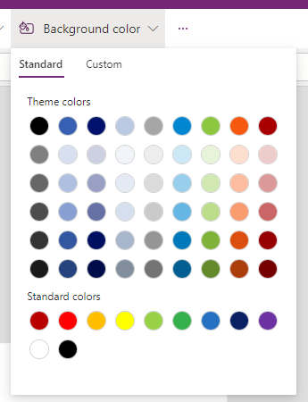

Select a background color for a screen. You can select from the list of standard colors or select the **Custom** table and choose your own color.

#### Background image

> [!div class="mx-imgBorder"] 
> 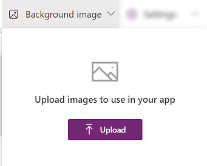

Select **Upload** to upload images to set as the background image.

#### Settings

Configure the app's general settings.

> [!div class="mx-imgBorder"] 
> 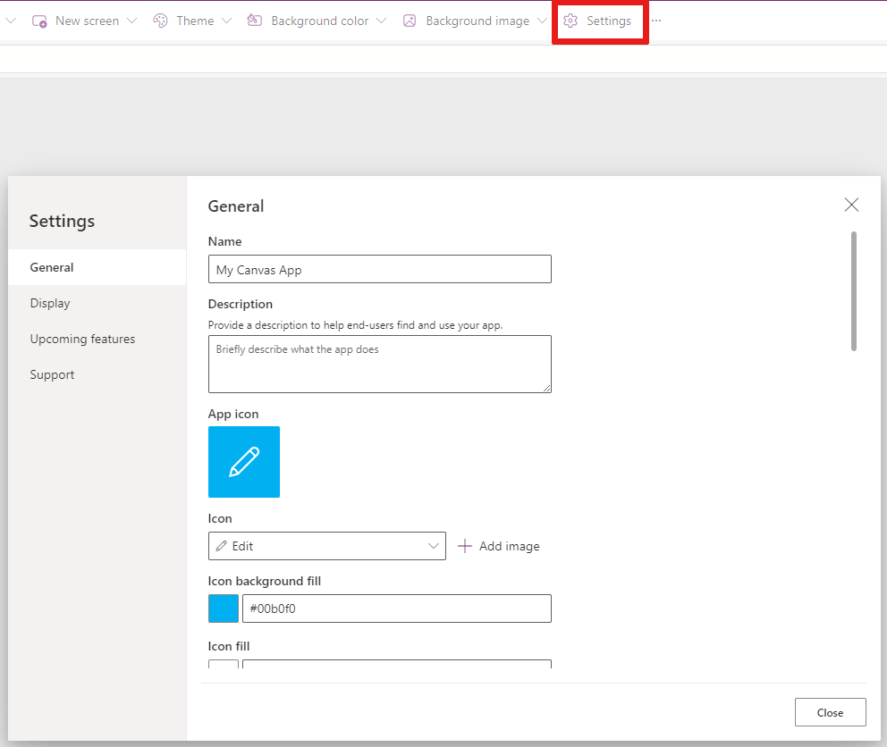

##### General

Shows app name, and allows changing the app icon. To update the icon, select a new icon or background color. To add or update description, enter text in the text box. You can also upload a custom icon for the app using the **Add image** option.

##### Display

Shows the screen size and orientation. To change, select the radio buttons for **Orientation** and **Size**.

Advanced settings allow you to further customize the app screen configuration.

- **Scale to it**: Scales the app to fit available space.
- **Lock aspect ratio**: Locks the height and width ratio.
- **Lock orientation**: Maintains app orientation when device rotates.
- **Optimize embedding appearance**: Optimizes for embedded experiences by aligning the app to the top left.
- **Replace formula notification**: Displays notifications to prevent replacing customized size and position properties.

To change the setting, toggle the switch.

More information: [Change screen size and orientation](set-aspect-ratio-portrait-landscape.md)

##### Upcoming features

Allows you to configure advanced settings for the app that include features under preview, experimental or retired features.

For more information, see [Understand experimental, preview, and retired features in Power Apps](working-with-experimental-preview.md).

##### Support

Shows current Power Apps Studio session details, version, and other information useful when working with Microsoft support.

#### Power Automate

Create a new flow with Power Automate, or select any available flow.

For more information, see [Use Power Automate pane](working-with-flows.md).

#### Collections

A collection is a group of items that are similar, such as products in a product list. This section lists the collections used by the current app. More information: [Collections in canvas apps](create-update-collection.md) used by the app.

> [!div class="mx-imgBorder"] 
> 

#### Variables

You can save data such as the result values from a data set into temporary storage by using variables. This section lists variables used by the current app. More information: [Variables in canvas apps](working-with-variables.md) used by the app.

> [!div class="mx-imgBorder"] 
> 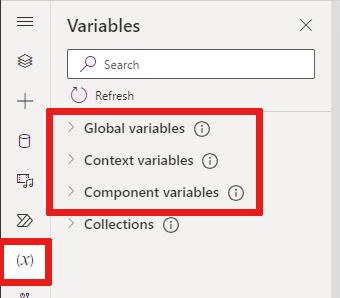

## 2 – App actions

To work with app-specific actions, use the options in the upper-right corner of Power Apps Studio.

> [!div class="mx-imgBorder"] 
> 

### App name editor

To edit the app name, select it.

> [!div class="mx-imgBorder"] 
> 

### Share

> [!div class="mx-imgBorder"] 
> 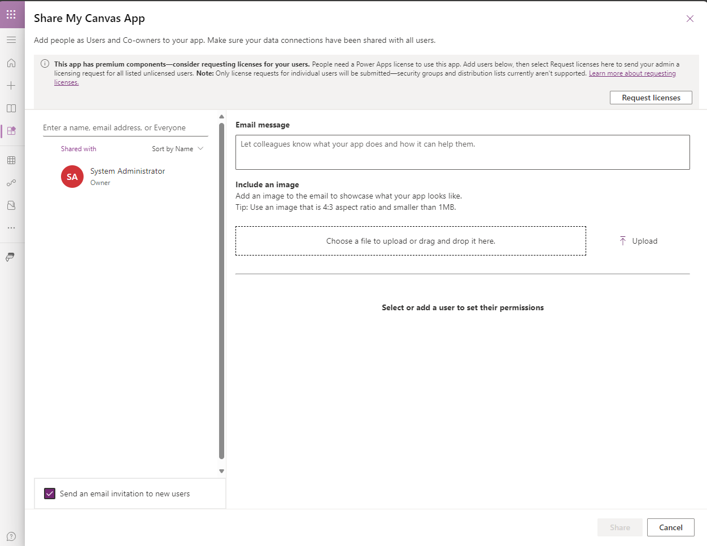

Lets you share the app with other users and add them as co-owners of your app. You must save the app before you can share it.

### App checker

Runs the [App checker](https://powerapps.microsoft.com/blog/powerapps-checker-now-includes-app-checker-results-for-canvas-apps-in-solutions/) with available rules and shows the results.

> [!div class="mx-imgBorder"] 
> 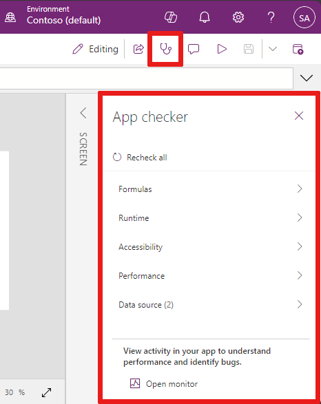

### Comments

Comments are notes associated with items in your app. Use comments to help your team review the app and provide feedback, or provide additional information on implementation details in your app.

> [!div class="mx-imgBorder"] 
> 

### Preview

This shows a preview version of the app that you can interact with.

### Save

> [!div class="mx-imgBorder"] 
> 

Save allows you to perform the following actions:

- **Save**: Saves recent and unsaved changes you made to the app in Power Apps Studio. Each time you save changes, a new version is created.
- **Save with version notes**: Save and add notes about the updates you made.
- **Save as**: Duplicate the app by saving the app with a different name.
- **Save and publish**: Allows you to save the app and publish it at the same time.
- **Download a copy**: Download a local copy of the app.

### Publish

Publishes the app’s current version. For more information about publishing an app, go to [Save and publish canvas apps](save-publish-app.md).

## 3 – Properties list

Shows the list of available properties for the selected object on the canvas. The properties list changes based on your selection. For a complete list of all properties, go to [All properties](reference-properties.md#all-properties).

> [!div class="mx-imgBorder"] 
> 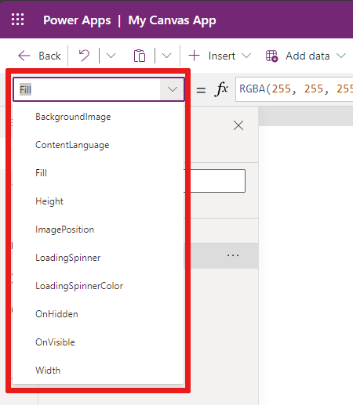

## 4 – Formula bar

Use the formula bar to add, edit, or remove functions relevant to the selected object and the property selected from the properties list. For example, select the screen to update the background by using the [RGBA function](/power-platform/power-fx/reference/function-colors).

> [!div class="mx-imgBorder"] 
> 

The formula bar is IntelliSense-enabled. When you start entering text that matches one or more functions, the formula bar shows the list of functions.

> [!div class="mx-imgBorder"] 
> 

When you select a function, the formula bar shows inline function help and highlights help text relevant to the cursor position.

> [!div class="mx-imgBorder"] 
> 

If a formula returns an error, tips relevant to the syntax error and mitigation steps are displayed. 

> [!div class="mx-imgBorder"] 
> 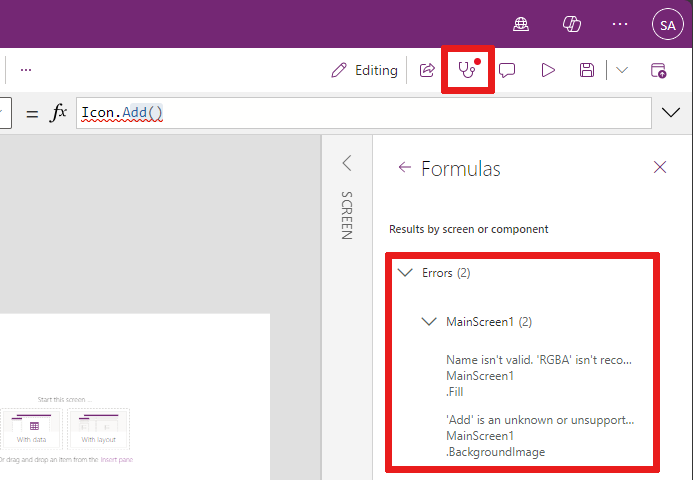

Similarly, you find help when working with complex functions, nested functions, or when correcting a formula syntax.

For a quick and easy function reference, you can also select the formula dropdown menu.

> [!div class="mx-imgBorder"] 
> 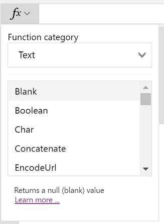

Select an event type from the dropdown menu at the top of the dialog box, such as **Action** instead of **Text**.

> [!div class="mx-imgBorder"] 
> 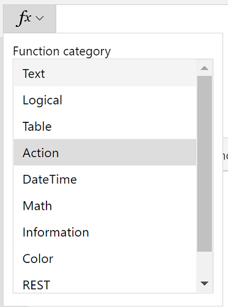

Select an action that you want to add a function for. The available functions for the selected event type are dynamically updated depending on the object you select.

> [!div class="mx-imgBorder"] 
> 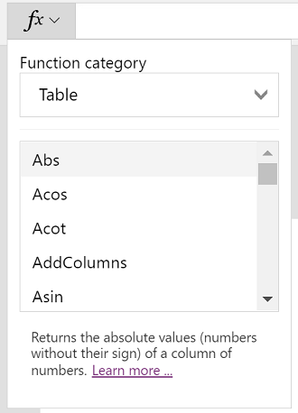

For example, if you selected a button on the canvas, the available **Action** functions also include the function *ClearCollect()*.

> [!div class="mx-imgBorder"] 
>  selected")

You can read the description of the selected **Action** function. Double-click the function name to add it into the formula bar.

For a complete list of all canvas app functions, go to [Power Fx formula reference for Power Apps](/power-platform/power-fx/formula-reference).

## 5 – App authoring menu

Switch between various authoring options while working with the app.

> [!div class="mx-imgBorder"] 
> 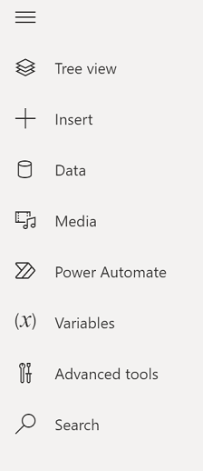

> [!TIP]
> You can also select the expand button to expand the list to include names instead of just icons.

- **Tree view**: Shows a tree view of all screens and controls in the current app.
- **Insert**: Allows you to add different controls to the screen.
- **Data**: Add or remove data such as tables that the app connects to.
- **Media**: Insert or remove media from the app.
- **Power Automate**: Add a flow using the [Power Automate pane](working-with-flows.md).
- **Variables**(preview): Work with [variables](working-with-variables.md) and [collections](create-update-collection.md) while editing your app.
- **Advanced tools**: Allows you to access the [Monitor](../monitor-canvasapps.md) and [Test](test-studio.md) tools to debug and test your app.
- **Search**: Select to search for media, formulas, text, and more in your app. You can also do a search and replace.

## 6 – App authoring options

The options for working with canvas apps change depending on the selection on the left pane.

### Tree view

Select the tree view to show the screens available in the app.

> [!div class="mx-imgBorder"] 
> 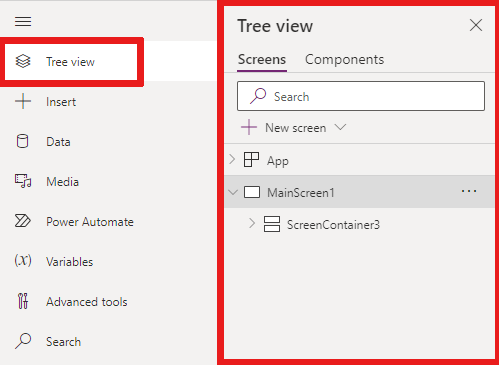

> [!TIP]
> Select **App** in the tree view to work with app-specific controls or to change app behavior, such as adding a formula on *OnStart* event of the app.

Switch to the **Components** tab to work with component library features. You can add new components or reuse ones from the published component libraries. More information: [Component library](component-library.md)

> [!div class="mx-imgBorder"] 
> 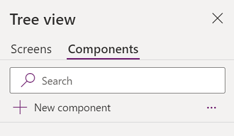

### Insert

For information, see the [Insert](power-apps-studio.md#insert) section.

### Data

Add, refresh, or remove data sources from your canvas app. You can add one or more [connections](connections-list.md) by using data sources.  

In addition to data stored within tables, there are many connectors available to interact with data in popular software as a service (SaaS), services, and systems.

> [!div class="mx-imgBorder"] 
> 

To choose other connectors such as SharePoint, OneDrive, or SQL Server, you can enter text in the data source search box or select from the list of connectors.

> [!div class="mx-imgBorder"] 
> 

More information: [List of all Power Apps connectors](/connectors/connector-reference/connector-reference-powerapps-connectors)

### Media

Select **Media** to add images, video, or audio files to your app. Adding media directly to your app uploads the files to the app and uses the app storage. Each file uploaded to the app as media must be 64 MB or smaller, and the size of all media files uploaded to an app can't exceed 200 MB.

> [!div class="mx-imgBorder"] 
> 

If you want to reference more media, consider using [audio and video controls with URLs](add-images-pictures-audio-video.md#add-images-audio-or-video-using-the-controls), using media from [Azure Media Services](add-images-pictures-audio-video.md#add-media-from-azure-media-services), or from [Microsoft Stream](./controls/control-stream-video.md#example). More information: [Using multimedia files in Power Apps](add-images-pictures-audio-video.md)

## 7 – Canvas/screen

The canvas shows the currently selected screen from the left pane.

## 8 – Properties pane

The properties pane shows properties and options available for the currently selected object on the canvas. The **Properties** tab shows generic options such as the name, color, size, or position. The **Advanced** tab shows more options for advanced customization. The advanced properties might sometimes be locked for editing, such as when working with data cards. You can select [Unlock to change properties](working-with-cards.md#unlock-a-card) in such situations.

> [!div class="mx-imgBorder"] 
> 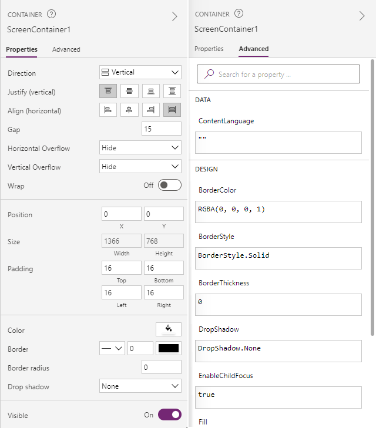

## 9 – Virtual agent

Real-time, in-product help is available from the documentation using the Power Platform virtual agent. The virtual agent can help answer questions about common scenarios. More information: [Get help building your app from a virtual agent](../common/virtual-agent.md)

## 10 – Screen selector

Use the screen selector to switch between screens when your canvas app has multiple screens. You can also select a screen from the left pane by selecting the tree view. If the current selection is inside a container, or inside an individual cell in a gallery, the selector shows the breadcrumbs for the parent elements at each level.

## 11 – Change canvas screen size

You can zoom in or out while authoring the canvas app. Select **Ctrl**+**0** **Fit to window** to fit the screen size based on the current authoring window size. The zoom percentage or screen size used in authoring a canvas app has no affect on the aspect ratio configured for the app. When you preview your app or play a published app, your screen size is temporary.
