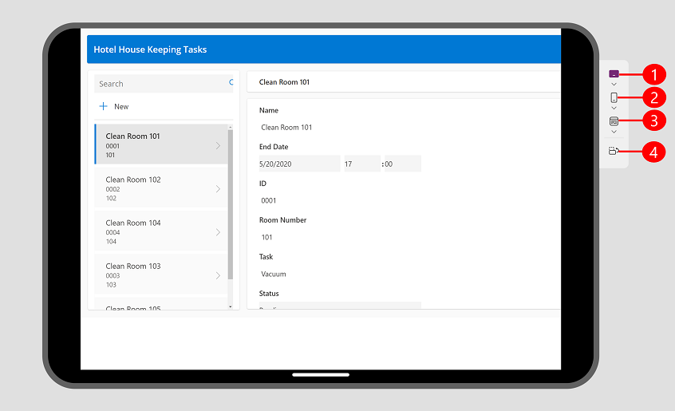

# Preview your app

As you create your canvas app, you may find it useful to preview the app from time to time to see how the app will look for your app users. You can even preview what the app will look like when viewed at different sizes and on different devices – helpful if you are building responsive apps.  

To see how your app will look for your app users, open the app for editing in [Power Apps Studio](https://create.powerapps.com), in the app actions menu, select the **Preview the app** button. 

You can preview your app to see how it will look on different devices using the device picker.  

> [!div class="mx-imgBorder"] 
> 

Legend: 
1. **Tablet Devices**: Allows you to select from common tablet devices from several manufacturers, along with the ability to select a custom size based on your needs. This option shows a device frame and device safe zone, shown as the black area either on the top and bottom or sides depending upon the orientation. It also shows a black area with the home bar at the bottom.  
2. **Mobile devices**: Lets you to select from common phones from several manufacturers, along with the ability to select a custom size based on your needs. This option shows a device frame and device safe zone, shown as the black area either on the top and bottom or sides depending upon the orientation. It also shows a black area with the home bar at the bottom. 
3. **Web view**: Lets you to preview what the app will look like on a web browser. You can select Window size to fill the browser window, or you can specify a custom size to emulate your app embedded at a certain size. This option does not include a device frame.  

## Display settings
The behavior of your app using each of the preview options will depend on the app type and selected display settings. 

If you are building your app to be responsive so that the contents of your app reflow depending on the screen space available on the device, the device picker can help you ensure that the content is reflowing in the way you’d like.  

VIDEO LINK

The preview experience will appear differently depending on some of the settings in your app and whether you chose tablet or phone when you first created your app.  

- Apps created using the Phone setting can still be viewed in the preview while selecting a tablet type device from the device picker, but if the app was not built using responsive app creation techniques, the app will still appear in in a phone shape on tablet devices. You will see a message explaining why the preview is narrow. If you’d like your app to be responsive to phone, tablet, and web sizes we recommend selecting the Tablet option to create your app. You can use responsive auto-layout containers to determine the flow of the content for different screen sizes including phones. Learn more.  

- Under Display settings:
   - **Scale To Fit**: When set to **On** this results in your entire app being scaled to fit the available space. If a smaller space is available to the app, you may notice empty space on the sides to accommodate the scaling. This empty space will also appear for your app users when they play apps.
  - **Lock Orientation**: When set to **On**, the **Switch Orientation** button in the device picker will be disabled.  

## Known Issues 

- If **Scale To Fit** setting is on and **Lock Aspect Ratio** is off, your preview may not be accurate. This configuration is not recommended. Learn more.  
- If **Scale to Fit** is off and you resize your browser window while in preview mode, the preview may not be accurate. To address this, close and reopen the preview once your browser window is in the desired size. 

