# Create SharePoint integrated canvas apps from scratch to view, edit, add, and delete SharePoint list items

In this scenario article, you'll learn how to create an app with SharePoint form functionality from scratch. The app will demonstrate how to view, edit, add, and delete SharePoint list items using a canvas app without visiting a SharePoint site. 

> [!NOTE]
> For more details about different scenarios working with SharePoint forms and additional examples, go to [SharePoint scenarios overview](scenarios-intro.md).

## Prerequisites

- You must have access to a SharePoint site to create a list and list items.
- You must be knowledgeable about [creating](https://support.microsoft.com/en-us/office/create-a-list-in-sharepoint-0d397414-d95f-41eb-addd-5e6eff41b083) and [setting up](https://support.microsoft.com/en-us/office/training-create-and-set-up-a-list-1ddc1f5a-a908-478b-bb6d-608f34b71f94) SharePoint lists.

## Scenario details

The purpose of this scenario is to demonstrate how to create a canvas app from scratch to work with a SharePoint list. At the end of this example demo, you'll be able to do the following tasks from inside the canvas app without the need to access the SharePoint list or its item:

- View all items from the SharePoint list.
- Search for items in a SharePoint list based on text value of a specific column.
- Select a SharePoint list item.
- Edit a SharePoint list item.
- Create a new SharePoint list item.
- Delete a SharePoint list item.

The scenario is a basic illustration of the canvas app capabilities when integrated with SharePoint. To enhance the layout with improved design or additional screens, go to the following articles:

- [Add and configure controls](../add-configure-controls.md)
- [Add and configure screen](../add-screen-context-variables.md)
- [Understand forms, layouts, and cards](../working-with-forms.md)

> [!IMPORTANT]
> The example in this scenario creates a sample app to view, edit, add, and delete SharePoint list items. You can change the approach to customize the app differently based on your choices or business objective. When you customize your app with custom names for controls, be sure to use the correct control names in the formula when following the steps in this example.

## Example

This scenario example walks you through the steps to create an app and connect it to a SharePoint list to view, edit, add, and delete SharePoint list items.

## Step 1 – Create a SharePoint list

Create a SharePoint list with columns and list items. In this scenario, we've used a list with the following columns and list items:

  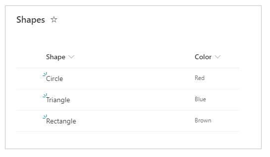

> [!NOTE]
> Both columns are *Single line of text*.

## Step 2 – Create a blank canvas app

Create a [blank canvas app](../create-blank-app.md).

## Step 3 – Connect app to SharePoint

1. Select **Data sources** from the left pane.

    

1. Select **SharePoint** data source. You can also search for the name in the search box.

    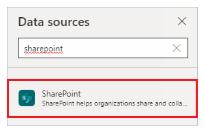

1. Select **Add a connection**.

    

1. Select a connection type. You can connect to SharePoint Online or an on-premises SharePoint site with a data gateway when configured. This scenario connects to a SharePoint Online site.

    

1. Select the SharePoint site having the list you created earlier.

    

1. Select the SharePoint list that you created. This scenario uses a list named *Shapes*.

    

1. Select **Connect**. The data source is added to the app.

    

## Step 4 – Add data table to view SharePoint list items

1. Select **+** (insert) from the left pane.

    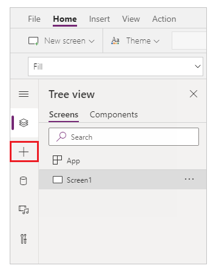

1. Expand **Layout**.

1. Select **Data table**.

    

1. Select the data source as your SharePoint connection.

    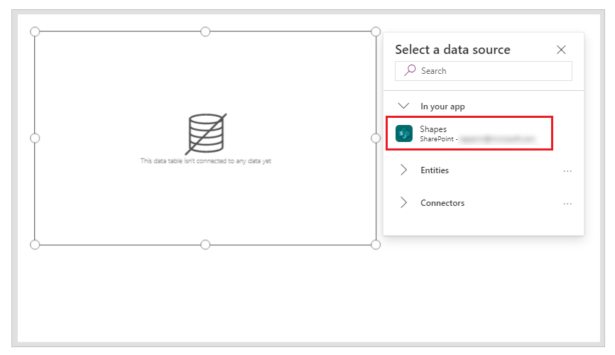

1. Move the data table to the lower-right inside the screen to make space for additional components.

    

## Step 5 – Add the capability to search and select item

1. Insert a **Text input** control to the canvas, and move it below the drop-down list.

    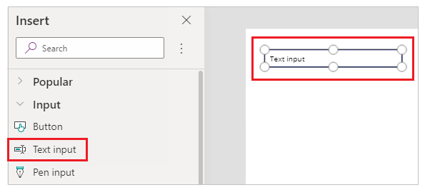

1. Update the search box **Default** property to the value *Search by shape*.

    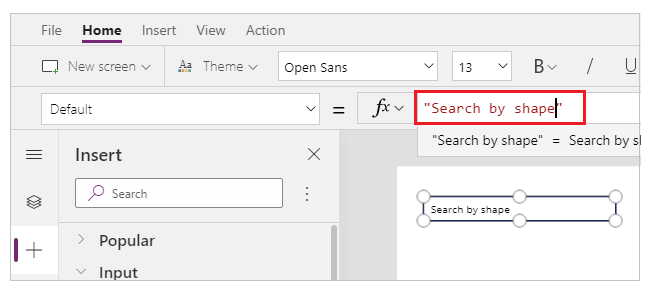

1. Insert a **List box** control to the canvas, and move it below the text input control added in the previous step.

    

1. From the right side of the Studio screen, set the **Items** property of the list box control to the **Shapes** SharePoint list for this example.

    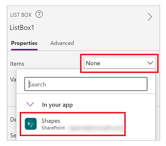

1. Set the **Value** property for the list box control to **Shape** instead of **Color** for this example.

    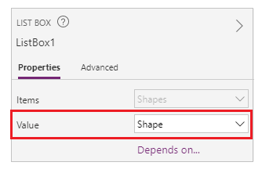

1. Update the **Items** property of the list box added in the previous step to the following formula:

    ```powerapps-dot
    Filter([@Shapes], StartsWith(Shape, TextInput1.Text))
    ```

    

    The formula contains following functions:

    - [Filter()](../functions/function-filter-lookup.md) – Used in this formula to filter items in the list box based on the defined parameters. `[@Shapes]` in this function defines which data source to filter.
    - [StartsWith()](../functions/function-startswith.md) – Used in this formula to filter the SharePoint list items based on the **Shape** column that start with the characters entered in the *TextInput1* control added earlier.

## Step 6 – Add the capability to edit item

1. Insert the **Edit form** control.

    

1. From the right side of the Studio screen, set the **Data source** property for the edit form control to **Shapes**.

    

1. Select **Edit fields** for the edit form control and remove any other fields such as **Attachments**, if present.

    

1. Ensure the **Shape** and **Color** fields are present. If not, add them using **Add field**.

    

1. Rearrange the screen layout to ensure the **Edit form** control is visible and doesn't overlay with other controls.

    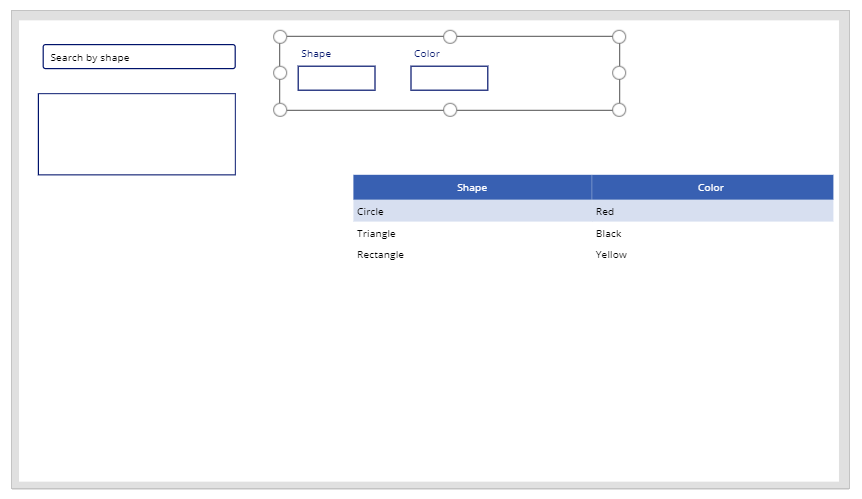

1. Set the **OnSelect** property of the list box control to the following function:

    ```powerapps-dot
    Set(TextSelected,1)
    ```

    

    The [Set()](../functions/function-set.md) function sets a new variable named *TextSelected* to the value of *1* when a value in the list box is selected. The *TextSelected* variable is used in this scenario as a flag to control the actions and behavior of add, edit, and delete capabilities as you'll see in the following sections.

1. Set the **Item** property of the edit form control to the following formula:

    ```powerapps-dot
    If(TextSelected=1,ListBox1.Selected,DataTable1.Selected)
    ```

    

    The [If()](../functions/function-if.md) function checks first if the value of the variable *TextSelected* is *1* or not. If it is, the edit form shows the selected item from the list box. If not, the edit form shows the selected item from the data table.

1. Insert a button.

    

1. From the right side of the Studio screen, set the **Text** property of the button added in the previous step to **Save**.

    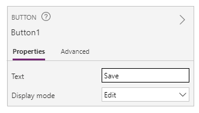

1. Set the **OnSelect** property of the **Save** button to the following formula:

    ```powerapps-dot
    SubmitForm(Form1);
    Set(TextSelected,0)
    ```

    

    The formula contains following functions:

    - [SubmitForm()](../functions/function-form.md) – Used in this formula to submit the edit form and save the values to SharePoint list.
    - [Set()](../functions/function-set.md) – Resets the *TextSelected* variable back to *o* so that a new item can be selected from the list box.

1. Insert **Text label** control.

    

1. Update the **Text** property for the **Text label** control added in the previous step to *To edit value(s) for an item, select from the table, or search.*

    

1. Rearrange the controls on the screen to order the edit controls.

    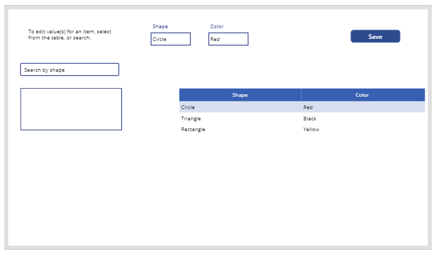

## Step 7 – Add the capability to add item

1. Insert a button.

1. Rearrange the controls on the screen to ensure the button is visible.

1. Update the **Text** property of the button added in the previous step to **Add**.

1. Set the **OnSelect** property of the **Add** button to the following function:

    ```powerapps-dot
    NewForm(Form1)
    ```

    

    The [NewForm()](../functions/function-form.md) function clears the edit form control added on the form named *Form1* so that you can add a new SharePoint list item.

## Step 8 – Add the capability to delete item

1. Insert a button.

1. Move the button added in the previous step below the **Save** button.

1. Update the **Text** property of the button added in the previous step to **Delete**.

1. Set the **OnSelect** property of the **Delete** button to the following formula:

    ```powerapps-dot
    Remove([@Shapes], If(TextSelected=1,ListBox1.Selected,DataTable1.Selected));
    Set(TextSelected,0)
    ```

    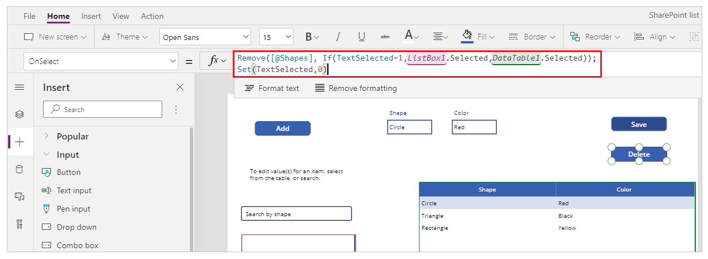

    The formula contains following functions:

    - [Remove()](../functions/function-remove-removeif.md) – Used in this formula to delete the selected SharePoint list item.
    - [If()](../functions/function-if.md) – Checks first if the value of the variable *TextSelected* is *1* or not. If it is, the **Delete** button deletes the item selected from the list box. If not, the **Delete** button deletes the item selected from the data table control.
    - [Set()](../functions/function-set.md) – Resets the *TextSelected* variable back to *o* so that a new item can be selected from the list box.

Now that you have all the app components configured, ensure the screen looks like the following example:


## Step 9 – Save the app

Now that the app has view, edit, add, and delete capability added, [save the app](../save-publish-app.md#save-changes-to-an-app).

1. Select the **File** menu.

1. Select **Save**.

1. When saving for the first time, the **Save** option takes you to **Save as**. Select **Save** to save the app to the cloud.

    

1. Close Power Apps Studio.

## Step 10 – Test the app

1. Go to [Power Apps](https://make.powerapps.com).

1. Select **Apps**.

1. Select the app created.

    

1. Test the app components.

    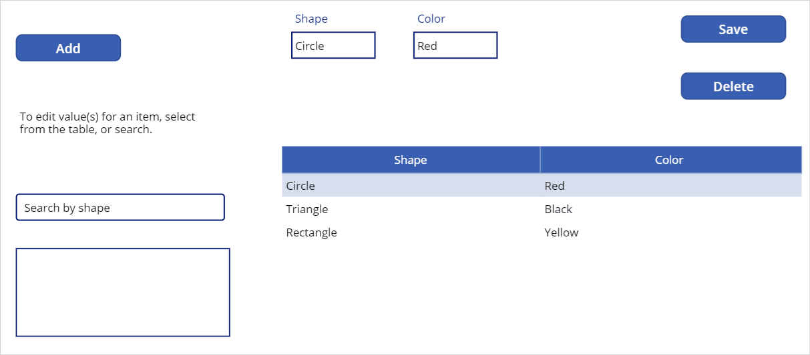

    > [!TIP]
    > You can quickly preview the behavior of a component using the keyboard key **Alt** and a mouse **left-click** when editing the app inside Power Apps Studio. 
    >
    > For example, instead of selecting **Preview the app** from the upper right, or **F5** from the keyboard that runs the app in preview, keep the **Alt** key on the keyboard pressed, and then select a row from the data table to change the edit form control to the selected row as if the app is running in preview.
    >
    > 
    > 
    > In addition, keep the **Alt** key pressed on the keyboard and you can continue to run the preview inside Power Apps Studio. For example, selecting multiple components for different actions or checks.

## Next steps

If you edit the app, you must [publish](../save-publish-app.md#publish-an-app) the changes for others to see.

Once the app is ready to use, [share the app](../share-app.md).

### See also

- [Add and configure controls](../add-configure-controls.md)
- [Add and configure screen](../add-screen-context-variables.md)
- [Understand forms, layouts, and cards](../working-with-forms.md)
- [Formula reference](../formula-reference.md)
- [Control reference](../reference-properties.md)


[!INCLUDE[footer-include](../../../includes/footer-banner.md)]