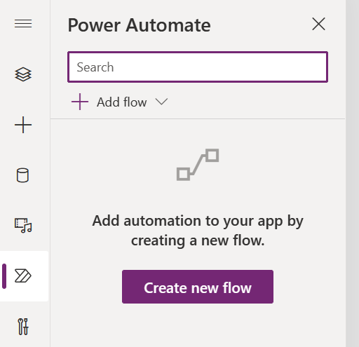
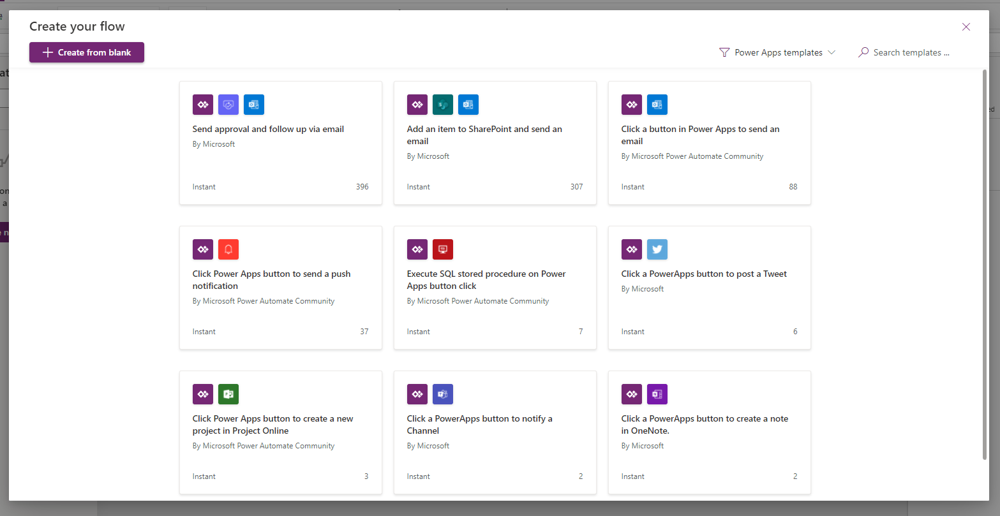
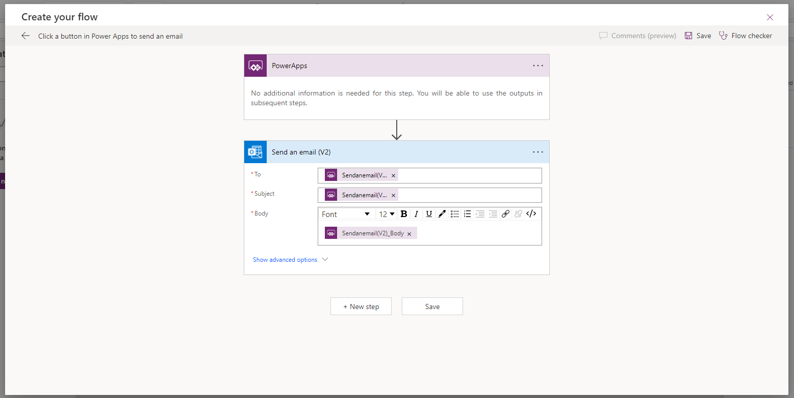
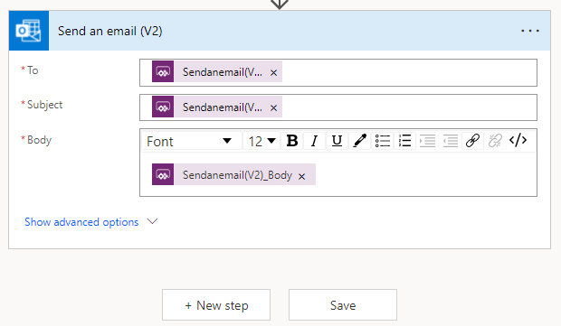
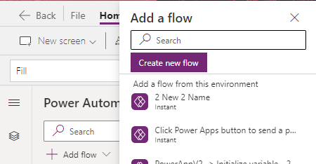
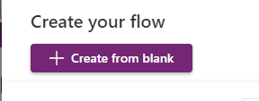
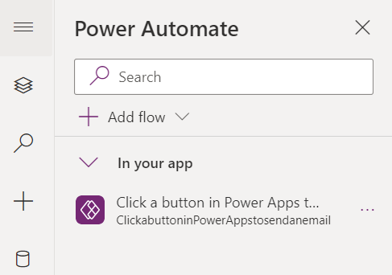
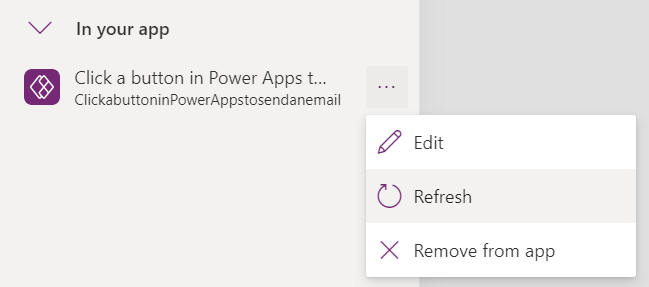

---
title: Working with Power Automate flows in Power Apps
description: Learn about how to create, edit, and use Power Automate flows in Power Apps
author: TashasEv
ms.service: powerapps
ms.topic: conceptual
ms.custom: canvas
ms.reviewer: tapanm
ms.date: 01/20/2022
ms.subservice: canvas-maker
ms.author: tashas
search.audienceType: 
  - maker
search.app: 
  - PowerApps
contributors:
  - tapanm-msft
  - TashasEv
---

# Working with Power Automate flows in Power Apps

## Enabling the Power Automate pane feature

1.  Click on Settings&gt;&gt; Upcoming Features and scroll to the "Enable Power Automate Pane" toggle. Select the toggle to turn it on.  
    

2.  You will now see the Power Automate logo in the left pane. Select it to see the Power Automate Pane. If no flows have been added to your app, the pane appears as below:  
    

## Creating a new Flow

1.  In the Power Automate Pane, select "Create New Flow." The "Create your flow" modal opens.  
    

## Start with a template

2.  The new modal allows you to choose from available Power Apps templates or to create a new flow from blank. For this example, select the "Click a button in Power Apps to send an email."

3.  The next step shows the connections required to create a flow based on the template selected. &lt;&lt;Learn more about connections&gt;&gt;  
    

4.  Optionally, selecting "Edit in advanced mode" here prompts you to accept any connections used within the flow template. Select "Continue" to accept the connections.  
    

5.  The copy of the selected flow template now opens in the modal in edit mode. You can make changes to the flow here prior to saving.  
    

6.  Once you have added the desired changes, save the flow using either Save button at the top right of the modal or the Save button below the body of the flow.  
      
    

7.  Upon successfully saving the flow, it has been added to the app and appears under "In your app" in the Power Automate Pane:  
    

## Create from blank

Instead of using a template, you can also create your cloud flow from blank.

1.  Select "+ Add flow" in the Power Automate pane, then select "Add new flow":  
    

2.  Select "+ Create from blank"  
    

3.  The cloud flow editing screen appears, showing the Power Apps trigger:  
    

4.  Continue to create your custom flow by adding new steps using the "+ New step" button.  
    

5.  Once complete, save the flow using either Save button at the top right of the modal or the Save button below the body of the flow.  
    

## Adding an Existing Flow

You may have access to flows which already existed in the environment in which you're creating your app. To add these flows for use in your app:

1.  Select "+ Add flow" in the Power Automate pane. The "Add a flow" flyout opens, showing flows you have access to which are eligible for adding to your app.  
    

&lt;&lt; TODO: validate these criteria for M2&gt;&gt;

Note: the following criteria determine whether flows are eligible for adding to your app:

-   You must have access to the flow

-   The flow must be in the same environment as the app

-   If the app is part of a solution, only flows that are part of a solution in the same environment will be shown

-   Only flows with a Power Apps trigger are eligible for adding to a canvas app for use in the app

2.  Hovering over the flow shows details about the flow. Select one to add it to your app

3.  Upon successfully adding the flow, it appears under "In your app" in the Power Automate Pane:  
    

## Editing an existing Flow

You can now edit flows added to your app without leaving the context of your app. To edit a flow:

1.  Under the "In your app" section of the Power Automate Pane, click the ellipsis to the right of a flow to open the context menu. Select "Edit"

2.  The flow designer opens, allowing you to edit and save your flow. &lt;&lt;TODO: Add screen capture&gt;&gt;

3.  If you attempt to close the designer without saving, you'll be prompted that you may lose unsaved changes if you continue &lt;&lt;TODO: Add screen capture&gt;&gt;

4.  Save the changes, and close the designer

5.  The flow refreshes to include the new changes

## Refresh a Flow

If you make changes to your flow in Power Automate instead of Power Apps while the app is open, you will need to refresh your flow to get the changes. To refresh the flow:

1.  Under the "In your app" section of the Power Automate Pane, click the ellipsis to the right of a flow to open the context menu. Select "Refresh"  
    

2.  A loading spinner appears and the flow is refreshed

## Remove a Flow

To remove a flow from your app:

1.  Under the "In your app" section of the Power Automate Pane, click the ellipsis to the right of a flow to open the context menu. Select "Remove from app"  
    

2.  The flow is removed from the app. The flow is not deleted from the environment; however, so you can re-add the flow to your app or another app as required.

### See also

[Add and configure controls](add-configure-controls.md)

[!INCLUDE[footer-include](../../includes/footer-banner.md)]

 

