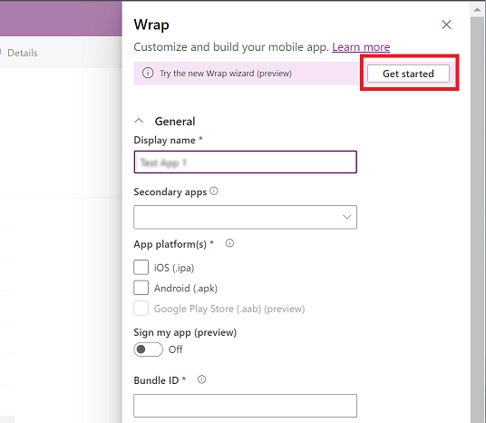
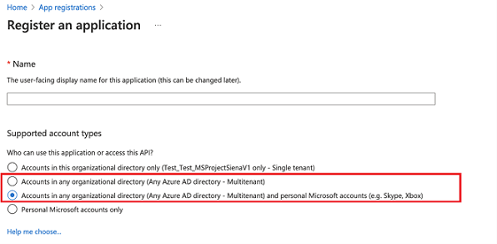

# Customize and build your mobile app using wrap (preview)

[This article is pre-release documentation and is subject to change.]

Use the wrap feature to package one or more canvas app(s) as a single native mobile app package using the step-by-step wizard.

The wrap feature in Power Apps lets you create native mobile versions of your [canvas apps](../../canvas-apps/getting-started.md) as custom-branded Android and iOS mobile apps. You can distribute such *wrapped* native mobile apps to the end users through Microsoft Intune, App Center or other native distribution methods.

Wrap feature allows you to create mobile apps for iOS, Android or Google Play Store:

- Android (APK package)
- Google Play Store (AAB package)

The wrap feature will wrap your canvas apps in a native mobile app shell that you can digitally sign and distribute. More information:

- [Code sign for iOS](code-sign-ios.md)
- [Code sign for Android](code-sign-android.md)

You can use Microsoft Intune, App Center or Apple Business Manager, Google Play Store to distribute your native mobile apps created with wrap.

When you update your app and republish it, the app is automatically updated.

> [!IMPORTANT]
> - This is a preview feature.
> - Preview features aren’t meant for production use and may have restricted functionality. These features are available before an official release so  that customers can get early access and provide feedback.

## Prerequisites

You'll need access to:
- [Azure portal](https://portal.azure.com/) to register your app and configure the API permissions on the Microsoft Identity platform.
- [App Center](https://appcenter.ms/) to add new organization and apps.
- This feature requires the apps to be part of a  [managed or unmanaged solution](/power-platform/alm/solution-concepts-alm#managed-and-unmanaged-solutions). If your apps aren't part of a solution already, add them to an existing or a new solution. More information: [Create a canvas app from within a solution](../../canvas-apps/add-app-solution.md#add-an-existing-canvas-app-to-a-solution). 

To use Android platform, ensure you [<u>generate keys</u>](code-sign-android.md#generate-keys), and then [generate signature hash](code-sign-android.md#generate-signature-hash) before you [<u>register the app</u>](how-to.md#app-registration). You'll need the generated signature hash to configure the **Redirect URI**.

## Create native mobile apps for iOS and Android

1. Sign in to [Power Apps](https://make.powerapp.com/).

2. Select **Apps**, from the left navigation pane. 

3. Select the app that you want to wrap, and then select **Wrap** on the command bar.

   > [!div class="mx-imgBorder"] 
   > 

4. On the **Wrap** pane, select **Get started** to use the wizard.

   > [!div class="mx-imgBorder"] 
   > 

### Step 1: Select Apps 

1. On the **Select the app(s) to wrap** screen, select your primary and secondary app.

   - **Primary app**: Select the app your end users will see when they launch the mobile app.
   - **Secondary app(s)**: Optional additional apps that you can bundle the same build for mobile app package along with the Primary app.

     > [!div class="mx-imgBorder"] 
     > 
  
     > [!NOTE]
     > You can use the same Primary app in multiple wrap projects.

2.  Select **Next**.

### Step 2: Target Platform 

1.  On the **Choose mobile platform to target** screen, enter a **Bundle ID** of our choice. This is the name of the app that appears in the app store. A bundle ID must contain one period (.) and no spaces. 

2. Under **Target platforms(s)**, select all the mobile platforms that your end users use on their mobile devices.

3. Set the **Sign my app (prview)** toggle to **ON** to code sign your ap pand then select **Next**. For more information on code sign, see:
  
   - [Code sign for iOS](code-sign-ios.md)
   - [Code sign for Android](code-sign-android.md) 

4.  Select **Next**.

### Step 3: Configure Branding

1. On the **Configure Branding Step**, set the following look and feel options for your app:
   
   - **App icons**: Upload icons to use for your app. All five icons need to be selected for your wrapped mobile app
   - **Splash screen image**: Image that will be used on the splash screen of your mobile app, while it loads. Default image used when not provided.
   - **Welcome screen image**: Image that will be used on the welcome (sign in) screen of your mobile app, while it loads. Default image used when not provided.
   - **Background fill color**: Hexadecimal color code used for the background of the welcome screen
   - **Button fill color**: Hexadecimal color code used to fill the button color
   - **Status bar text theme**: Color for the status bar text at the top of the app.

2.  Select **Next**.

### Step 4: Register app

On the **Register your app** screen, register your application in Azure to establish a trust relationship between your app and the Microsoft identity platform.

Your app must be registered in Azure ADD so that your app users can sign in. You need to go to [Azure portal](https://portal.azure.com/) to register your app and configure the API permissions on the Microsoft Identity platform.

- **For iOS**: The **Redirect URI** only requires the **Bundle ID**.  Examples for iOS:

    - **Bundle ID**: com.contoso.myapp
    - **Redirect URI**: msauth.com.contoso.myapp://auth

- **For Android**: The **Redirect URI** requires the **Package name**, and the **Signature hash**. To create the signature hash, [generate keys](code-sign-android.md#generate-keys), and then [generate signature hash](code-sign-android.md#generate-signature-hash). Examples for Android:

    - **Package name**: com.contoso.myapp
    - **Redirect URI**: msauth://com.contoso.myapp/&lt;generated signature hash&gt;

#### New app registration

For new app registration, select **New app registration** to create a new registration for your app in the organizational directory using the Azure portal. For detailed steps, see [Quickstart: Register an application with the Microsoft identity platform](/azure/active-directory/develop/quickstart-register-app).

   > [!div class="mx-imgBorder"] 
   > 

When creating a new app registration, ensure to use the supported account type that includes accounts in an organizational directory.

Both single tenant and multitenant customers can use wrap to create native mobile apps based on their canvas app.

However, you must select any of the options containing **Any Azure AD directory - Multitenant** when choosing the supported account type for your app to enable it for wrap:

 > [!div class="mx-imgBorder"] 
 > 
    
The sign-in experience for users on the mobile wrapped up will still be scoped to a single tenant regardless of what type of account you choose in this step for your app.

> [!IMPORTANT]
> - Wrap only supports **Multitenant** account types currently. **Single tenant** account type is not yet supported. More information: [Account types in Microsoft identity platform](/azure/active-directory/develop/v2-supported-account-types)
> - To ensure the **Redirect URI** matches the [required format](how-to.md#redirect-uri-format), don't create the **Redirect URI** while creating the app registration. Once the app registration is complete, go to app, and then choose **Authentication** &gt; **+ Add a platform** to add the platform instead.
> - You must create a separate **Redirect URI** for each platform (iOS, Android) that you want to target.

After the app is registered, copy the **Application (client) ID** and the **Redirect URI** that you'll need later when configuring the wrap project inside Power Apps. More information: [Register an application](/azure/active-directory/develop/quickstart-register-app#register-an-application)

### Step 5: Manage output

On the **Manage output** screen, set up automated app setup with your app center account. To create a new app center container, you'll need your org and app name.

- **Android**: Choose an existing location or select Configure manually.

- **iOS**: Choose an existing location or select Configure manually.

### Step 6: Wrap up

On the **Wrap up** screen, review the app details and then select **Build**.
