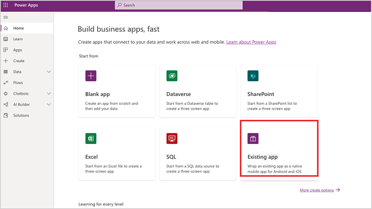
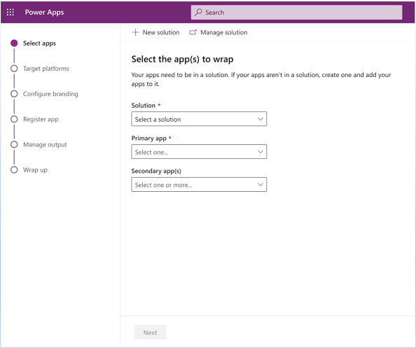

# Customize and build your mobile app using wrap (preview)

[This article is pre-release documentation and is subject to change.]

Use the wrap feature to package one or more canvas or model-driven app(s) as a single native mobile app package using the step-by-step wizard.

The wrap feature in Power Apps lets you create native mobile versions of your[canvas apps](../../canvas-apps/getting-started.md) and [model-driven apps](../../model-driven-apps/model-driven-app-overview.md) as custom-branded Android and iOS mobile apps. You can distribute such *wrapped* native mobile apps to the end users through Microsoft Intune, App Center or other native distribution methods.

You can wrap multiple canvas and model-driven apps in a single mobile app package. The mobile app package needs one primary app, which serves as the entry point for all other apps. This includes the mobile app package, which will be invoked as secondary apps.

Adding secondary apps to a single mobile app package is optional. When you wrap only one app, the included app is automatically designated as a Primary app.

However, including secondary apps in the bundle provides a better launch time performance when opening them for the first time.

> [!NOTE]
> If you have many secondary apps, you may choose to not bundle them to reduce the total size of the mobile app package.

You can use wrap feature to customize mobile app startup experience to match the branding requirements of your organization. You can specify the app icon, splash screen image, welcome (sign in) screen image, and color palette to use throughout the native experiences of the wrapped mobile app.

Wrap feature allows you to create mobile apps for iOS, Android or Google Play Store:

- Android (APK package)
- Google Play Store (AAB package)

The wrap feature will wrap your canvas and model-driven apps in a native mobile app shell that you can digitally sign and distribute. More information:

- [Code sign for iOS](code-sign-ios.md)
- [Code sign for Android](code-sign-android.md)

You can use Microsoft Intune, App Center or Apple Business Manager, Google Play Store to distribute your native mobile apps created with wrap.

When you update your app and republish it, the app is automatically updated.

> [!IMPORTANT]
> - This is a preview feature.
> - Preview features aren’t meant for production use and may have restricted functionality. These features are available before an official release so  that customers can get early access and provide feedback.

## Prerequisites

You'll need access to:
- [Azure portal](https://portal.azure.com/) to register your app and configure the API permissions on the Microsoft Identity platform.
- [App Center](https://appcenter.ms/) to add new organization and apps.

You'll need one or more canvas or model-driven apps (saved in a solution) that you can package for distribution to mobile users.

To use Android platform, ensure you [<u>generate keys</u>](code-sign-android.md#generate-keys), and then [generate signature hash](code-sign-android.md#generate-signature-hash) before you [<u>register the app</u>](how-to.md#app-registration). You'll need the generated signature hash to configure the **Redirect URI**.

## Create native mobile apps for iOS and Android

1. Sign in to [Power Apps](https://make.powerapp.com/).

2. On the **Home** screen, select **Existing app**.

   > [!div class="mx-imgBorder"] 
   > 

3. Select **Get started**.

### Select the app(s) to wrap

On the Select the app(s) to wrap step, select the solution, primary app, and any secondary apps.

- Solution: This feature requires the apps to be part of a  [managed or unmanaged solution](/power-platform/alm/solution-concepts-alm#managed-and-unmanaged-solutions). If your canvas apps aren't part of a solution already, add them to an existing or a new solution. More information: [Create a canvas app from within a solution](../../canvas-apps/add-app-solution.md#add-an-existing-canvas-app-to-a-solution)  

- Primary app: Select the app your end users will see when they launch the mobile app.

  > [!NOTE]
  > You can use the same Primary app in multiple wrap projects.

- Secondary app(s): Optional additional apps that you can bundle the same build for mobile app package along with the Primary app.

  > [!div class="mx-imgBorder"] 
  > 

### Choose mobile platform to target

On the **Choose mobile platform to target** screen, select all platforms that your end users use on their mobile devices.

- Set the **Sign my app** toggle to **ON** to code sign your app. More information: [Code sign for iOS](code-sign-ios.md), [Code sign for Android](code-sign-android.md).

### Configure branding

On the **Configure branding** screen, configure the appearance of your app.

All five icons need to be selected for your wrapped mobile app.

- **App preview**: Select the phone or tablet to see a preview of your customized app. Make sure you're using a supported device. More information: [System requirements, limits, and configuration values for Power Apps](../../../limits-and-config.md#supported-platforms-for-running-apps-using-the-power-apps-mobile-app)

- **Color palette**: Choose the app colors.

- **Look and feel**: Select the look and feel of your app.

### Register your app

On the **Register your app** screen, register your application in Azure to establish a trust relationship between your app and the Microsoft identity platform.

Your app must be registered in Azure ADD so that your app users can sign in. You need to go to [Azure portal](https://portal.azure.com/) to register your app and configure the API permissions on the Microsoft Identity platform.

- **Application bundle ID**: Select an app bundle ID from the list.

For iOS, the **Redirect URI** only requires the **Bundle ID**.

Examples for iOS:

- **Bundle ID**: com.contoso.myapp

- **Redirect URI**: msauth.com.contoso.myapp://auth

For Android, the **Redirect URI** requires the **Package name**, and the **Signature hash**. To create the signature hash, [generate keys](code-sign-android.md#generate-keys), and then [generate signature hash](code-sign-android.md#generate-signature-hash).

Examples for Android:

- **Package name**: com.contoso.myapp

- **Redirect URI**: msauth://com.contoso.myapp/&lt;generated signature hash&gt;

- **New app registration**: Select **+ New app registration** to create a new registration for your app in the organizational directory using the Azure portal. For detailed steps, see [Quickstart: Register an application with the Microsoft identity platform](/azure/active-directory/develop/quickstart-register-app).

When creating a new app registration, ensure to use the supported account type that includes accounts in an organizational directory.

Both single tenant and multitenant customers can use wrap to create native mobile apps based on their Power Apps canvas and model-driven apps.

However, you must select any of the options containing **Any Azure AD directory - Multitenant** when choosing the supported account type for your app to enable it for wrap:

 > [!div class="mx-imgBorder"] 
 > 
    
The sign-in experience for users on the mobile wrapped up will still be scoped to a single tenant regardless of what type of account you choose in this step for your app.

> [!IMPORTANT]
> - Wrap only supports **Multitenant** account types currently. **Single tenant** account type is not yet supported. More information: [Account types in Microsoft identity platform](/azure/active-directory/develop/v2-supported-account-types)
> - To ensure the **Redirect URI** matches the [required format](how-to.md#redirect-uri-format), don't create the **Redirect URI** while creating the app registration. Once the app registration is complete, go to app, and then choose **Authentication** &gt; **+ Add a platform** to add the platform instead.
> - You must create a separate **Redirect URI** for each platform (iOS, Android) that you want to target.

After the app is registered, copy the **Application (client) ID** and the **Redirect URI** that you'll need later when configuring the wrap project inside Power Apps. More information: [Register an application](/azure/active-directory/develop/quickstart-register-app#register-an-application)

### Manage output

On the **Manage output** screen, to set up automated app set up with the app center. To create a new app center container, you'll need your org and app name.

- **Android**: Choose an existing location or select Configure manually.

- **iOS**: Choose an existing location or select Configure manually.

### Wrap up

On the **Wrap up** screen, review the app details and then select **Build**.
