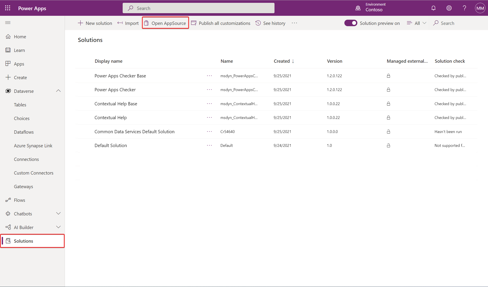
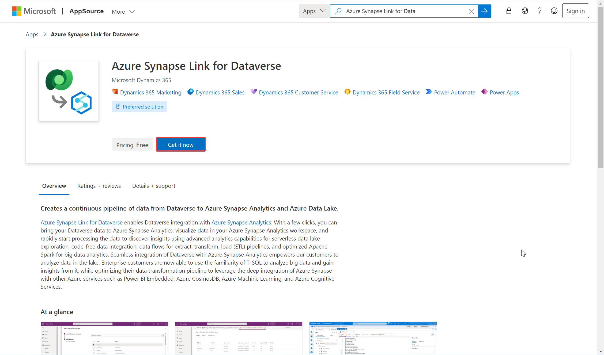
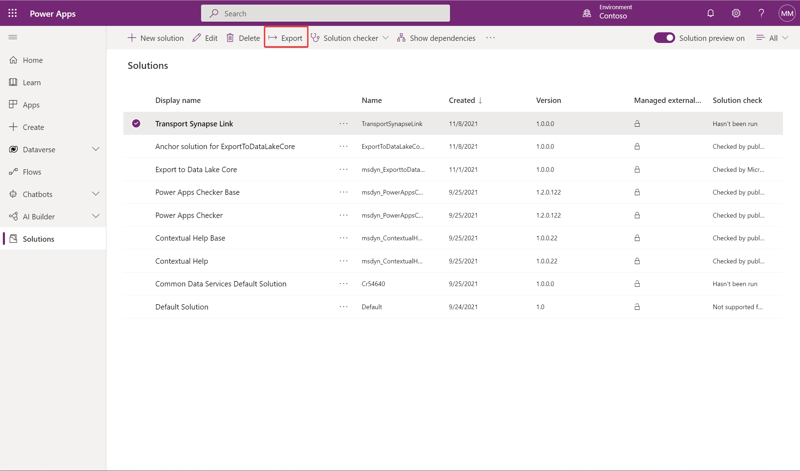
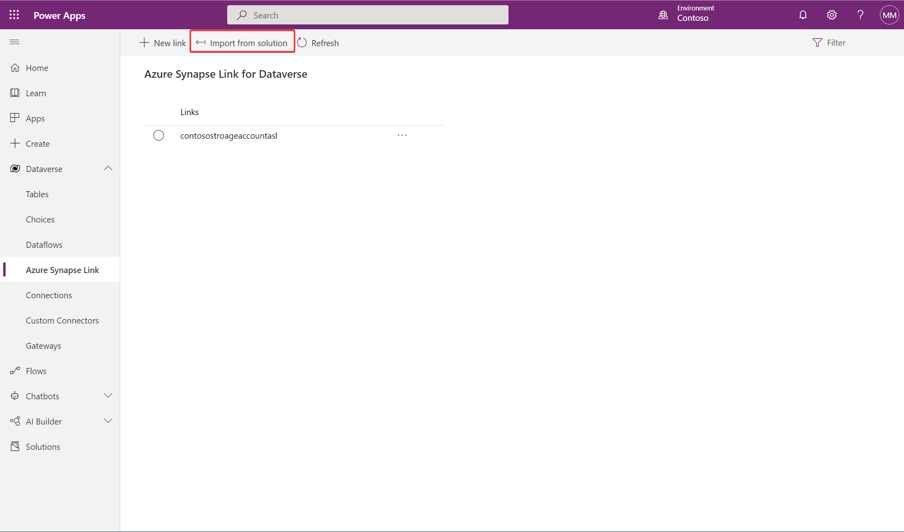
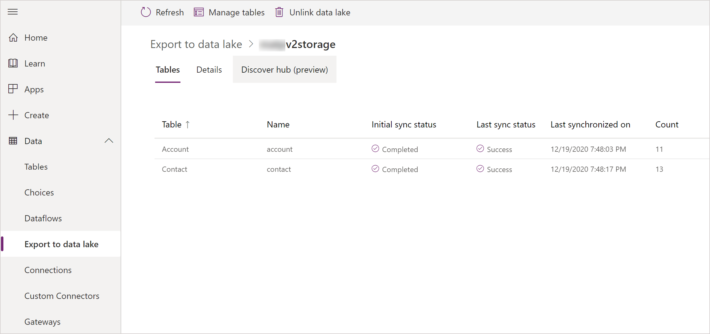

# Transport the Azure Synapse Link for Dataverse Configuration across Environments

[!INCLUDE[cc-data-platform-banner](../../includes/cc-data-platform-banner.md)]

In Power Apps, solutions are used to transport apps and components from one environment to another, or to apply a set of customizations to existing apps. Making the Azure Synapse Link for Dataverse configurations solution-aware enables basic application lifecycle management (ALM) abilities such as distribution, copy, and backup and restore of the Azure Synapse Link for Dataverse configuration.

> [!NOTE]
> Azure Synapse Link for Microsoft Dataverse was formerly known as Export to data lake. The service was renamed effective May 2021 and will continue to export data to Azure Data Lake as well as Azure Synapse Analytics.

## Prerequisites

This section describes the prerequisites necessary to transport the Azure Synapse Link for Dataverse configuration across environments.

- **Azure Synapse Link for Dataverse.** This guide assumes that you have already exported data from Dataverse by using the [Azure Synapse Link for Dataverse](export-to-data-lake.md).

## Install the Azure Synapse Link for Dataverse solution

> [!NOTE]
> The Azure Synapse Link for Dataverse solution must be installed in both the source and the destination environments.

1. From the Power Apps Maker Portal, select the source environment for the Azure Synapse Link for Dataverse configuration.

2. On the leftmost navigation pane, select **Solutions** and **Open AppSource**.

    

3. Search for the solution named **Azure Synapse Link for Dataverse** and **Get it now**.

    

4. Repeat above steps in the destination environment. You need the **Azure Synapse Link for Dataverse** solution in both the source and destination environments.

## Add an Azure Synapse Link configuration to a Solution

1. From the Power Apps Maker Portal, select the source environment, and on the leftmost navigation pane, select **Solutions**.

2. Select **New solution**, provide a **Name**, **Publisher**, and **Version Number**.  

3. Open the solution you created in the previous step, select **Add existing** > **More** > **Azure Synapse Link config**.

    

4. Select the link configurations that you want, and then select **Add**.

5. In the **Solutions** area, select the solution, and then on the command bar, select **Export**.

    

6. In the **Before you export** pane, select **Publish** to publish all changes before you export, and then select **Next**.

> [!NOTE]
> Once the solution has been configured and exported, it is not updated automatically. Any updates you make to the configuration will require you to re-export and re-import the solution.

## Import the solution that contains the Azure Synapse Link configuration

1. In the destination environment, import the solution under the **Solutions** tab.

2. In the destination environment, import the solution under the **Dataverse** > **Azure Synapse Link** tab.

    

## Verify the Azure Synapse Link configuration

In the destination environment, verify that you can see the new Azure Synapse Link from the solution addition to the list of links.

### See also

[Azure Synapse Link for Dataverse](./export-to-data-lake.md)

[!INCLUDE[footer-include](../../includes/footer-banner.md)]
