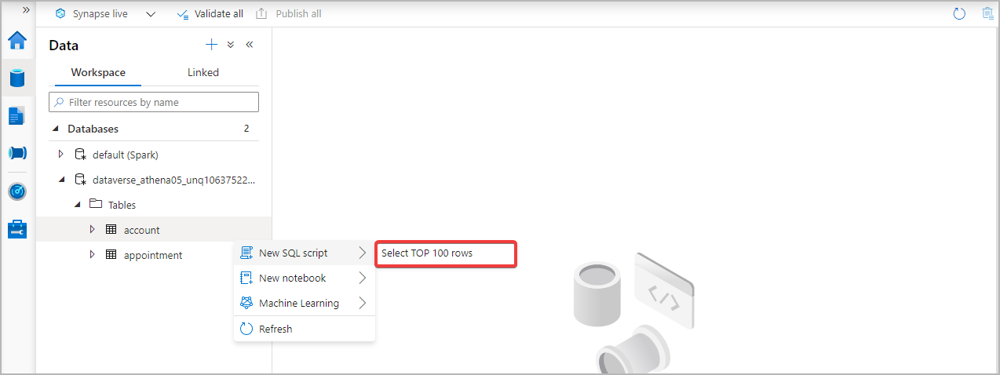
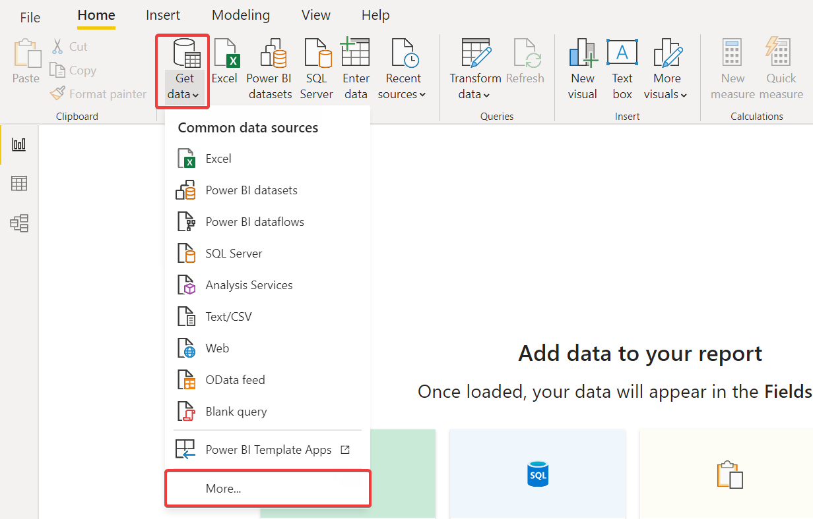
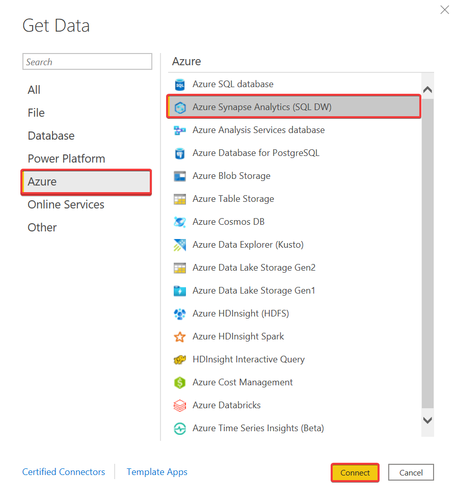
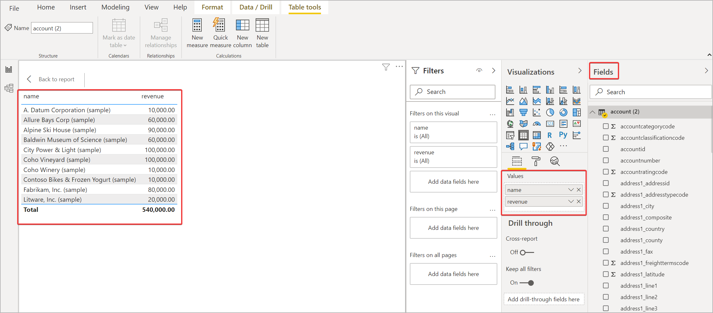

# Configure Azure Synapse Link for Dataverse with your Azure Synapse Workspace (Preview)

[!INCLUDE[cc-data-platform-banner](../../includes/cc-data-platform-banner.md)]

> [!NOTE]
> Azure Synapse Link for Dataverse was formerly known as Export to data lake. The service was renamed effective June 2021 and will continue to export to data to the data lake as well as Azure Synapse Analytics.

> [!NOTE]
> Preview (pick from footnotes)

You can use the Azure Synapse Link to connect your Microsoft Dataverse data to Azure Synapse Analytics to explore your data and accelerate time to insight. This article shows you how to perform the following tasks:

1. Connect your Dataverse data to your Azure Synapse Analytics workspace with the Azure Synapse Link service.
2. Query your data in Azure Synapse Analytics workspace.
3. Generate a Power BI Report.

## Prerequisites

### Azure Data Lake Storage Gen2

You must have an Azure Data Lake Storage Gen2 account and **Owner** and **Storage Blob Data Contributor** role access. Your storage account must enable **Hierarchical namespace** and it is recommended that replication is set to **read-access geo-redundant storage (RA-GRS)**.

### Synapse workspace

You must have a Synapse workspace and the **Synapse Administrator** role access within the Synapse Studio. The synapse workspace must be in the same region as your Azure Data Lake Storage Gen2 account. To create a Synapse workspace, follow the steps [here](https://docs.microsoft.com/en-us/azure/synapse-analytics/get-started-create-workspace).

## Connect Dataverse to Synapse workspace

1. Sign in to [Power Apps](https://make.powerapps.com/?utm_source=padocs&utm_medium=linkinadoc&utm_campaign=referralsfromdoc) and select your preferred environment.

2. Select **Data** > **Export to data lake** from the left sidebar and select **+ New link to data lake** from the top.

    

3. Check the **Connect to your Azure Synapse workspace (Preview) option**.

4. Select the **Subscription**, **Resource group**, **Workspace name**, and **Storage account**. Ensure that the Synapse workspace and Storage account meet the requirements specified in the Prerequisites section. Select **Next**.

    

5. Add your preferred Tables to export. Select **Save**.

    

## Query your Dataverse data

1. Select your storage account name from the list and select **Go to Azure Synapse workspace** button from the top when your Tables have completed syncing.

    

2. Expand **Databases**, select your Dataverse container, and find your exported tables under the **Tables** directory on the left sidebar.

    

3. Right-click on the desired table and select **New SQL script** > **Select TOP 100 rows**.

    

4. Select **Run** and find your results at the bottom. Alternatively, you can edit the script to your needs.

    

## Connect to your Azure Synapse Analytics workspace to Power BI

1. Launch Power BI Desktop.

2. Select **Get data** > **More...**.

    

3. Select **Azure** > **Azure Synapse Analytics (SQL DW)** and **Connect**.

    

4. Navigate to your Azure Synapse Analytics workspace and copy the **Serverless SQL endpoint**.

    

5. Paste the endpoint for the **Server**. Select **DirectQuery** for the **Data Connectivity mode**. Select **OK**.

    

6. If prompted, sign in with your Microsoft Account.

7. Select the container and the preferred table from the Navigator and **Load**.

    

8. Select fields from the **Fields** pane to create a simple table or create other visualizations.

    

### See also

[Configure Azure Synapse Link for Dataverse with your Azure Data Lake](./azure-synapse-link-data-lake.md)

[Azure Synapse Link for Dataverse Advanced Configuration](./azure-synapse-link-advanced-configuration.md)

[Azure Synapse Link FAQ](azure-synapse-link-faq.yml)

[Blog: Announcing Azure Synapse Link for Dataverse](https://aka.ms/synapse-dataverse)

[!INCLUDE[footer-include](../../includes/footer-banner.md)]