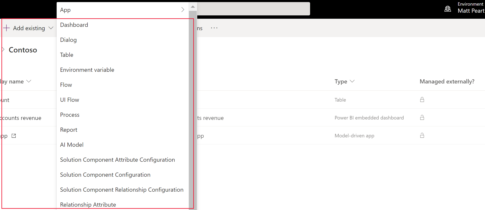
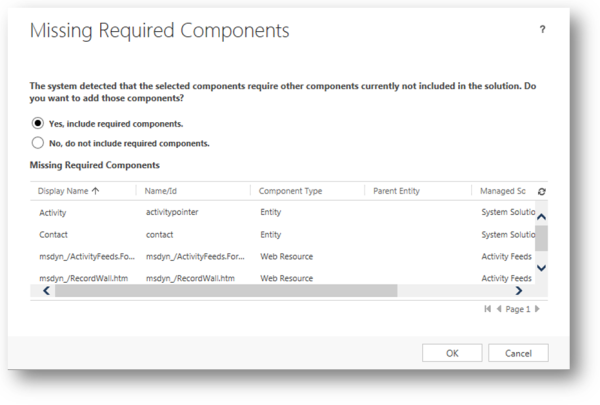
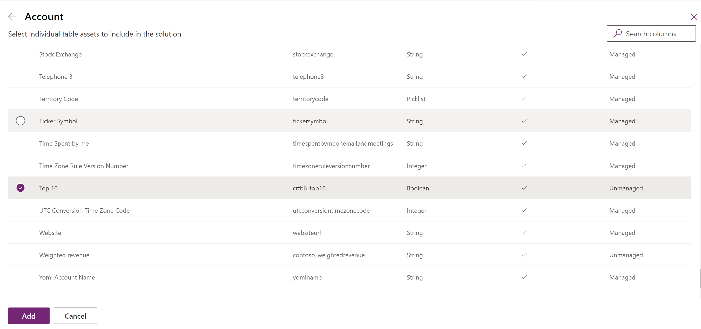

# Create a solution

[!INCLUDE[cc-data-platform-banner](../../includes/cc-data-platform-banner.md)]

To locate and work with just the components you’ve customized, create a solution and do all your customization there. Then, always remember to work in the context of the custom solution as you add, edit, and create components. This makes it easy to export your solution so that it can be backed up or imported to another environment. 

> [!NOTE]
> For information about implementing healthy application lifecycle management (ALM) using solutions, see the [Power Platform ALM guide](/power-platform/alm).
  
To create a solution:   
1.  Sign in to [Power Apps](https://make.powerapps.com/?utm_source=padocs&utm_medium=linkinadoc&utm_campaign=referralsfromdoc) and select **Solutions** from the left navigation. 
  
2.  Select **New solution** and then complete the required columns for the solution.
  
    |Field|Description|  
    |-----------|-----------------|  
    |**Display Name**|The name shown in the list of solutions. You can change this later.|  
    |**Name**|The unique name of the solution. This is generated using the value you enter in the Display Name column. You can edit this before you save the solution, but after you save the solution, you can’t change it.|  
    |**Publisher**|You can select the default publisher or create a new publisher. We recommend that you create a publisher for your organization to use consistently across your environments where you will use the solution. See [Solution publisher](#solution-publisher) later in this article. |  
    |**Version**|Enter a number for the version of your solution. This is only important if you export your solution. The version number will be included in the file name when you export the solution.|  
  
3.  Select **Save**.  
  
 After you save the solution, you may wish to add information to columns that aren’t required. These steps are optional. Use the **Description** column to describe the solution and choose an HTML web resource as a **Configuration Page** for the solution. The configuration page is typically used by ISVs who distribute solutions. When this is set, a new **Configuration** node appears below the **Information** node to display this web resource. Developers will use this page to include instructions or controls to allow you to set configuration data or launch their solution.  
  

## Add solution components

 After you’ve created your solution, it won’t contain any solution components. You can create new components to be added to the solution or add existing components to your new solution.
 
 ### Create components in a solution

 You can use the **New** command to create different types of components. This takes you to a different create experience depending on the component type that you choose. After you finish creating the component, it will be added to the solution. 
 
> [!div class="mx-imgBorder"]  
>   
 
 ### Add an existing component to a solution
 
 With solutions that are unmanaged and not the default one, you can use the **Add existing** command to bring in components that aren’t already in the solution.  
 
> [!div class="mx-imgBorder"]  
>   

> [!NOTE]
> The list of existing components will be different depending on the version and solutions imported in your environment. 
  
When you add an existing table, rather than select **Include all components** or **Include table metadata**, use the **Select components** option to only add the table components that have been updated. With solution segmentation, you export solution updates with selected table assets, such as table columns, forms, and views, rather than entire tables with all the assets. [Create a segmented solution with table assets](#create-a-segmented-solution-with-table-assets)

 Many of the customizations you’ll want to do will involve tables. You can use the **table** filter to show a list of all the tables in the current solution that can be customized in some way. Once you drill into a table, you can see the components that are part of the table as shown with the account table in the following screenshot. 
   
> [!div class="mx-imgBorder"]  
>   
  
<!--
When you do this you may see a **Missing Required Components** dialog.  
   
   
  
 This dialog alerts you that the solution component has dependencies on other solution components. If you select **No, do not include required components**, the solution may fail if you import it into another organization where all those required components do not exist. If the solution import succeeds, the behavior in the other solution may not be identical as the original organization because the components are configured differently than those in the source solution.  
  
When you select table components, we recommend that you use solution segmentation so that you only include table components that are new or updated when you distribute solution updates. With solution segmentation, you work in a solution with selected table assets, such as table columns, forms, and views, rather than entire tables with all the assets. More information: [Use segmented solutions](use-segmented-solutions-patches-simplify-updates.md)
  
 If you don’t intend to export the solution, or if you only intend to export it as an unmanaged solution and import it back into the same organization, it isn’t necessary to include required components. If you ever export the solution you’ll see another warning indicating that some required components are missing. If you are only going to import this solution back into the same organization, it is OK to disregard this warning. The steps to edit application navigation or the ribbon without using a third-party editing tool expect that you’ll export the solution back into the same organization.-->  

## Publish changes 

When you make unmanaged changes in an environment, some components, such as forms, tables, model-driven apps, site maps, and views are saved in an unpublished state. The publish action promotes these changes to an active state and makes them available to end users and for export. 
 
### Publish your customizations

1.  Select **Solutions** from the left navigation.

2.  Select the solution that you want to publish to open it.

3.  From the list of commands, select **Publish all customizations**.  

  
  
> [!IMPORTANT]
>  Preparing customizations may take some time. If you see a message that the browser page has become unresponsive, wait for the page to become responsive, and don't close it.  

## Solution publisher
Every app you create or customization you make is part of a solution. Every solution has a publisher. You specify the publisher when you create a solution. 

The solution publisher indicates who developed the app. For this reason, you should create a solution publisher that is meaningful. You can view the solution publisher for a solution by selecting **Settings** from the **Solutions** area in Power Apps. For more information about the solution publisher, see [Solution publisher](/power-platform/alm/solution-concepts-alm#solution-publisher) in the Power Platform ALM guide.

> [!NOTE]
> The **Common Data Services Default Solution** is associated with the **Microsoft Dataverse Default Publisher**. The default customization prefix will be randomly assigned for this publisher, for example it could be `cr8a3`. This means that the name of every new item of metadata created for your organization will have this prepended to the names used to uniquely identify the items.

### Create a solution publisher
1.	In the Power Apps portal, select **Solutions**. 
2.	On the command bar, select **New solution**, in the right pane select the **Publisher** drop down list, and then select **+ Publisher**. 
    > [!div class="mx-imgBorder"] 
    > 
3.	In the **New Publisher** form, enter the required and optional information: 
   - **Display Name**. Enter the display name for the publisher. 
   - **Name**. Enter the unique name for the publisher. 
   - **Prefix**. Enter the publisher prefix you want. 
   -	**Option Value Prefix**. This column generates a number based on the publisher prefix. This number is used when you add options to choices and provides an indicator of which solution was used to add the option. 
   - **Contact Details**. Optionally, you can add contact and address information.
4. Select **Save and Close**.

### Change a solution publisher
You can change a solution publisher for an unmanaged solution by following these steps:
1.	In the Power Apps portal, select **Solutions**, select **…** next to the solution you want, and then select **Settings**. 
2.	In the **Solution settings** pane, select **Edit publisher**. 
3.	Edit the **Display name** and **Prefix** columns to the values you want. The **Option Value Prefix** column generates a number based on the publisher prefix. This number is used when you add options to choices and provides an indicator of which solution was used to add the option. 
4.	In addition to the prefix, you can also change the solution publisher display name, contact information, and address in the **Contact Details** section. 
5.	Select **Save and Close**.

## Create a segmented solution

Use solution segmentation so that you only include table components that are updated when you distribute solution updates. More information: [Use segmented solutions](/power-platform/alm/segmented-solutions-alm) in the Power Platform ALM guide

### Create a segmented solution with table assets 
 To create a segmented solution, start with creating an unmanaged solution and add only the components that you've updated. The wizard-like setup takes you step by step through the process of adding table assets. 

For example, imagine that you've created a new custom table that doesn't exist in any other environment named *Custom table* and also added a new column named *topten* for the account table. To create a segmented solution, follow these steps. 
  
1. Go to the Power Apps portal and then select **Solutions**.  
  
2.  Select **New solution** and create a solution. Enter information in the required columns. Select **Create**.  
  
3.  Open the solution you created. On the command bar, select **Add Existing**, and then select **Entity**.  
  
4.  In the **Add existing entities** pane, select one or more tables you want to add to the solution. For example, select **Account** and **Custom table**. Select **Next**.  

5.  In the **Select Entities** pane, you can choose from the assets to include: 
    - **Include all components**. This option includes all components *and* metadata associated with the table. It can include other tables or table components such as business process flows, reports, connections, and queues. 
    - **Include entity metadata**. This option includes *only* the metadata associated with the table. Metadata includes the table attributes, such as auditing, duplicate detection, or change tracking. 
    - **Select components**. This option lets you individually select each component that’s associated with the table, such as columns, relationships, business rules, views, forms, and charts. 
    - Don't include any components. 

      For this example, because *Custom table* has never been imported into the target environment, next to **Custom table** select **Include all components**. Under **Account**, choose **Select components**.  
      > [!div class="mx-imgBorder"] 
      > 
  
6.  Since only the *topten* custom column is new to the account  table, select **Top Ten**, and then select **Add**.  
     > [!div class="mx-imgBorder"] 
     > 

7. Select **Add** to add the components to the solution. 

### Create a segmented solution using solution explorer  
The following illustrations provide an example of creating a segmented solution by choosing table assets from the `Account`, `Case`, and `Contact` tables.  

> [!NOTE]
> The case table is included with some Dynamics 365 applications, such as Dynamics 365 Customer Service. 
  
Start by opening an unmanaged solution you created. Choose the **table** component.  

 > [!div class="mx-imgBorder"] 
 >   
  
 Then, select the solution components.  
  
   
  
 Follow the wizard. In Step 1, starting in alphabetical order, select the assets for the first table, the `Account` table, as shown here.  
  
   
  
 Open the **Fields** tab and select the **Account Number** column.  
  
   
  
 In Step 2, for the **Case** table, add all assets.  
  
   
  
 In Step 3, add the **Anniversary** column for the **Contact** table.  
  
   
  
 As a result, the segmented solution that’s created contains three tables, `Account`, `Case`, and `Contact`. Each table contains only the assets that were chosen.  
  
 > [!div class="mx-imgBorder"] 
 > 

### See also
 [Use solutions](use-solution-explorer.md)  
[For developers: Create, export, or import an unmanaged solution](/power-platform/alm/solution-api#create-export-or-import-an-unmanaged-solution)
