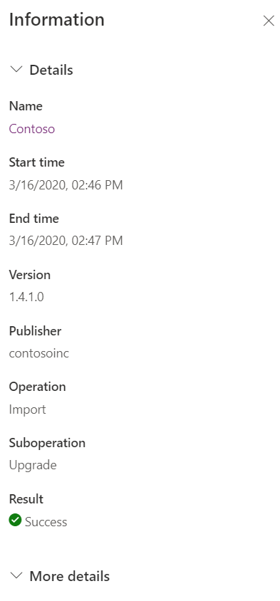

# View the history of a solution

You can view details about solution operations from the **Solutions** area of Power Apps. An operation can be a solution import, export, or uninstall. The solution history displays information such as solution version, solution publisher, type of operation, operation start and end time, and operation status.

## View solution history
1.	Sign in to [Power Apps](https://make.powerapps.com/?utm_source=padocs&utm_medium=linkinadoc&utm_campaign=referralsfromdoc).
2.	Select **Solutions** on the left navigation pane, select the solution you want, and then on the command bar select **See history**. 

    The history is displayed. 

    > [!div class="mx-imgBorder"] 
    > 

Select a solution operation to display the **Information page**. Each solution history row is read-only and includes the following in the **Details** area:
-	**Name**. The solution unique name. 
-	**Start time**. The time in which the operation started.
-	**End time**: The time in which the operation ended.
-	**Version**. The version of the solution.
-	**Publisher**. The name of the publisher that is associated with the operation. 
-	**Operation**. The operation, such as import, export, or delete. 
-	**Suboperation**: Denotes the type of operation, such as a new solution import or an update to an existing solution.
-	**Result**. The result of the operation, such as Success or Failure.

 > [!div class="mx-imgBorder"] 
 > 

### View solution operation error details 
Below the **Details** area is the **More details** area that has additional information about the solution and, when a solution operation has a failure, the information includes: 
- The **Error code** of the error returned from the operation. 
- The **Exception message**, which can help diagnose the underlying cause for the operation failure. Some errors, including solution dependency errors, may also include links to solution layers to make it easier for you to diagnose the issue. 
- The **Activity Id** can be useful in cases where you need to contact Microsoft Customer Support.

### See also
[View solution layers](solution-layers.md)   
[Solutions overview](solutions-overview.md) 

[!INCLUDE[footer-include](../../includes/footer-banner.md)]