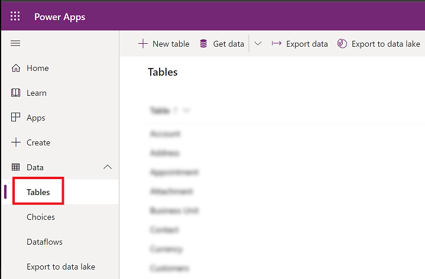

# Types of tables

[!INCLUDE[cc-data-platform-banner](../../includes/cc-data-platform-banner.md)]

Before creating or editing tables in Microsoft Dataverse, you should understand that there are different types of tables. Once a custom table is created, these types can't be changed. The two main table types are standard tables and activity tables.  
  

## Standard tables 

There are four different types of standard table ownership. When you create a custom standard table the only options are **User or team** owned or **Organization** owned, but you should be aware that other tables have different ownership types.  
  
|Ownership|Description|  
|---------------|-----------------|  
|**Business-owned**|Data in these tables belongs to the Business unit. Access to the data can be controlled at the business unit level.|  
|**None**|Data not owned by another table.|  
|**Organization**|Data belongs to the organization. Access to the data is controlled at the organization level.|  
|**User or team**|Data belongs to a user or a team. Actions that can be performed on these rows can be controlled on a user level.|  
  
  
> [!IMPORTANT]
>  After a standard table is created, you can’t change the ownership. Before you create a table, make sure that you choose the correct type of ownership. If you later determine that your custom table must be of a different type, you have to delete it and create a new one.
  

## Activity tables

An activity can be thought of as any action for which an entry can be made on a calendar. An activity has time dimensions (start time, stop time, due date, and duration) that help determine when the action occurred or will occur. Activities also contain data that helps determine what action the activity represents, for example, subject and description. An activity can be opened, canceled, or completed. The completed status of an activity will have several sub-status values associated with it to clarify the way that the activity was completed.  
  
Activity tables can only be owned by a user or team, they can’t be owned by an organization.  
  
The following table lists activity tables that are available in a default Dataverse environment.
  
|Name|Description|Display in activity menus|Reference|
|----------|-----------------|----------------|---------------|  
|**Appointment**|Commitment representing a time interval with start/end times and duration.|Yes|[Appointment](/powerapps/developer/data-platform/reference/tables/appointment)|
|**Email**|Activity that is delivered using email protocols.|Yes|[Email](/powerapps/developer/data-platform/reference/tables/email)|
|**Fax**|Activity that tracks call outcome and number of pages for a fax and optionally stores an electronic copy of the document.|Yes|[Fax](/powerapps/developer/data-platform/reference/tables/fax)|
|**Letter**|Activity that tracks the delivery of a letter. The activity can contain the electronic copy of the letter.|Yes|[Letter](/powerapps/developer/data-platform/reference/tables/letter)|
|**Phone Call**|Activity to track a telephone call.|Yes|[PhoneCall](/powerapps/developer/data-platform/reference/tables/phonecall)|
|**Recurring Appointment**|The master appointment of a recurring appointment series.|Yes|[RecurringAppointmentMaster](/powerapps/developer/data-platform/reference/tables/recurringappointmentmaster)|
|**Task**|Generic activity representing work needed to be done.|Yes|[Task](/powerapps/developer/data-platform/reference/tables/task)|
  
You can create new custom activity tables. For example you might create a custom activity table to row instant message communications. Creating an activity table is different from creating a non-activity table because you don’t specify a primary column. All activity tables have a **Primary Field** set to **Subject** and other common columns that are defined by the Activity table. This allows all types of activities to be shown in a view where just the common columns are displayed.  

To create a custom activity table, open the **More settings** section in the **New table** panel, select **Activity table** option from the **Choose table type** drop-down list. After you select this, you’ll see that **Display in Activity Menus** is selected. This setting allows people to create this type of activity in the activity menus. This isn’t selected for activities that are typically associated with specific events and created behind using code or by a workflow. After you save the table, you can’t change these settings.  

### Enable activities for a table

Enable activities to add activities to a table and use the Regarding lookup for the table.

1. To enable activities, Sign in to [Power Apps](https://make.powerapps.com).

  
2. On the left nav, select **Data** to expand it and then select **Tables**.  

   > [!div class="mx-imgBorder"]
   >
   
  
3. Select a table.

4. On the command bar, select **Settings**. 

   > [!div class="mx-imgBorder"]
   >

5. Expand **Collaboration**, and select **Enable for activities** and then choose **Done**. 

   > [!div class="mx-imgBorder"]
   >
   
   > [!IMPORTANT]
   > Once enabled this setting can't be disabled. If prompted, select **Okay** to confirm.
   
6.  Select **Save Table** and then publish the table.

## Virtual tables

A virtual table is a custom table in Dataverse that has columns containing data from an external data source. Virtual tables appear in your app to users as regular table rows, but contain data that is read-only and sourced from an external database, such as an  Azure SQL Database. Rows based on virtual tables are available in all clients including custom clients developed using the Dataverse web services.  More information: [Create and edit virtual tables that contain data from an external data source](create-edit-virtual-entities.md)

### See also
[Create or edit tables](create-edit-entities.md)

[!INCLUDE[footer-include](../../includes/footer-banner.md)]
