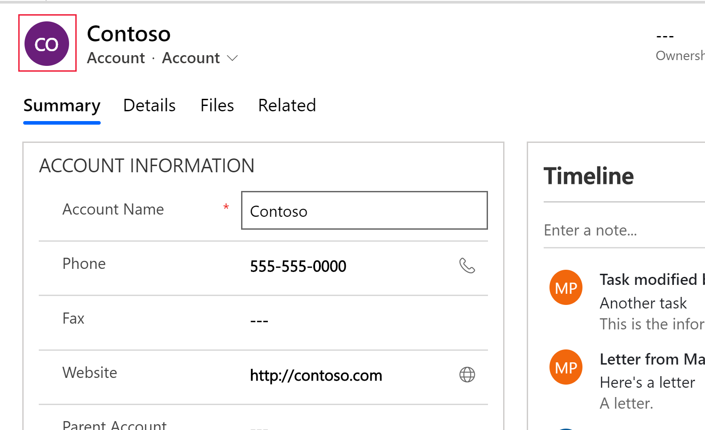
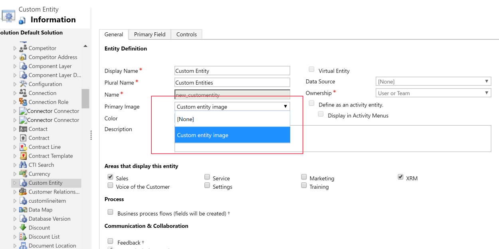
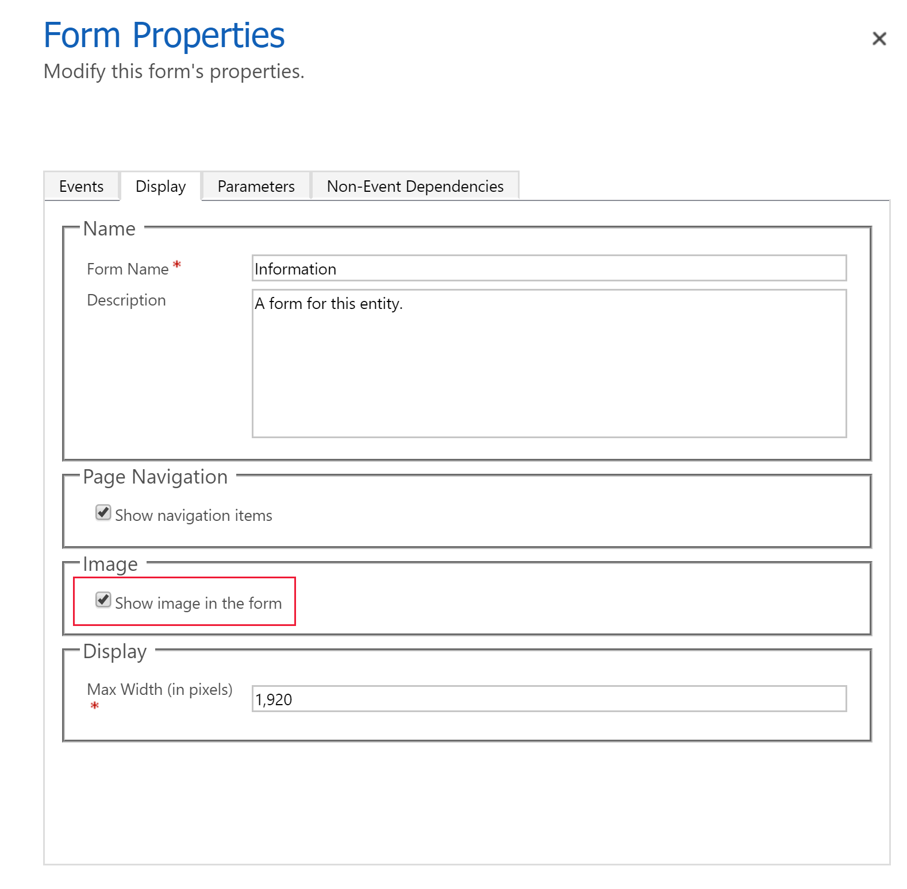
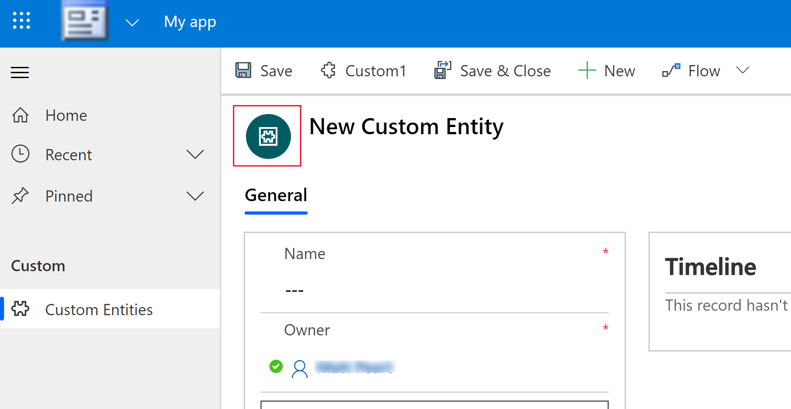
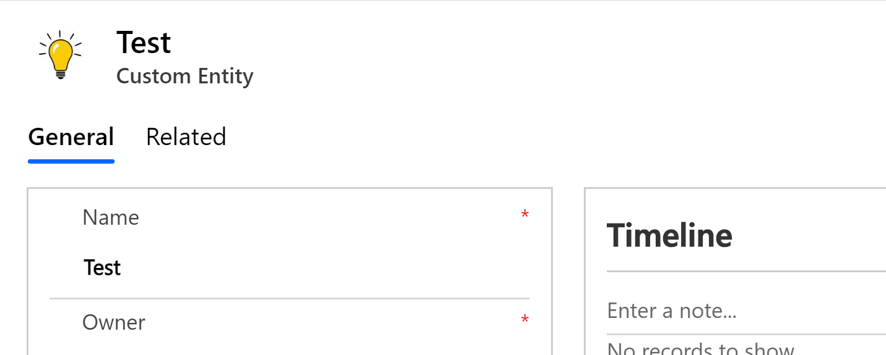
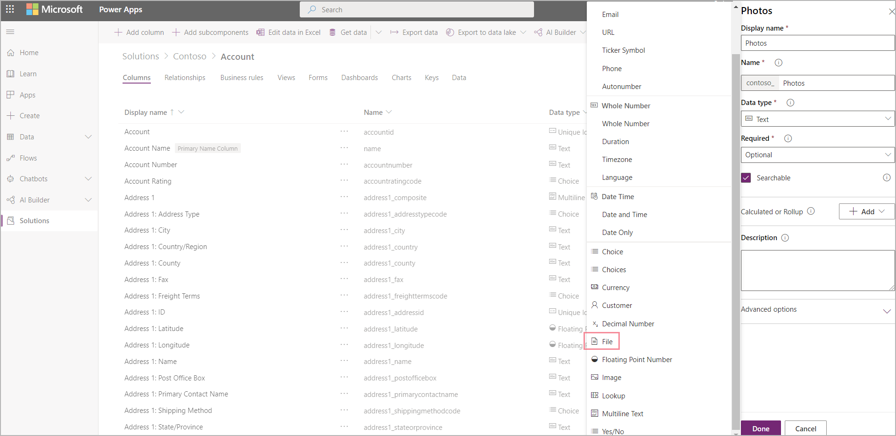

# Types of columns

[!INCLUDE[cc-data-platform-banner](../../includes/cc-data-platform-banner.md)]

The names used for types depend on the designer used. [Power Apps](https://make.powerapps.com/?utm_source=padocs&utm_medium=linkinadoc&utm_campaign=referralsfromdoc) uses a convention that includes the way the data is formatted. The solution explorer type uses a name aligned with the database data type with a format modifier.

Watch this video for a quick overview about data types in Dataverse:
> [!VIDEO https://www.microsoft.com/en-us/videoplayer/embed/RWJ4Su]

The following table includes the corresponding `AttributeTypeDisplayName` API type.

|Portal Data type |Solution Explorer  type| API type|
|--|--|--|
|**Big Integer**|**Time Stamp**|`BigIntType`|
|**Currency**|**Currency**|`MoneyType`|
|**Customer**|**Customer**|`CustomerType`|
|**Date and Time**|**Date and Time** *Date and Time* Format|`DateTimeType`|
|**Date Only**|**Date and Time** *Date Only* Format|`DateTimeType`|
|**Decimal Number**|**Decimal Number**|`DecimalType`|
|**Duration**|**Whole Number** *Duration* Format|`IntegerType`|
|**Email**|**Single Line of Text** *Email* Format|`StringType`|
|**File** | **File**   | `FileType`  |
|**Floating Point Number**|**Floating Point Number**|`DoubleType`|
|**Image**|**Image**|`ImageType`|
|**Language**|**Whole Number** *Language* Format|`IntegerType`|
|**Lookup**|**Lookup**|`LookupType`|
|**Choices**|**MultiSelect Field**|`MultiSelectPicklistType`|
|**Multiline Text**|**Multiple Lines of Text**|`MemoType`|
|**Choice**|**Option Set**|`PicklistType`|
|**Owner**|**Owner**|`OwnerType`|
|**Phone**|**Single Line of Text** *Phone* Format|`StringType`|
|**Status Reason**|**Status Reason**|`StatusType`|
|**Status**|**Status**|`StateType`|
|**Text Area**|**Single Line of Text** *Text Area* Format|`StringType`|
|**Text**|**Single Line of Text** *Text* Format|`StringType`|
|**Ticker Symbol**|**Single Line of Text** Ticker Symbol Format|`StringType`|
|**Timezone**|**Whole Number** *Time Zone* Format|`IntegerType`|
|**Yes/No**|**Two Options**|`BooleanType`|
|**Unique Identifier**|**Unique Identifier** or **Primary Key**|`UniqueidentifierType`|
|**URL**|**Single Line of Text** *URL* Format|`StringType`|
|**Whole Number**|**Whole Number** *None* Format|`IntegerType`|

For more descriptions for each type you can add or edit, see the article for the corresponding designer:
 - [Create and edit columns for Microsoft Dataverse using Power Apps portal: Column Data types](create-edit-field-portal.md#column-data-types)
 - [Create and edit columns for Dataverse using Power Apps solution explorer: Column Data types](create-edit-field-solution-explorer.md#column-data-types)

For more information about how column data types are defined in the API, see [Attribute metadata](../../developer/data-platform/entity-attribute-metadata.md)

## Column types used by the system

There are some columns used by the system that you cannot add using the designer.

|Type|Description|
|--|--|
|**Big Integer** or **Time Stamp**|Used by the system to capture a version number manage updates to a table.|
|**Customer**|A lookup column that you can use to specify a customer, which can be an account or contact. **Note**: This attribute can be added using solution explorer designer.|
|**Owner**|A system lookup column that references the user or team that is assigned a user or team owned table row.|
|**Status Reason**|A system column that has options that provide additional detail about the Status column. Each option is associated with one of the available Status options. You can add and edit the options.    You can also include custom state transitions to control which status options are available for certain tables. More information: [Define status reason transitions for custom tables](define-status-reason-transitions.md)|
|**Status**|A system column that has options that generally correspond to active and inactive status. Some system attributes have additional options, but all custom attributes have only **Active** and **Inactive** status options.  |
|**Unique Identifier**|A system column stores a globally unique identifier (GUID) value for each row.|

## Text columns

Text columns can contain text characters. This column type has several format options that will change the presentation of the text.

Watch this video for a quick overview about text columns:
> [!VIDEO https://www.microsoft.com/en-us/videoplayer/embed/RWE7j0]

## Choices

You can customize forms (main, quick create, and quick view) and email templates by adding multi-select columns that are called **Choices**. When you add a choices column, you can specify multiple values that will be available for users to select. When users fill out the form they can select one, multiple, or all the values displayed in a drop-down list.

For example, if an organization operates in multiple areas or countries, you can include multiple locations or countries in an ‘Area of operation’ column. A user can then select one or more locations from the list of available values.

Choices can be used with read-only grids, editable grids, and most forms. Multi-select choices can't be used with: 
- Workflows, business process flows, actions, dialogs, business rules, charts, rollup columns, or calculated columns.
- Reports, SLA1, and routing rules1.

1table requires Dynamics 365 Customer Service.

### Forms
Multi-select columns are supported in the following types of forms:

|Form Type|Availability|
|--|--|
|**Turbo form**|Yes|
|**Refresh form**|Read-only (column will available but cannot be edited)|
|**Legacy form**|No|
|**Bulk Edit form**|No|

You can use global choices that are defined in your organization to configure values for the multi-select choices.

  
## Using the right type of number

When choosing the correct type of number column to use, the choice to use a **Whole Number** or **Currency** type should be straightforward. The choice between using **Floating Point** or **Decimal** numbers requires more thought.  

Watch this video to help you decide what number column type to use:
> [!VIDEO https://www.microsoft.com/en-us/videoplayer/embed/RWEmPd]
  
Decimal numbers are stored in the database exactly as specified. Floating point numbers store an extremely close approximation of the value. Why choose extremely close approximation when you can have the exact value? The answer is that you get different system performance.  
  
Use decimals when you need to provide reports that require very accurate calculations, or if you typically use queries that look for values that are equal or not equal to another value.  
  
Use floating point numbers when you store data that represents fractions or values that you will typically query comparing to another value using greater than or less than operators. In most cases, the difference between decimal and float isn’t noticeable. Unless you require the most accurate possible calculations, floating point numbers should work for you.  
  

 
## Using currency columns

Currency columns allow for an organization to configure multiple currencies that can be used for rows in the organization. When organizations have multiple currencies, they typically want to be able to perform calculations to provide values using their base currency. When you add a currency column to a table that has no other currency columns, two additional columns are added:  
  
- A lookup column called **Currency** that you can set to any active currency configured for your organization. You can configure multiple active currencies for your organization in **Settings** > **Business Management** > **Currencies**. There you can specify the currency and an exchange rate with the base currency set for your organization. If you have multiple active currencies, you can add the currency column to the form and allow people to specify which currency should be applied to money values for this row. This will change the currency symbol that is shown for the currency columns in the form.  
  
  Individuals can also change their personal options to select a default currency for the rows they create.
  
- A decimal column called **Exchange Rate** that provides the exchange rate for a selected currency associated with the table with respect to the base currency. If this column is added to the form, people can see the value, but they can’t edit it. The exchange rate is stored with the currency.  
  
For each currency column you add, another currency column is added with the suffix `_Base` on the name. This column stores the calculation of the value of the currency column you added and the base currency. Again, if this column is added to the form, it can’t be edited.  
  
When you configure a currency column you can choose the precision value. There are three options as shown in the following table.  
  
|Option|Description|  
|------------|-----------------|  
|Pricing Decimal Precision|This is a single organization precision to be used for prices found in **Settings** > **Administration** > **System Settings** > **General Tab**.|  
|Currency Precision|This option applies the precision defined for the currency in the row.|  
|Specific precision values|These settings allow for defining a specific set precision using values between  0 and 4.|  
  
 
  
## Different types of lookups  

When you create a new lookup column you are creating a new Many-to-One (N:1) table relationship between the table you’re working with and the **Target Row Type** defined for the lookup. There are additional configuration options for this relationship that are described in [Create and edit relationships between tables](create-edit-entity-relationships.md). But all custom lookups can only allow for a reference to a single row for a single target row type.  
  
However, you should be aware that not every lookup behaves this way. There are several different types of system lookups as shown here.  
  
|Lookup type|Description|  
|-----------------|-----------------|  
|**Simple**|Allows for a single reference to a specific table. All custom lookups are this type.|  
|**Customer**|Allows for a single reference to either an account or a contact row.|  
|**Owner**|Allows for a single reference to either a team or a user row. All team or user-owned tables have one of these. More information: [Add a table as a lookup option in your app](../model-driven-apps/team-entity-lookup.md)|  
|**PartyList**|Allows for multiple references to multiple tables. These lookups are found on the Email table **To** and **Cc** columns. They’re also used in the Phone and Appointment tables.|  
|**Regarding**|Allows for a single reference to multiple tables. These lookups are found in the regarding column used in activities.|  

## Image columns

Use image columns to display a single image per row in the application. Each table can have one image column. You can add an image column to custom tables but not to standard tables. Some standard tables have image columns defined.
  
Even though a table has an image column, displaying that image in a model-driven app requires that you enable two settings. 
- The standard table definition **Primary Image** property value must be set to **Default Image**. Custom tables require a custom image column. Then, you can select that image column for the **Primary Image** value in the custom table definition.  
- The table form where the image is to be displayed must have the **Show image in the form** property enabled.  
  
When image display is enabled for a table, any rows that don’t have an image will display a placeholder image. For example:

> [!div class="mx-imgBorder"] 
> 
  
People can choose the default image to upload a picture from their computer. Images must be less than 10 MB and must be in one of the following formats:  
  
- jpg
- jpeg
- gif
- tif
- tiff
- bmp
- png
  
When the image is uploaded, it will be converted to a .jpg format and all downloaded images will also use this format. If an animated .gif is uploaded, only the first frame is saved.  
  
When an image is uploaded, it will be resized as a "thumbnail" image to a maximum size of 144 pixels by 144 pixels. People should resize or crop the images before they upload them so that they will display well using this size. All images are cropped to be square. If both sides of an image are smaller than 144 pixels, the image will be cropped to be a square with the dimensions of the smaller side.  

<!-- 
By default,	when an app user adds an image to display to a form or canvas app, the image displayed is the thumbnail image. To display a full image for a canvas app, see [Display a full-sized image on a canvas app form](../canvas-apps/display-full-image-on-form.md).

### Add an image column to a table using the Power Apps site

[!INCLUDE [cc-beta-prerelease-disclaimer](../../includes/cc-beta-prerelease-disclaimer.md)]

1. Sign in to [Power Apps](https://web.powerapps.com/?utm_source=padocs&utm_medium=linkinadoc&utm_campaign=referralsfromdoc).  
2.  Select **Data** > **Tables** and then select the table where you want to add an image column. 
3. Select **Add column** on the command bar, enter the following properties, and then select **Done**: 
   - **Display name**. Enter a friendly name for the column. 
   - **Data type**. Select **Image**. 
   - **Primary image**. When selected, the primary image column becomes the image column for the table. You can only have one primary image for each table. 
   - **Maximum image size**. The maximum file size that an app user can upload to the row. 10,240 KB is the default maximum size and 10 MB is the maximum size limit. 
   - **Can store full images**. When selected, in addition to the rescaled thumbnail image described earlier, the full image is stored when uploaded by the user for each row. Full size images are limited to 30 MB.  -->

### Add image support for a form in a custom table using solution explorer
1. Open [solution explorer](../model-driven-apps/advanced-navigation.md#solution-explorer). 
2. In the left navigation pane, expand **Tables**, expand the custom table you want, and then select **Columns**. 
3. On the toolbar, select **New**. 
4. In the **Type** section in the **Data Type** dropdown list select **Image**. 
5. Enter a **Display Name**, such as *Custom table image*. 
6. Complete the remaining columns as appropriate. Notice that the **Name**, **Column Requirement**, and **Searchable** columns can’t be changed. Select **Save and Close**. 
7. On the table definition next to the **Primary Image** property make sure the value is set to the custom image you created in the previous step. If it's not select it.  
    > [!div class="mx-imgBorder"] 
    > 

8.	Open the form where you want image support, such as the table main form. 
9.	On the form editor ribbon, select **Form Properties**. 
10.	On the **Form Properties** page, select the **Display** tab, select **Show image in the form**, and then select **OK**. 

    > [!div class="mx-imgBorder"] 
    > 

11.	On the form editor ribbon, select **Save**, and then select **Publish**. Close the form editor. 

>[!NOTE]
> Once the maximum file size has been saved, it can't be changed.

App users can now select the image to display on the form. When an app user opens the form for a row, they can choose the image that they want displayed on the form. 

> [!IMPORTANT]
> If the row is a new row that hasn’t been saved the error Invalid Argument is returned when you try to change the image. 

### Change the image for a record
Once a table form has an image column, app users can change the image for a given record. 

1. Open the app that includes the table form, and then select the image on the form. 
   > [!div class="mx-imgBorder"] 
   > 

2. Select **Upload image**, browse and select the image you want displayed on the table form, and then select **Change**. The image appears on the record. 
   > [!div class="mx-imgBorder"] 
   > 

More information for developers working with image data:
- [table metadata > table images](/powerapps/developer/data-platform/table-metadata#table-images)
- [Image attributes](../../developer/data-platform/image-attributes.md)

## File columns
[!INCLUDE [cc-beta-prerelease-disclaimer](../../includes/cc-beta-prerelease-disclaimer.md)]

The **File** column is used for storing binary data. The primary intended use of this column is to store a single image, note, or attachment. However, storage of other forms of binary data is also possible. One or more columns of this data type can be added to an existing standard customizable table or a custom table.

The default **Maximum file size** is 32 MB and the largest size you can set is 10 GB. The file size limit can be set individually for each column of file type added to a table. 

>[!NOTE]
> Once the maximum file size has been saved, it can't be changed.

To create a file column, on the left pane in Power Apps select **Solutions**, open the solution you want, open the table you want, on the **Columns** tab select **Add Column**, and then in the **Column properties** pane, select **File** as the **Data type**. 

> [!div class="mx-imgBorder"] 
> 

More information for developers working with file data: [File attributes](../../developer/data-platform/file-attributes.md)

[!INCLUDE[footer-include](../../includes/footer-banner.md)]
