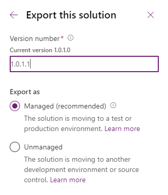

# Upgrade or update a solution  
[!INCLUDE[cc-data-platform-banner](../../includes/cc-data-platform-banner.md)]

There are times when you need to update an existing managed solution. To update the solution, follow these steps: 

1.	Open the unmanaged solution in your development environment and create new or add and remove the existing components that you want. 
2.	Increment the version number when you export the solution as a managed solution. More information: [Understanding version numbers for updates](#understanding-version-numbers-for-updates) 

    > [!div class="mx-imgBorder"] 
    > 
3. [Apply the upgrade or update in the target environment](#apply-the-upgrade-or-update-in-the-target-environment)

## Apply the upgrade or update in the target environment
The procedure to import the updated solution is similar to installing a new managed solution, except you will get some different options. If you are updating a solution you got from someone else, you should get guidance from the solution publisher about which options you should choose.  

1. Sign into [Power Apps](https://make.powerapps.com/?utm_source=padocs&utm_medium=linkinadoc&utm_campaign=referralsfromdoc), select the target environment you want, and then select **Solutions** from the left navigation.  

2. On the command bar, select **Import**.  

3. On the **Select Solution Package** page, select **Browse** to locate the compressed (.zip or .cab) file that contains the solution you want to update.  

4. Select **Next**.  

5. This page displays a yellow bar indicating **This solution package contains an update for a solution that is already installed**. To upgrade the solution, select **Next**. To view additional options, expand **Advanced settings**, and then select from the following solution action options:  
   - **Upgrade (recommended)**
        This is the default option and upgrades your solution to the latest version and rolls up all previous patches in one step.  Any components associated to the previous solution version that are not in the newer solution version will be deleted. This is the recommended option as it will ensure that your resulting configuration state is consistent with the importing solution including removal of components that are no longer part of the solution.
        
   - **Stage for Upgrade**
        This option upgrades your solution to the higher version, but defers the deletion of the previous version and any related patches until you apply a solution upgrade later.  This option should only be selected if you want to have both the old and new solutions installed in the system concurrently so that you can do some data migration before you complete the solution upgrade. Applying the upgrade will delete the old solution and any components that are not included in the new solution.
        
   - **Update (not recommended)**
        This option replaces your solution with this version.  Components that are not in the newer solution won't be deleted and will remain in the system.  This option is not recommended as your destination environment will differ in configuration from your source environment and could cause issues that are difficult to reproduce and diagnose.
        
8. Decide whether to enable the following option for post import actions:
   - **Enable any SDK message processing steps included in the solution**  
        Selecting this option will enable plugins and workflows that are included in the solution.
        
9. Select **Import**.  

   :::image type="content" source="media/import-solution-pane.png" alt-text="Import solution information and options":::

10. You may need to wait a few moments while the solution import completes. If it's successful, you can view the results and select **Close**.  

   Managed customizations are always imported in a published state, so there is no need to publish customizations after import in this scenario.

**Completing Solution Upgrade**
If you chose to stage for upgrade, or if the system had an issue completing an upgrade, you will see that you have the original solution still installed in your system as well as a new solution that has the same solution name as the base solution suffixed with \_Upgrade.  To complete the upgrade, select the base solution in the solution list and select **Apply Solution Upgrade**.  This will uninstall all previous patches and the base solution then rename the \_Upgrade solution to be the same name as the previous base solution.  Any components that were in the original solution and patches that are not present in the \_Upgrade solution will be deleted as part of this process.

## Understanding version numbers for updates

A solution’s version has the following format: major.minor.build.revision. An update must have a higher major, minor, build or revision number than the parent solution. For example, for a base solution version 3.1.5.7, a small update could be a version 3.1.5.8 or a slightly more signficant update could have version 3.1.7.0. A substantially more significant update could be version 3.2.0.0.

## Overwrite customizations option

The option to overwrite customizations is only available with the classic import experience and using the SDK APIs.

> [!IMPORTANT]
> Selecting the **Overwrite Customizations (not recommended)**  option will overwrite or remove any unmanaged customizations previously performed on components included in this solution. This option does not affect components that support merge behavior (forms, sitemap, ribbon, app modules).  Components that have other managed solutions on top of the existing solution you are replacing do also still remain on top and are not affected by this option.  

### See also
[Add solution components](create-solution.md#add-solution-components)  
[Export solutions](export-solutions.md)  
[Import solutions](import-update-export-solutions.md)  
[Create solution patches](/powerapps/maker/data-platform/solution-patches)  
[For developers: Cloning, patching, and upgrading](/power-platform/alm/solution-api#cloning-patching-and-upgrading)
