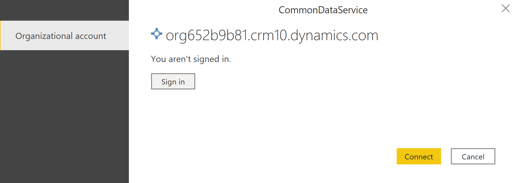

# View table data in Power BI Desktop

You can use Power BI Desktop to view tables in Microsoft Dataverse. The table
row data that you can access from your environment is read-only. Data access
uses the Dataverse security model that is the same used to access
table row data using a Power Apps app.

## Prerequisites

* Enable the Tabular Data Stream (TDS) endpoint (on by default). More information: [Manage feature settings](/power-platform/admin/settings-features).
* Power BI Desktop. [Get it now](https://powerbi.microsoft.com/downloads/)
          
## View table data

1.  Sign into [Power Apps](https://make.powerapps.com/), and then select the
    appropriate environment from the top-right corner.

2.  On the left navigation pane expand **Data**, select **Tables**, and then
    select **Analyze in Power BI** on the command bar.

    The pbids file for your environment is downloaded to your browser’s default download folder.

3.  Open the .pbids file to access it in Power BI Desktop.

4.  The pbids file is loaded in Power BI Desktop. In the dialog box, select **Organizational account**, select **Sign in**, and then in the browser window that appears select or enter your credentials.

    > [!div class="mx-imgBorder"] 
    > 

5.  In the dialog box in Power BI Desktop, select **Connect**.

    The environment appears in the Power BI Desktop **Navigator** window. Expand
    it to view the tables available to analyze. Select a table to preview
    its data.

    > [!div class="mx-imgBorder"] 
    > 

6. After you're finished selecting the tables you want to analyze, select **Load** to build a report.

For more information about Power BI Desktop, see [Get started with Power BI Desktop](/power-bi/desktop-getting-started).

> [!NOTE]
> SQL options, such as a T-SQL queries aren’t supported.

### See also
[Use SQL to query data](../../developer/data-platform/dataverse-sql-query.md) 
[Dataverse SQL](/powerapps/developer/data-platform/how-dataverse-sql-differs-from-transact-sql) 
[Power Query Dataverse connector](/power-query/connectors/dataverse) 

[!INCLUDE[footer-include](../../includes/footer-banner.md)]
