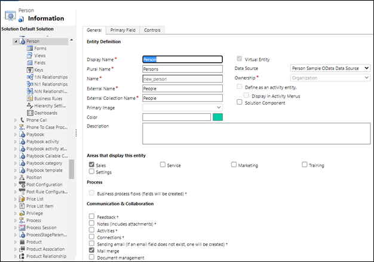
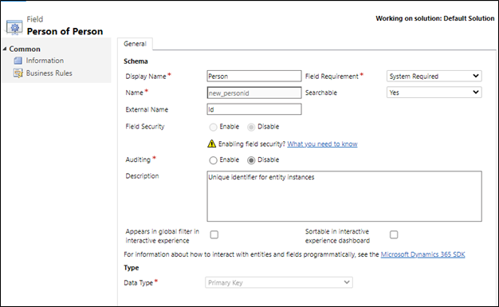
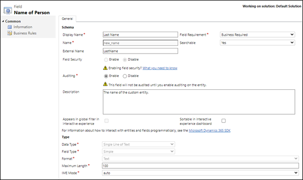
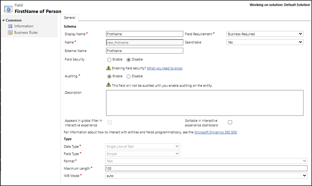
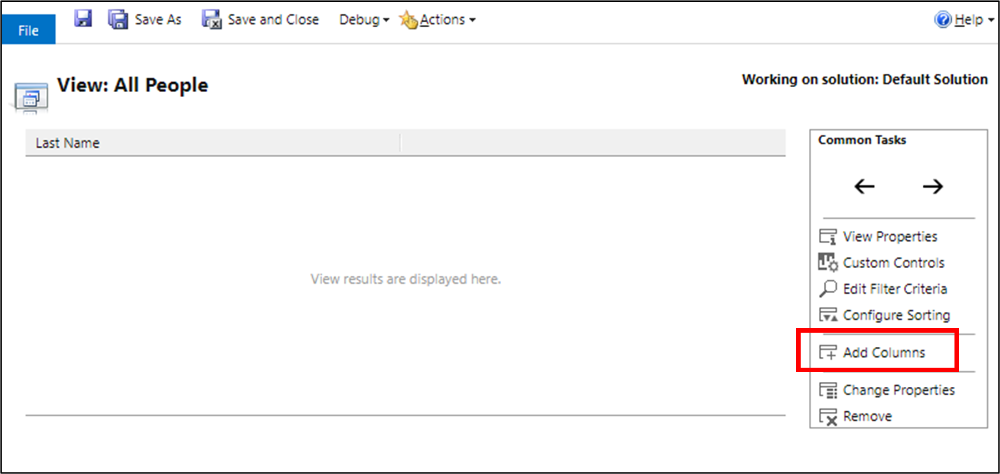

# Virtual table walkthrough using the OData v4 Data Provider

[!INCLUDE[cc-data-platform-banner](../../includes/cc-data-platform-banner.md)]

Imagine that you want to access, create, update, and delete some personal information about a contact from an external data source within your model-driven app. In this simple walkthrough, you will model a virtual table named *Person* with columns mapped to the external schema to these operations at runtime from an OData web service.

## Data source details

Because the data source used for this walkthrough has an OData v4 web service, we can use the OData v4 Data Provider included with your environment.

Web service url: `https://contosowebservice.azurewebsites.net/odata/` 

> [!IMPORTANT]
> The web service url used for this walkthrough isn't a functioning web service.

For this walkthrough, a single virtual table that contains the following columns is needed.

|External column name |External data type |Virtual table data type |Purpose |
|---------|---------|---------|---------|
|Id |`Edm.Guid` |Primary key |Primary key for the table |
|FirstName  |`Edm.String` |Single line of text |First name of the person |
|LastName |`Edm.String`| Single line of text | Last name of the person |
| Age   | `Edm.Int32`  | Whole number   | Age of the person  |
| LastModifiedOn  | `Edm.DateTimeOffset`  | Data and time  | Last modified data and time of the person record  |

The OData metadata of the external data source person table:

:::image type="content" source="media/odata-external-source-table1.png" alt-text="Odata external source XML part 1":::
:::image type="content" source="media/odata-external-source-table2.png" alt-text="Odata external data source XML part 2":::

## Create the data source

Create the data source for the OData v4 data provider that uses the OASIS Open Data Protocol (OData) sample web service.

1. Go to **Settings** > **Administration** > **Virtual Entity Data Sources**.
1. Select **NEW**, select **OData v4 Data Provider**, and then select **OK**.
1. Enter or select the following information.

    |Field|Value|
    |--|--|
    |**Name**|Person Sample OData Data Source|
    |**URL**|`https://contosowebservice.azurewebsites.net/odata` |
    |**Timeout**|30|
    |**Return Inline Count**  | Client-side Paging  |
    |**Return Inline Count**|True|

Leave the other columns as-is, and select **SAVE & CLOSE**.

> [!TIP]
> When using your own web service, verify that the URL is valid by pasting it in to your web browser. If you want to understand the columns and data types respective to the table you are interested in, you can append `/$metadata` to the end of your URL to see the definition of tables in you web service.

## Open solution explorer

Part of the name of any custom table you create is the customization prefix. This is set based on the solution publisher for the solution you’re working in. Make sure that you are working in an unmanaged solution where the customization prefix is the one you want for this table. More information: [Change the solution publisher prefix](create-solution.md#solution-publisher) 

[!INCLUDE [cc_navigate-solution-from-powerapps-portal](../../includes/cc_navigate-solution-from-powerapps-portal.md)]

## Create the virtual table

1. In the left navigation pane of solution explorer, select **Entities**, and then select **New** from the main pane.
2. On the **Entity: New** form, select the **Virtual table** option, and then enter the following information: 

    |Field|Value|
    |--|--|
    |**Data Source**|Person Sample OData Data Source|
    |**Display Name**|Person|
    |**Plural Name**|Persons|
    |**Name**|new_person|
    |**External Name**|People|
    |**External Collection Name**|People|
    |**Notes (includes attachments)**|selected|
    |**Activities**|selected|

   > [!NOTE]
   > The OData resource path semantics uses `EntitySet` to identify the resource. In the sample OData web service, the `EntitySet` is defined as **People**. This value is used as the **External Name** for the virtual table **Person**.

1. Next to **Areas that display this entity**, select **Sales**, and then select **Save** (but don’t close the table form).
    

## Create the columns for the virtual table

On the left navigation pane of the **Entity: Person** page, select **Fields**. As part of this walkthrough, you will edit two existing columns and add three more columns that are available in the external data source.

> [!IMPORTANT]
> External names are case sensitive. Refer to your web service metadata to make sure you use the correct name.
> A Nullable value of false indicates that the attribute is required. Notice that primary key columns are always system required.

1. Open the **new_personid** column, and change the following property with the value indicated here:

    **External Name**: Id

    
1. Select **Save and Close**.
1. Open the **new_name** column, and change the following properties to have the values indicated here:
    - **Display Name**: Last Name
    - **External Name**: LastName
 
   
1. Select **Save and Close**.
1. Select **New**, and on the **Field: New for Person** page enter the following information:

    |Field|Value|
    |--|--|
    |**Display Name**|First Name|
    |**Name**|new_firstname|
    |**External Name**|FirstName|
    |**Field Requirement**|Business Required|
    |**Data Type**|Single Line of Text|

  
1. Select **Save and Close**.
1. Select **New**, and on the **Field: New for Person** page enter the following information:
   |Field |	Value |
   |--|--|
   |Display Name |	Age |
   |Name	| new_age  |
   |External Name	| Age |
   |Field Requirement |	Business Required |
   |Data Type	| Whole Number |

   :::image type="content" source="media/age-field.png" alt-text="Create age column":::
1. Select **Save and Close**.

1. Select **New**, and on the **Field: New of Person** page enter the following information:
   | Field	| Value |
   |--|--|
   |Display Name	|Last Modified On |
   |Name	| new_lastmodifiedon   |
   |External Name |	LastModifiedOn |
   | Field Requirement	| Business Required |
   |Data Type	|Date and Time|

   :::image type="content" source="media/lastmodifiedon-field.png" alt-text="Create last modified on column":::

## Add the columns to the main form

1. On the **Person** table window, select **Forms**.
1. Open the main form, drag and drop the **First Name**, **Age**, and **Last Modified On**  columns from the right pane onto the form in the **General** section.
    
1. On the **Person** table window, select **Save and Close**.

## Configure the default view

1. On the left pane of the solution explorer, under the **Person entity**, select **Views**.
1. Open the **All People** view.
1. In the **Common Tasks** pane, select **Add Columns**.
    
1. Select the **First Name**, **Age**, and **Last Modified On** columns, and then select **OK**.
1. On the **View: All People** window, arrange the column order by selecting the move left and move right arrows, and then select **Save and Close**.
1. On the Solution Explorer window, select **Publish All Customizations**.
1. After all customizations are published, close the Solution Explorer window.

## Use the virtual table in a model-driven app

Users perform read, create, update, and delete operations on a virtual table just like any other table in Microsoft Dataverse.

1. Create a model-driven app and add the **Person** table to the site map. Then, select the **Person** main form and the **Person Advance Find** view. Publish the app. More information: [Build your first model-driven app from scratch](../model-driven-apps/build-first-model-driven-app.md)
    
1. Run the model-driven app. Select **New**, complete the required columns, and then save the record.
1. Select **New** again to create another record and save it.
1. You should now have two records similar to the following in the **All Persons** view.
:::image type="content" source="media/vt-all-persons-view.png" alt-text="View All Persons":::
1. To delete a record, select a person record and then select **Delete**. Confirm to delete the record in the confirmation page.
:::image type="content" source="media/vt-delete-person.png" alt-text="Delete person record":::

### See also

[OData v4 Data Provider configuration, requirements, and best practices](virtual-entity-odata-provider-requirements.md) 
[Create and edit virtual tables that contain data from an external data source](create-edit-virtual-entities.md)

[!INCLUDE[footer-include](../../includes/footer-banner.md)]