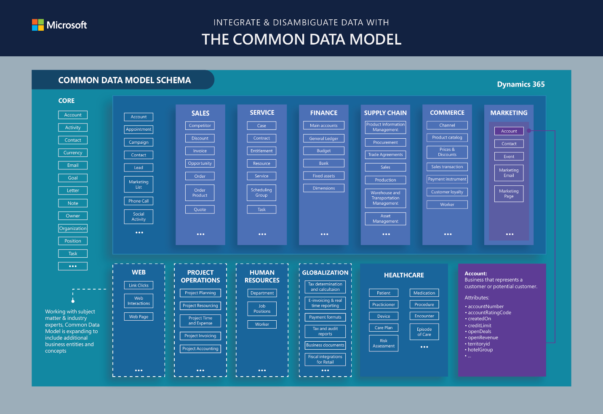
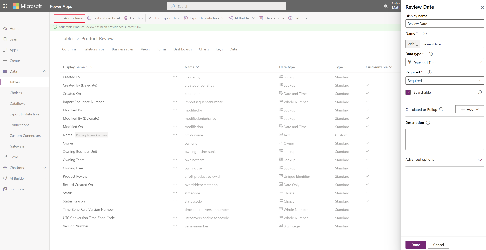
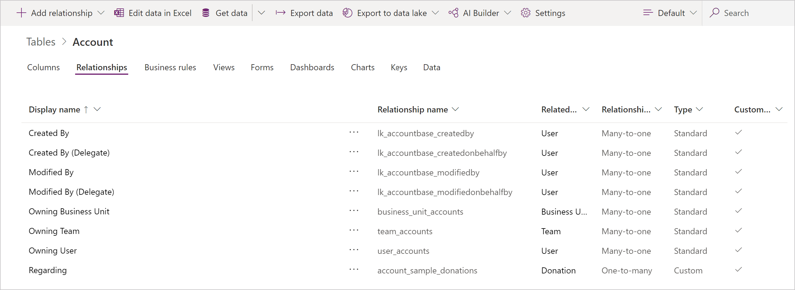
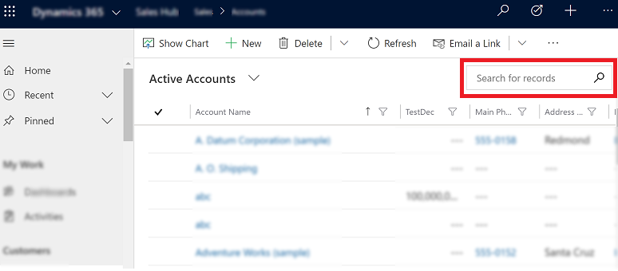

# Work with any data

[!INCLUDE[cc-data-platform-banner](../../includes/cc-data-platform-banner.md)]

Microsoft Dataverse provides an abstraction that makes it possible to work with any type of data, including relational, non-relational, image, file, relative search, or data lake. There is no need to understand the type of data as Dataverse exposes a set of data types that allow you to build up your model. The type of storage is optimized for the data type chosen.

Data can be easily imported and exported with dataflows, Power Query, and Azure Data Factory. Dynamics customers can also use the Data Export Service.

Dataverse also has a connector for Power Automate and Azure Logic Apps that can be used with the hundreds of other connectors in those services for on-premises, infrastructure as a service (IaaS), platform as a service (PaaS), or software as a service (SaaS) services. This includes sources in Azure, Microsoft 365, Dynamics 365, SAP ERP, Salesforce, Amazon Redshift, Access, Excel, text/CSV, SharePoint lists, SQL Server databases, Oracle, MySQL, PostgreSQL, Blockchain, and Azure SQL Data Warehouse.

## Common Data Model

If you've ever had to bring data from multiple systems and apps together, you know what an expensive and time-consuming task that can be. Without being able to share and understand the same data easily, each app or data integration project requires a custom implementation.

Common Data Model provides reference architecture that's intended to streamline this process by providing a shared data language for business and analytical apps to use. The Common Data Model metadata system makes it possible for data and its meaning to be shared across apps and business processes such as Power Apps, Power BI, Dynamics 365, and Azure.

Common Data Model includes a set of standardized, extensible data schemas that Microsoft and its partners have published. This collection of predefined schemas includes tables, attributes, semantic metadata, and relationships. The schemas represent commonly used concepts and activities, such as **Account** and **Campaign**, to simplify the creation, aggregation, and analysis of data.

The Common Data Model schemas can be used to inform the creation of tables in Dataverse. The resulting tables will<!--Edit okay?--> then be compatible with apps and analytics that target this Common Data Model definition.

The following image shows some elements of the standard Common Data Model tables. 

## Tables

In Dataverse, tables are used to model and manage business data. To increase productivity, Dataverse includes a set of tables known as standard tables. These tables are designed, in accordance with best practices, to capture the most common concepts and scenarios within an organization. The standard tables adhere to Common Data Model.

A set of tables that are commonly used across industries, such as **User** and **Team**, are included in Dataverse and referred to as *standard tables*. These out-of-the-box tables can also be customized, such as including additional columns. In addition, you can easily create your own custom tables in Dataverse.

## Columns

Columns define the individual data items that can be used to store data in a table. Fields are sometimes called attributes by developers. An table representing a course at a university might contain columns such as "Name," "Location," "Department," "Registered Students," and so on.

Columns might have different types of data such as strings, digital data, images, and files. There's no need to keep relational and non-relational data separated artificially if it's part of the same business process or flow. Dataverse stores the data in the best storage type for the model created.

Each of these columns can be associated with one of many data types supported by Dataverse.

More information: [Types of columns](./types-of-fields.md)

## Relationships

Data in one table often relates to data in another table. table relationships define how rows can be related to each other in the Dataverse model.

Dataverse provides easy-to-use visual designers to define the different types of relationships from one table to another (or between a table and itself). Each table can have a relationship with more than one table, and each table can have more than one relationship to another table.

The relationship types are:

- **Many-to-one**: In this type of relationship, many table A records can be associated with a single table B record. For example, a class of students have a single classroom.

- **One-to-many**: In this type of relationship, a single table B record can be associated with many table A records. For example, one single teacher teaches many classes.

- **Many-to-many**: In this type of relationship, each record in table A can match more than one record in table B, and vice versa. For example, students attend many classes, and each class can have multiple students.

Because many-to-one relationships are the most common, Dataverse provides a specific data type named *lookup*, which not only makes it easy to define this relationship but adds productivity to building forms and apps.

For more information about creating table relationships, see [Create a relationship between tables](/powerapps/maker/data-platform/data-platform-table-lookup).

Organizations often need to be in compliance with various regulations to ensure the availability of customer interaction history, audit logs, access reports, and security incident tracking reports. Organizations might want to track changes in Dataverse data for security and analytical purposes.

Dataverse provides an auditing capability where changes to tables and attribute data in an organization can be rowed over time for use in analysis and reporting. Auditing is supported on all custom&mdash;and most customizable&mdash;tables and attributes. Auditing isn't supported on metadata
changes, retrieve operations, export operations, or during authentication. For information about how to configure auditing, see [Configure tables and attributes for auditing](../../developer/data-platform/configure-entities-attributes-auditing.md).

Dataverse supports analytics by providing the capability to choose tables for machine learning models to run. It has a prebuilt AI capability through AI Builder.

## Search

Dataverse provides three ways to query rows:

- Relevance search

- Quick find (single-table or multi-table)

- Advanced find

> [!NOTE]
> Multi-table quick find is also called *categorized search*.

For more information, see [Compare searches](../../user/search.md).

### Relevance search

Relevance search delivers fast and comprehensive results across multiple tables in a single list, sorted by relevance. It uses a dedicated search service external to Dataverse (powered by Azure) to boost search performance.

Relevance search brings the following enhancements and benefits:

- Improves performance by using external indexing and Azure search technology.

- Finds matches to any word in the search term in any column in the table, compared to quick find where all words from the search term must be found in one column.

- Finds matches that include inflectional words like *stream*, *streaming*, or *streamed*.

- Returns results from all searchable tables in a single list sorted by relevance, so the better the match, the higher the result appears in the list. A match has a higher relevancy if more words from the search term are found in close proximity to each other. The smaller the amount of text where the search words are found, the higher the relevancy. For example, if you find the search words in a company name and address, it might be a better match than finding the same words in a long article, far apart from each other.

- Highlights matches in the results list. When a search term matches a term in a row, the term appears as bold and italicized text in your search results.

For more information about relevance search, see [Using relevance search to search for rows](../../user/relevance-search.md).

### Quick find

Dataverse includes the ability to find rows quickly and has approaches that will search just one type of table, such as customer, or be used to search across multiple types of tables at the same time, such as contacts, users, customers, and so on.

*Single-table quick find* is used to find rows of only one type. This search option is available from within a view.

*Multiple-table quick find (categorized search)* is also used to find
rows, but will find them across different types of tables, such as accounts or contacts.

## Data Lake

Dataverse supports continuous replication of table data to Azure Data Lake Storage, which can then be used to run analytics such as Power BI reporting, machine learning, data warehousing, and other downstream integration processes.

This feature is designed for enterprise big-data analytics. It's cost-effective, scalable, has high availability and disaster recovery capabilities, and enables best-in-class analytics performance.

Data is stored in the Common Data Model format, which provides semantic consistency across apps and deployments. Standardized metadata and self-describing data in Common Data Model facilitates metadata discovery and interoperability between data producers and consumers such as Power BI, Data Factory, Azure Databricks, and Azure Machine Learning.

### See also

[Importing and exporting data](import-export-data.md)

[!INCLUDE[footer-include](../../includes/footer-banner.md)]