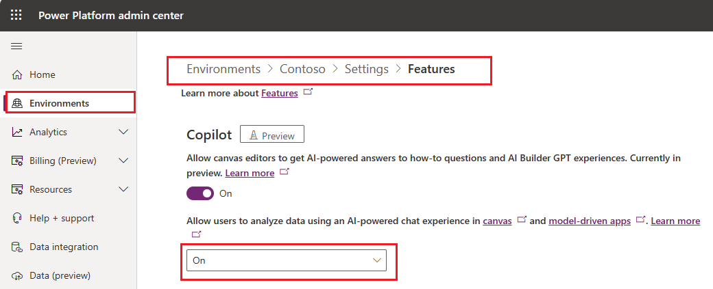
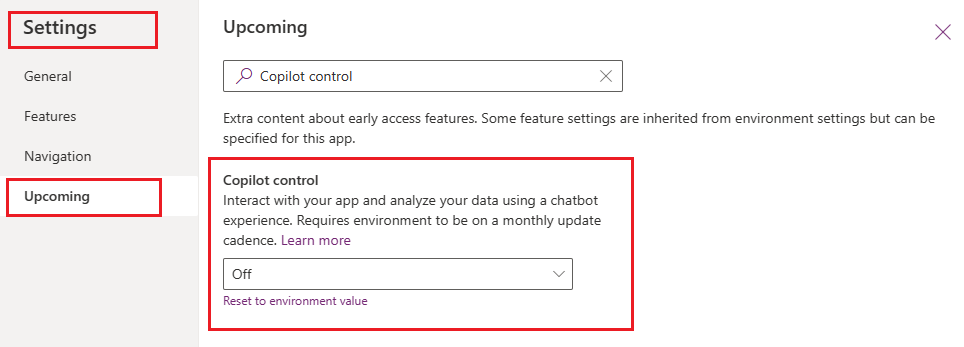

# Add Copilot for app users in model-driven apps (preview)

[!INCLUDE [cc-beta-prerelease-disclaimer](../../includes/cc-beta-prerelease-disclaimer.md)]

Copilot for model-driven apps in Power Apps is a next-generation AI assistant for app users to get insights about the data in their apps through conversation in natural language. Copilot helps app users boost their productivity through AI-powered insights and intuitive app navigation.

> [!IMPORTANT]
>
> - This is a preview feature.
> - To use this capability, your environment must be in the US region and have its language set to en-US.
> - You must allow data movement across regions for Generative AI features as a prerequisite for running Copilots in Power Apps. This step is especially important if your organization and your environment are in differnt regions. More information: [Enable copilots and generative AI features](https://learn.microsoft.com/en-us/power-platform/admin/geographical-availability-copilot#enable-data-movement-across-regions)
> - Preview features aren’t meant for production use and may have restricted functionality. These features are available before an official release so that customers can get early access and provide feedback.
> - For more information, go to our [preview terms](https://go.microsoft.com/fwlink/?linkid=2189520).
> - This capability is powered by [Azure OpenAI Service](/azure/cognitive-services/openai/overview).
> - This capability  may be subject to usage limits or capacity throttling.

When enabled, Copilot can be accessed through the Copilot icon in the right navigation bar in a model-driven app. The Copilot pane can be opened or minimized as desired.

Copilot in model-driven apps can answer questions about the configured Microsoft Dataverse table data in the environment. Copilot can also help you navigate the model-driven app. For example, when a user enters *take me to Online Cases* or *show me Cruise Support Tickets*, the Copilot in the model-driven app automatically opens the relevant app screens.

:::image type="content" source="media/model-driven-app-copilot.png" alt-text="Copilot right pane in a model-driven app" lightbox="media/model-driven-app-copilot.png":::

## Enable Copilot for model-driven apps feature for your environment

Power Platform administrators enable the Copilot feature in model-driven apps for all the users in their environments in [Power Platform admin center](https://admin.powerplatform.microsoft.com).

  > [!IMPORTANT]
  > Copilot for app users in model-driven apps feature isn't enabled by default. Administrators must manually enable this feature for their environments in [Power Platform admin center](https://admin.powerplatform.microsoft.com).

1. Sign in to the Power Platform admin center at https://admin.powerplatform.microsoft.com.

2. In the navigation pane, go to **Environments** and select the environment where you want to enable Copilot for app users in model-driven apps in. Select **Settings** for this environment on the command bar.

   > [!div class="mx-imgBorder"]
   > 
 
3. In **Settings** for the selected environment, select **Product** > **Features**.

   > [!div class="mx-imgBorder"]
   > 

4. In the **Features** section, set the value for **Allow users to analyze data using an AI-powered chat experience in canvas and model-driven apps** to **On**, and then **Save** your changes.
   
   > [!div class="mx-imgBorder"]
   > 

## Set your environment to receive monthly updates for model-driven apps

Makers must set their environment to receive monthly model-driven apps updates as a prerequisite for having Copilot for end users in model-driven apps.

1. Sign in to the Power Platform admin center at https://admin.powerplatform.microsoft.com.
2. In the navigation pane, go to **Environments** and select the environment where you want to enable Copilot for app users in model-driven apps. Select **Settings** on the command bar.
3. Select **Product** > **Behavior**.  Set **Release channel** for model-driven apps to **Monthly channel**, and then **Save** your changes.
   
  > [!div class="mx-imgBorder"]
  > 

More information: [Behavior settings](/power-platform/admin/settings-behavior#settings) and [Changing release channels for model-driven apps](channel-change.md).

## Configure Dataverse tables and columns for Copilot

Administrators must configure the Dataverse tables that Copilot will using for the responses. You must choose both the tables and the columns of importance for Copilot to search across to produce relevant, high quality data insights. More information: [Configure tables to use Copilot](../data-platform/table-settings-for-copilot.md)

> [!IMPORTANT]
> Not configuring standard and custom Dataverse tables for Copilot might result in poor quality of Copilot insights. Configure your Dataverse tables and columns of importantance to receive relevant, accurate Coplilot responses in model-driven apps.

> [!NOTE]
> Questions and answers for enterprise data environments that have [customer managed key](/power-platform/admin/customer-managed-key) or [Customer Lockbox](/power-platform/admin/about-lockbox) won't use your data stored in Dataverse. You might get answers from Copilot, but they won't be based on your Dataverse database.

## Disable Copilot for a model driven app
Makers can can disable Copilot for their model drven app. In Studio, open your model app for **Edit** and click on **Settings** option in top menu. Choose **Upcoming** section in **Settings** screen, then set **Copilot Control** to **OFF** and **Save**.

   > [!div class="mx-imgBorder"]
   > 

## Provide feedback in Copilot

To provide feedback to help improve Copilot, app users can select the thumbs up or thumbs down icons included in each Copilot response. Feedback can be submitted for each Copilot response in the pane.

### Provide positive feedback

1. On the right navigation bar, select the “thumbs up” icon.
1. Optionally, provide feedback in your own words about what you liked.
1. Select **Submit** after you're done entering your feedback.

### Provide feedback for improvement

1. On the right navigation bar, select the “thumbs down” icon.
1. Optionally, provide feedback, such as feedback about the content of Copilot’s response, or a description in your own words about what went wrong, or how you would like Copilot to improve.
1. Select **Submit** after you're done entering your feedback.

## Disable feedback for app users 

If you want to disable the ability for users to submit feedback about Copilot in model-driven apps, follow these steps.

1. Sign in to [Power Apps](https://make.powerapps.com/).
1. Go to **Tables**, and then open the **Organization** table.
1. In the **Organization columns and data** section, select **+nnn more** to display the column search box.
1. In the search box search for the *Allow users to provide feedback for App Copilot* column.
   :::image type="content" source="media/disable-mda-copilot-feedback1.png" alt-text="Find the Allow users to provide feedback for App Copilot column":::

1. Set the column to **No**, and then **Save** the table.
   :::image type="content" source="media/disable-mda-copilot-feedback2.png" alt-text="Set the Find the Allow users to provide feedback for App Copilot column to No":::

## See also

[FAQ for Copilot in model-driven apps](../common/faqs-copilot-model-driven-app.md)  
[Responsible AI FAQs for Power Apps](../common/responsible-ai-overview.md)  
[Add Copilot control to a canvas app (preview)](../canvas-apps/add-ai-copilot.md)  
[Enable copilots and generative AI features in Power Apps](https://learn.microsoft.com/en-us/power-platform/admin/geographical-availability-copilot#enable-data-movement-across-regions)
