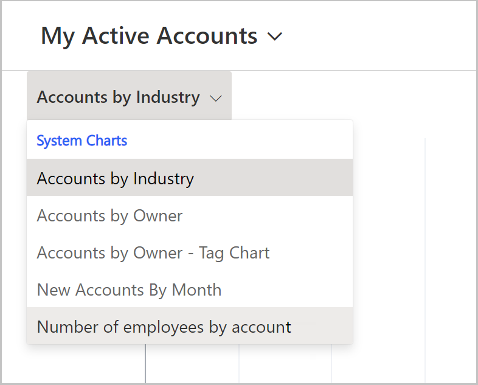

# Example: Add and customize visualizations in model-driven apps

In this article you learn how to create a system chart. System charts are organization-owned charts, which makes them available to anyone with access to read the data running the app. System charts can't be assigned or shared with specific app users.

1.  Sign in to [Power Apps](https://make.powerapps.com/?utm_source=padocs&utm_medium=linkinadoc&utm_campaign=referralsfromdoc).
1. On the left navigation pane, select **Apps**.

1. Next to the model driven app to which you want to add a chart, select **...** (ellipses), and then select **Edit**. In this example, we use the **Manage Customers** app used in the tutorial *How to create a model driven app*.
1. In the app designer, locate the table to which you want to add the chart, and then select the corresponding **Charts** tile. In this example, we add a chart to the **Account** table

   :::image type="content" source="media/add-and-customize-visualizations-in-model-driven apps/add-and-customize-visualizations-in-model-driven-apps-1.png" alt-text="Locate the table where you want to add a chart":::

1. On the **Components** tab, select **Create New**.

   :::image type="content" source="media/add-and-customize-visualizations-in-model-driven apps/add-and-customize-visualizations-in-model-driven-apps-2.png" alt-text="On the Components tab pane select Create New":::

   A new window opens where you can create a chart.

1. Specify the type of chart, and how the data is displayed in the chart.

   - Enter the chart name, such as *Number of employees by account*.
   - In the **Select Column** dropdowns:
      -  In the **Select Column** **Series** axis dropdown list select a column, such as **Number of Employees**.
      - In the **Select Column** **Category** axis dropdown list select a column, such as **Account Name**.

   -   Add a description to identify the purpose of the chart, such as *This column chart displays the number of employees by account name*.

   :::image type="content" source="media/add-and-customize-visualizations-in-model-driven apps/add-and-customize-visualizations-in-model-driven-apps-3.png" alt-text="Description to identify the purpose of the system chart you create":::

1. Select **Save and Close**.

The **Number of employees by account** chart is now displayed in the app designer chart list.

## View your visualization in your model-driven app

Now that you have created your chart in your app, you can now use it to visualize account data in your app. Follow these steps to view your chart:

1. In the app designer, select **Play**.

   The app launches.

1. Select **Accounts** in menu on left

4.  In the Command Bar, select **Show Chart**

5.  Chart pane will open

6.  Select the chart selector drop-down

7.  Select **Number of employees by account**

8.  Your visualization will appear in-line with the data view

Selecting a bar in the chart will filter the data in the view

Changing the view selected will refresh the chart to display the data from the newly selected view

Charts can also be added to model-driven app dashboards

## Known issues

In the chart designer, adding a order by on certain calculated columns are not supported and will cause an error. The calculated columns causing this are using another calculated columns, a related table column, or a local column on the table.

