# Tutorial: Add a Power BI visual into a model-driven app

Power BI is a powerful analysis and visualization tool. Power Apps is great at enabling people to take action via the web and mobile. With Power Apps, a Power BI dashboard can be embedded in an app. Similarly, a Power BI report tile can be added to an app. The best of both worlds can be achieved at the same place and at the same time.

In this tutorial, you create a quick Power BI report and a model-driven app. Then, you see how to add the report as a dashboard in the app.

## Prerequisites

To complete this tutorial, you need the following:
- Ability to create Power BI dashboards and reports in Power BI.
- Enable the Power BI visualization embedding setting for your environment from the Power Platform admin center. More information: [Manage feature settings](/power-platform/admin/settings-features)

## Create a workspace, dashboard, and report

In this section, you sign in to Power BI and create a workspace and add a Power BI report and dashboard.

1. Sign in to [Power BI](https://powerbi.microsoft.com) with the same Microsoft Office subscription as the one you use for creating apps in Power Apps.

1. Select **Workspaces** on the left navigation menu, and then select **Create a workspace**.

   

1. Enter a name for the workspace, such as *Power BI in Power App demo*, and then select **Save**.

   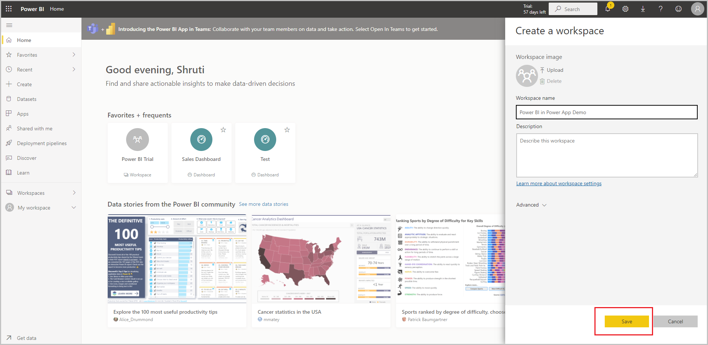

   The workspace is created. 
   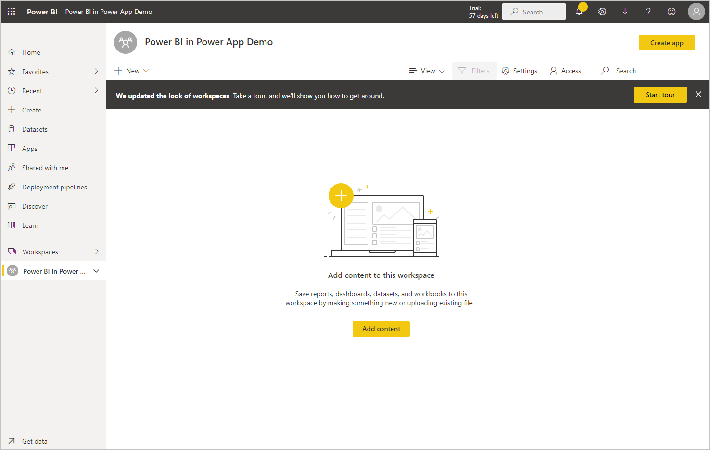

1. Select **+New**, and then select **Dashboard**.

   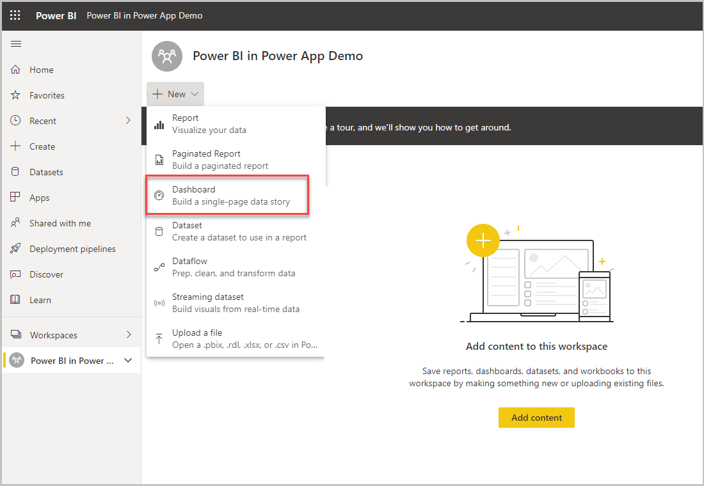

1. Enter a name for the dashboard, and then select **Create**.

   

   The Power BI dashboard is created within the workspace.

   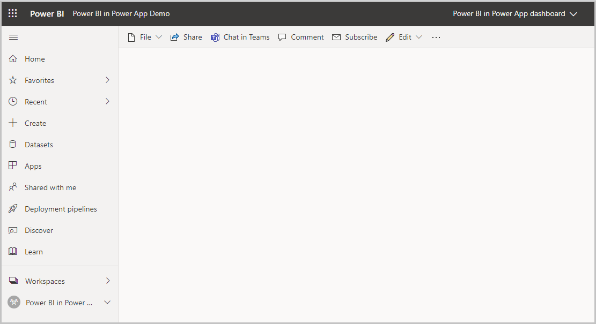

1. Open the workspace, select **+New**, and then select **Dataset** to create a new dataset.

   

1. Select the **Samples** link under **More ways to create your own content** to use sample data.

   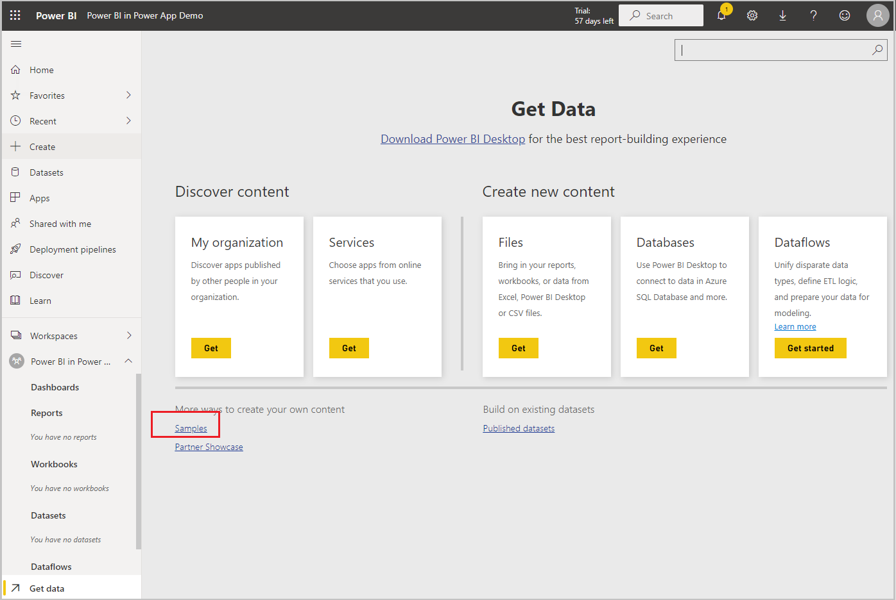

1. Select a sample, such as **Sales and Marketing Sample**.

   

1. Select **Connect** to connect to the data sample.

   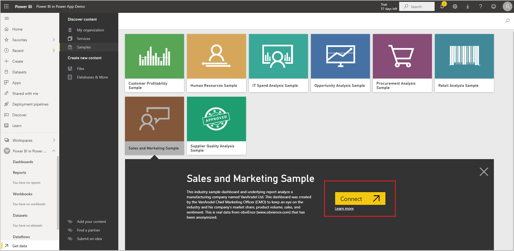

      A dataset with the sample, such as **Sales and Marketing Sample**, and a report is added to the workspace.

      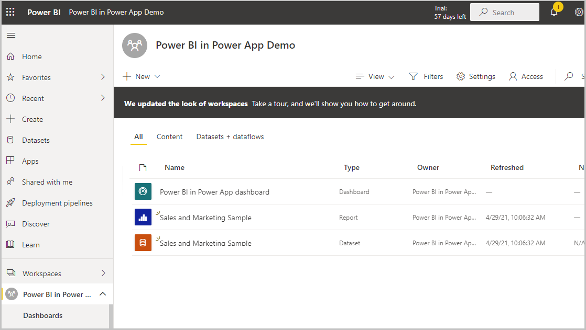

1. On the left pane, select the report that was created from the dataset, such as the **Sales and Marketing Sample** report. Then, on the command bar, select **...** (ellipsis), and then select **Pin to dashboard**.

   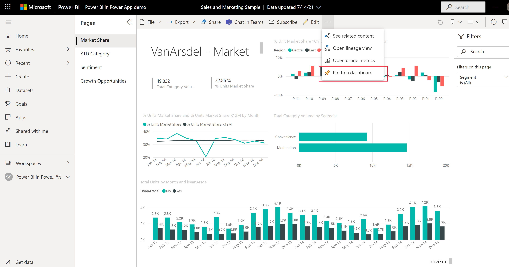

1. Select **Existing dashboard**, select the dashboard, and then select **Pin live**.

   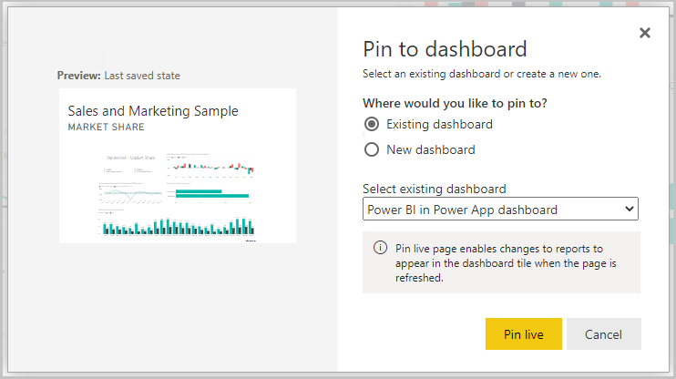

   The report is now added to the dashboard and is available in Power BI.

## Add the dashboard and report to a solution

In this section, you create a solution in Power Apps that includes a Power BI embedded dashboard.

1. Sign in to [Power Apps](https://make.powerapps.com?utm_source=padocs&utm_medium=linkinadoc&utm_campaign=referralsfromdoc), on the left navigation pane select **Solutions**, and then on the command bar select **+New solution**.

   

1. In the **Display name** box enter *Power BI in Power App Solution*, select the
    **Default Publisher** for your environment, and then select **Create**.

   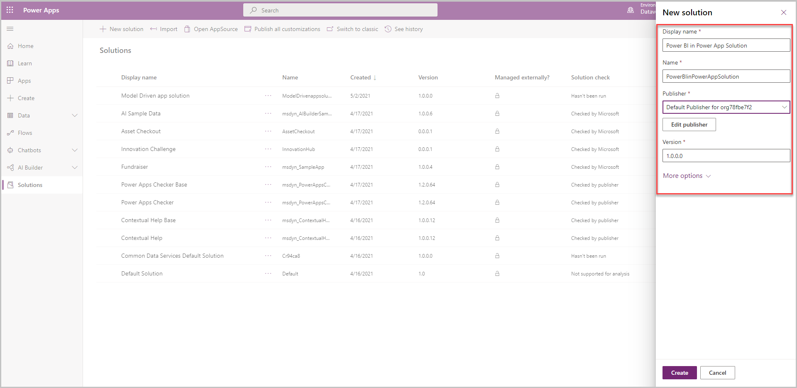

1. Select the solution to open it.

   

1. Select **+New** > **Dashboard** > **Power BI Embedded**.

   <!-- The UI in this screenshot doesn't have the option to select a PBI Embedded dashboard.  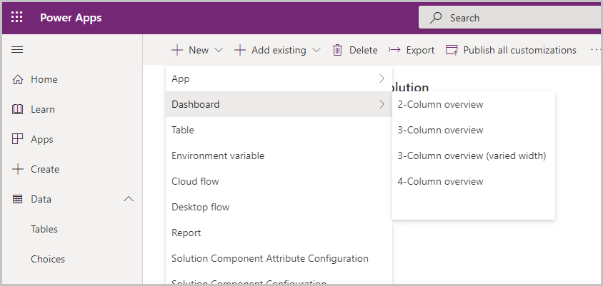  -->

1. Select or enter the following options, and then select **Save**:
   - **Display name**: *Test Embedded BI Report*
   - **Type**: **Power BI report**
   - **Power BI workspace**: **Power BI in Power App Demo** (the workspace you created earlier)
   - **Power BI report**: **Sales and Marketing Sample** (the report you created earlier)

     
   
   A Power BI embedded dashboard is created and ready to add to a model-driven app.

## Create a new model-driven app and add the Power BI embedded report

In this section, you create a model-driven app and add the Power BI embedded report you created earlier.

1. Sign in to [Power Apps](https://make.powerapps.com?utm_source=padocs&utm_medium=linkinadoc&utm_campaign=referralsfromdoc), select the environment you want, and then on the left navigation pane, select **Apps**.

   

1. On the command bar, select **+New app**, and then select **Model-driven**.

   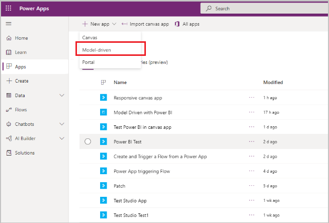

1. Enter a **Name** for the model-driven app, and then select **Done**.

   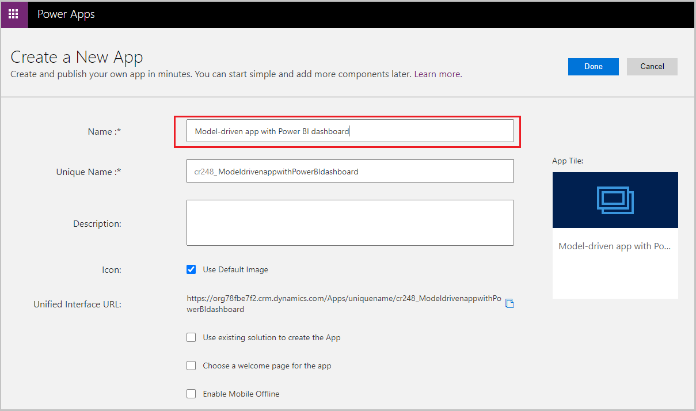
   The model-driven app designer opens.
1. Select the **Edit Site Map** pencil icon, to open the sitemap designer.

   

1. Select **New subarea** on the site map. Then select the following **Properties**, and then select **Save**:
   - **Type**: **Dashboard**
   - **Default Dashboard**: **Test Embedded BI Report**
   - **Title**: **Test Embedded BI**

    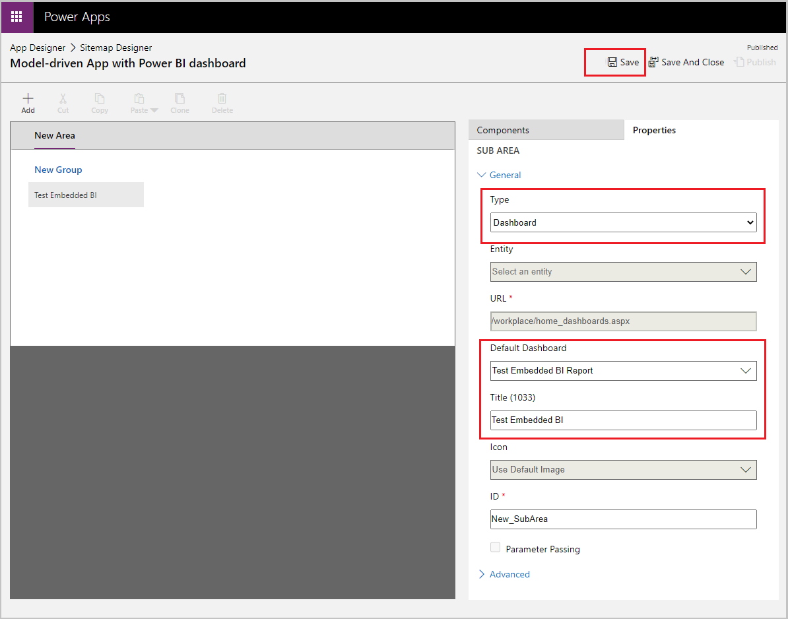

1. Select **Publish**, and then select **Save and Close** to close the sitemap designer.
1. On the app designer command bar select, **Save**, then **Validate**, and then select **Publish**.

   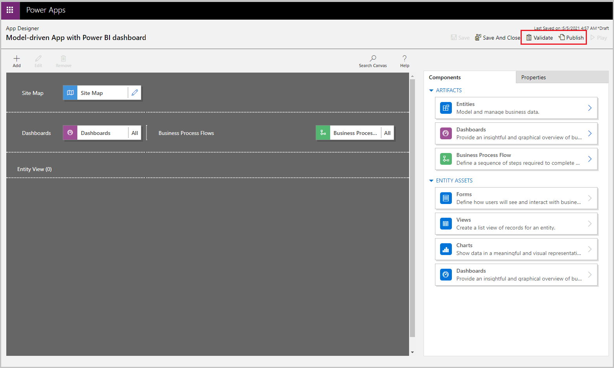

1. On the command bar, select **Play**.

   

   The app opens with the **New BI Dashboard**.

   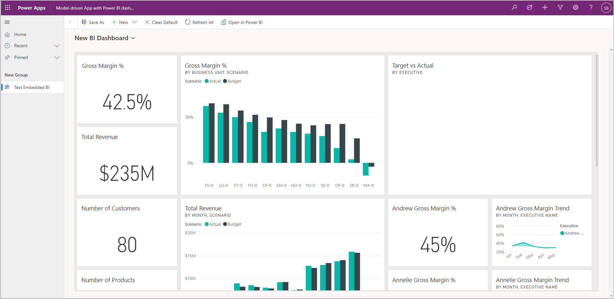

1. Select  **New BI Dashboard** to reveal the dashboard dropdown list, and then select **Test Embedded BI Report**.
  
   Notice how the report named **Test Embedded BI Report** is embedded in the model-driven app.

   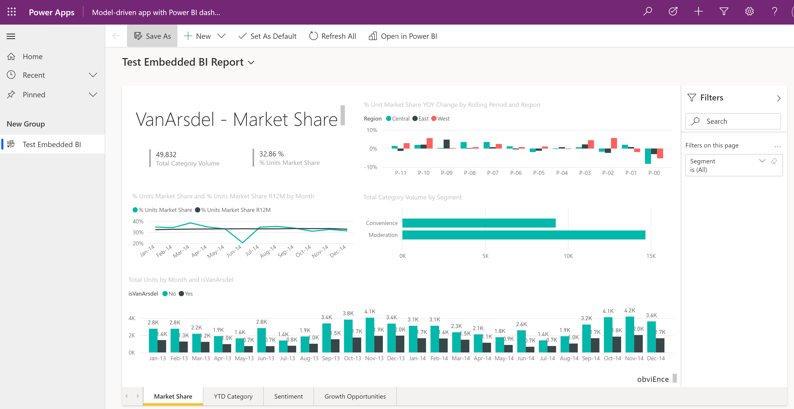

### See also
[Use Power BI with model-driven apps](use-power-bi.md)
