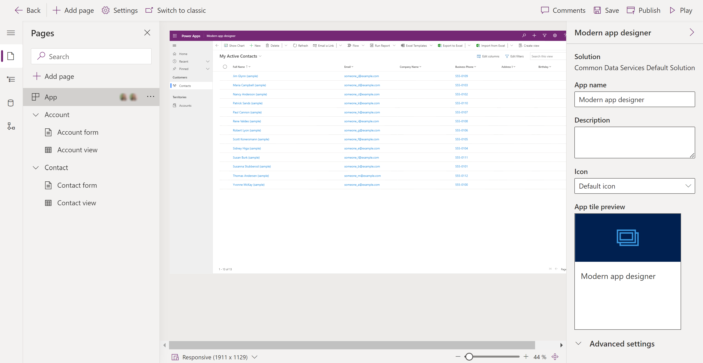

# Manage model-driven app properties in the app designer

App properties define important details about the app, like its title. You define app properties when you create an app. If you want to change those properties later, you can do that in the app designer.  
  
1. In the app designer, on the left pane, select **App** under the **Pages** section. Or alternatively, select **Settings** on the command bar.

    > [!div class="mx-imgBorder"]
    >   
  
2. View and change the information, as required:

    |Area|Property|Description|  
    |-------------|--------------|-----------------|
    | **General**  | **Solution**  | Read-only property that displays the solution name where the app is located.  |
    |**General** |**App name**| The friendly name for the app.|  
    |**General** |**Description**| An optional description of what the app is.|  
    |**General** | **Icon** | Change the app icon by selecting **Select icon**, to browse and select an image web resource. This icon will be displayed on the preview tile of the app. More information: [Create or edit model-driven app web resources to extend an app](create-edit-web-resources.md)|
    | **Advanced settings**   | **Unique name**  | Read-only property that displays the app unique name including the publisher prefix.  |
    | **Advanced settings**   | **Welcome page**   | This option allows a maker to select from the web resources available in your organization. The welcome pages created can contain information that's useful to users, such as links to videos, upgrade instructions, or getting started information. The welcome page is displayed when an app is opened. Users can select **Do not show this Welcome Screen next time** on the welcome page to disable the page so it doesn't appear the next time the app starts. Notice that the **Do not show this Welcome Screen next time** option is a user-level setting and can't be controlled by administrators or app makers. More information: [Create or edit model-driven app web resources to extend an app](create-edit-web-resources.md)  |
    |**Advanced settings**  | **Primary mobile player**(preview)  | Determines which mobile player is available to users to play the model-driven app. By default, **Power Apps mobile** is selected.  More information: [Use model-driven apps on Power Apps mobile](../../mobile/use-custom-model-driven-app-on-mobile.md) |

3. **Save** the app.  

## Known limitations

The following app properties can't be edited in the app designer:

- App Url Suffix
- Manage App
- Enable Mobile Offline
- Mobile Offline Profiles

## See also

[Create or edit an app](create-edit-app.md)

[!INCLUDE[footer-include](../../includes/footer-banner.md)]
