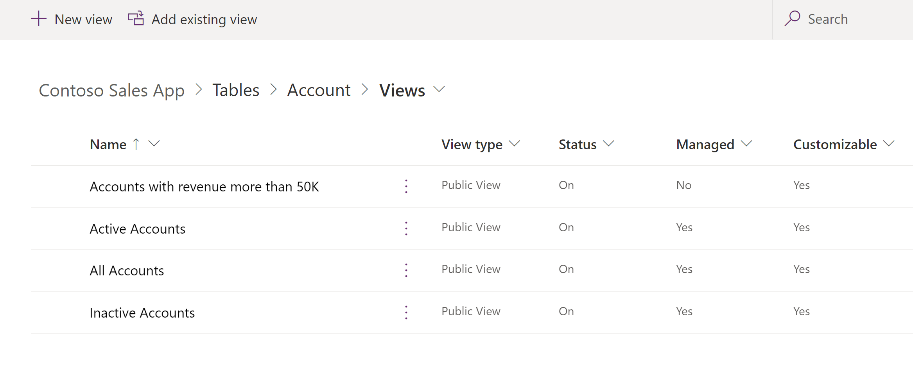
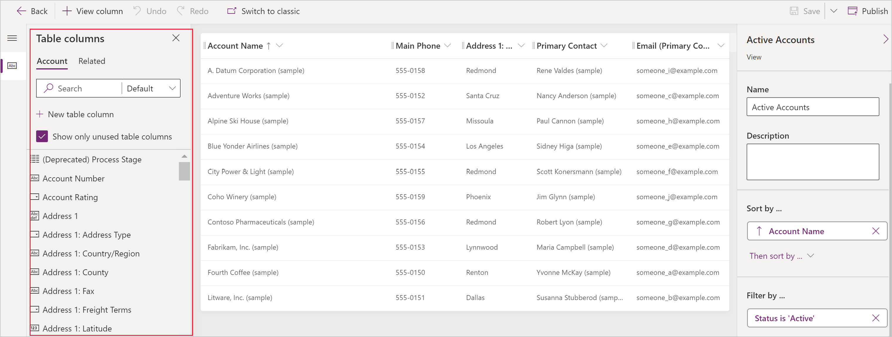

# Choose and configure columns in model-driven app views

   

 Along with the filter criteria, the columns visible in a Power Apps view are very important to the value provided by the view. In this topic, you create or edit views by performing the following tasks:  

> [!IMPORTANT]
> The latest version of the view designer is currently in preview. Some features like enabling or disabling presence for a column and adding a find column are not yet supported. To accomplish these tasks, [open the view in the classic view designer](/dynamics365/customer-engagement/customize/create-and-edit-views#open-the-classic-view-designer).
>  -   [Enable or disable presence for a column](/dynamics365/customer-engagement/customize/choose-and-configure-columns#BKMK_EnableOrDisablePresence)  
>
>  -   [Add find columns](/dynamics365/customer-engagement/customize/choose-and-configure-columns#BKMK_AddFindColumns) 

## Opening the view editor

1. Sign in to [Power Apps](https://make.powerapps.com/?utm_source=padocs&utm_medium=linkinadoc&utm_campaign=referralsfromdoc).  

1. Select **Tables**, and then select the table that you want. [!INCLUDE [left-navigation-pane](../../includes/left-navigation-pane.md)]
1. Select the **Views** area. You can also navigate to the table and views via solutions as shown below.

   > [!div class="mx-imgBorder"] 
   > 

1. Select an existing view to open it or on the toolbar select **New view**.

   
## Adding columns  
 You can include columns from the current table or any of the related tables that have a 1:N table relationship with the current table.  
  
 For example, perhaps you want to display the owner of a user-owned table in a column. You can choose the **Owner** column of the current table to display the name of the owner. This will appear as a link to open the **User** row for the person who is the owner.  
  
 If you want to display the phone number for the owner of the row, you must select **Owning User (User)** from the **Row type** drop-down and then select the **Main Phone** column.  
  
### Add columns to views  
  
1.  While creating and editing views, ensure that the **Table columns** panel is open. If it is not, select **View column** on the toolbar. 

    > [!div class="mx-imgBorder"] 
    > 

2.  Select the columns you want to add to the view designer. This adds the column as a column on the right-hand of the view.

3.  Select the **Related** tab to see related tables and their corresponding columns.
  
 As you add columns, you will increase the width of the view. If the width of the view exceeds the space available to show it in the page, horizontal scrollbars will allow people to scroll and see the hidden columns.  
  
> [!TIP]
>  If your view filters on data for a certain column so that only rows with a certain value are shown, don’t include that column in the view. For example, if you are only showing active rows, don’t include the status column in the view. Instead, name the view to indicate that all the rows shown in the view are active.  
  
> [!NOTE]
>  When you add columns to Lookup views for updated tables, only the first three columns will be displayed.  
  
   
## Removing columns  
  
1.  Select the header of the column you want to remove.  
  
2.  In the dropdown, select **Remove**.  
  
   
## Changing column widths 
  
1.  Hover over the area between columns in the view.  
  
2.  A line appears and your cursor becomes a double sided arrow.  
  
3.  Drag the column to the appropriate width.  
  
   
## Moving a column  
  
Click and drag the column header to the correct position.
  
> [!TIP]
>   You can also select the header of the column you want to move and from the dropdown select **Move Right** or **Move Left**.  

  
### Next steps
[Create or edit view filters](create-edit-view-filters.md)

[!INCLUDE[footer-include](../../includes/footer-banner.md)]
