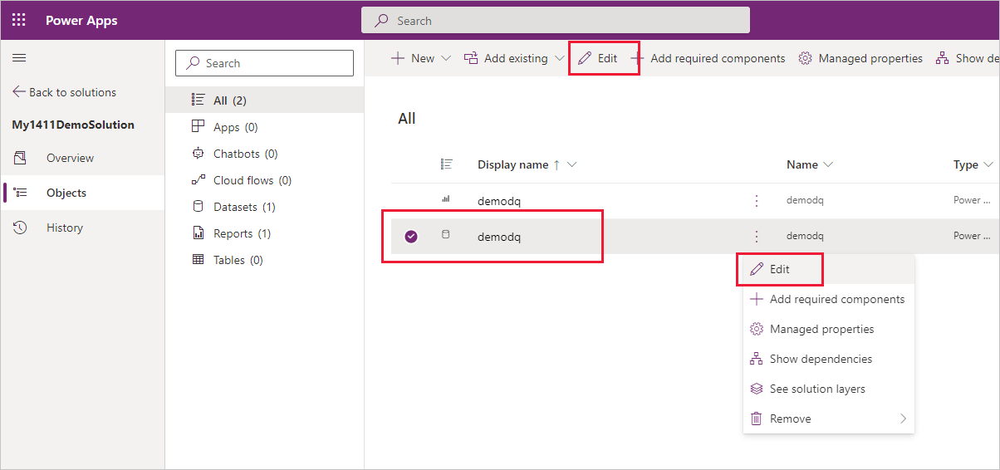
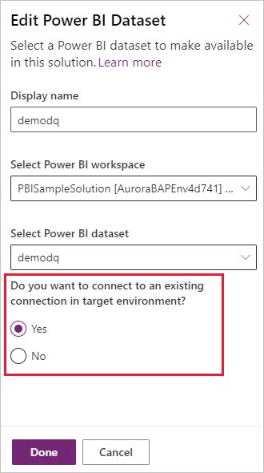
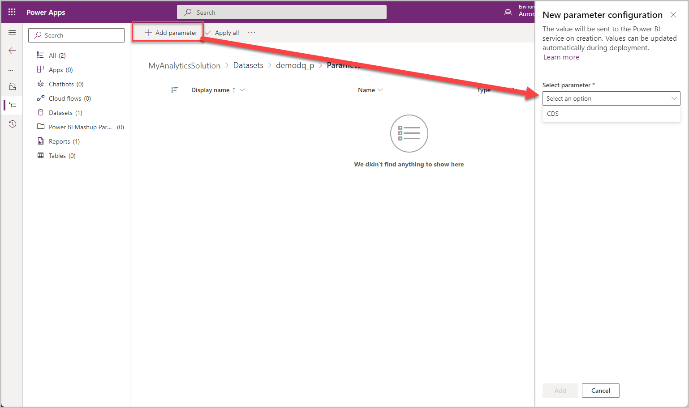
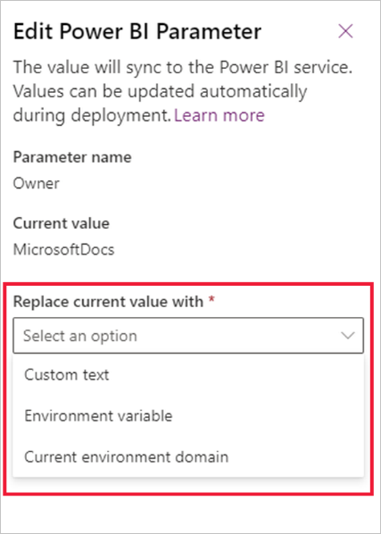

# Create Power BI report and dataset components (preview)

As data culture spreads across more and more organizations, and analytics becomes a vital part of decision making and the daily actions taken by employees, it has become critical to have reliable, up-to-date analytics readily available in your Power Apps.  

As a step towards achieving this goal, it possible to add Power BI reports and datasets as components in Power Apps solutions. Once you've added a Power BI report to a solution, it can be seamlessly managed as part of your ALM process across environments and tenants.

In this article, you'll see how to

* Add Power BI reports and dataset components to a solution.
* Configure the behavior of Power BI mashup parameters upon import and export as part of the Power Apps solution.
* Configure the dataset component so that the dataset automatically connects to a Dataverse data source when the solution is deployed to a new environment.

##  Prerequisites

* A Power BI Pro license.
* A Power BI report and/or dataset that you want to create Power Apps solution components for.

## General limitations and restrictions

* Connection references to Power BI data sources are not supported.
* Only datasets created with the enhanced dataset model are supported. Paginated reports are not supported.
* The Power BI dataset parameter types "Any" and "Binary" are not supported in the Power BI integration with Power Apps solutions.
* Sharing Power BI reports and datasets can only be done from Power BI (sharing the model driven app does not share the embedded report).
* Recovery from workspace deletion is not supported. Once the dedicated environment workspace has been deleted, you will not be able to add/import any Power BI component to the Power Apps environment.
* The **Power BI Extensions (Preview)** system solution must be installed. It is installed in new environments by default. Existing environments must install it manually from PPAC before importing solutions and creating Power BI components. For more information see [Add link to how to install D365].
* Power Apps Application IDs are not supported during public preview.
* The Power Apps environment and the Power BI workspaces all need to be in the same geography. For more information, see [Considerations working with the Power Apps/Power BI integration](/power-bi/collaborate-share/power-apps-power-bi-integration-considerations).
* Environment life cycle operations are not supported during public preview. For more information, see [Considerations working with the Power Apps/Power BI integration](/power-bi/collaborate-share/power-apps-power-bi-integration-considerations).  

## Create Power BI report and dataset components

1. Open your Power Apps solution development environment.
    > [!NOTE]
    > During public preview, your Power Apps solution development environment must be created in the geography where the Power BI tenant is located. See [Cross-geo operations](/power-bi/collaborate-share/service-powerbi-powerapps-integration#cross-geo-operations) more information. 

1. Create a new solution.

1. In the new solution, choose **Add existing > Analytics > Power BI Report**.

    

1. Click **Outside Dataverse**, find and select the Power BI report you want to add to the solution, then choose **Add**. 

    

    When you add a Power BI report component to a solution, a component for the report's dataset is added to the solution as well.  

    In addition, when you add a report from outside of Dataverse, copies of the report and its dataset are created in the Power workspace that is dedicated to the environment. **Afterwards, all updates should start from this dedicated environment workspace**.

    

    > [!NOTE]
    > The Add operation can last a few minutes while the actual reports and datasets are being exported to Dataverse.

1. If your dataset connects to a Dataverse data source, you can configure it to automatically connect to the Dataverse data source in deployment environments. 

    Select the dataset and choose **Edit**.

    

1. In the edit pane that appears, select **Yes** to configure the dataset so that it automatically connects to an existing connection when the solution is imported into another environment.

    

    > [!NOTE]
    > Steps 5 and 6 are only relevant for Dataverse data sources.

1. When done, export the solution. You can export the solution as either a managed or unmanaged solution.

## Configure Power BI parameters

Power BI components allow you to configure Power BI mashup parameters. However, you can't create Power BI mashup parameters in the solution environment – they must already be present in the Power BI dataset you add to the solution. 

> [!NOTE]
> The Power BI dataset parameter types *Any* and *Binary* are not supported in the Power BI integration with Power Apps solutions. 

In this section you'll see the options you have for configuring how a Power BI dataset parameter is going to get its value when the solution is deployed in a different environment.

1. Go to your Power Apps environment > Solutions.

1. Create a solution.

1. Select the dataset that has the parameters you want to configure, and then choose **Edit parameters**:

    

1. Choose **Add a parameter**. You can only add parameters that are already part of the Power BI dataset:

    

1. Select a Power BI mashup parameter and choose **Edit** to open the parameters edit pane. Select the **Replace current value with \*** drop down to view the parameter configuration options.

    

    You have three options for determining how the parameter is going to get its value when the solution is installed in a different environment:  

    * **Custom text**: This is the most straightforward way to set a value. When you select the custom text option, you specify a text string, and then, when the solution is deployed in another environment, that text string will be the value of the parameter. 

    * **Current environment domain**: When you choose current environment domain, the value of the parameter will be domain of the current environment. This means that wherever the solution is deployed, the value of the parameter will be the domain of the deployment environment. 

    * **Environment variable**: With this option you associate the parameter value with an environment variable. When you select this option, you will see all the environment variables in the current environment, and you can select one. If the environment variable you need doesn't exist, you can create one in the solution. 

        The environment variable option is significant because it makes it possible to require the installer to provide a value for a parameter during deployment. This is done by associating the parameter with an environment variable that has a blank value. 

        When you configure a parameter with an environment variable in order to require the installer to provide a value upon deployment, make sure that the default value is blank. If there is a current value, remove it by right-clicking and choosing **Remove from solution**. 

        See [Environment variables overview](../data-platform/environmentvariables.md) for more information about environment variables. 

1. Once you're done configuring the parameters, click **Apply all to apply all parameter values**. 
 
    

1. Once you’re applied the parameters, you can export the solution and deploy it in your deployment environments.

### See also

[Customize and manage Power BI components](../data-platform/customize-manage-powerbi-components.md)

[!INCLUDE[footer-include](../../includes/footer-banner.md)]