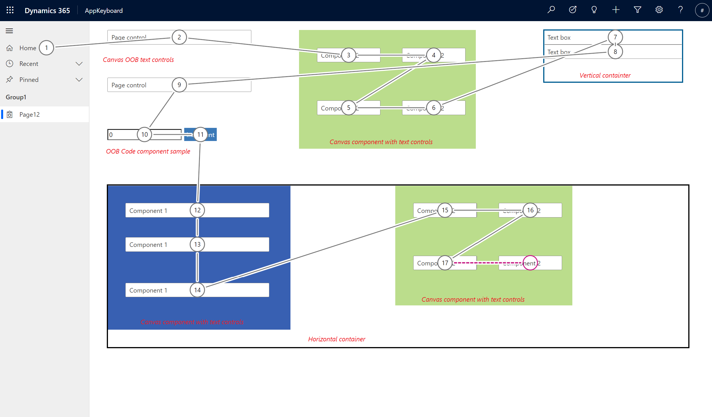

# Design a custom page for your model-driven app (preview)

[!INCLUDE [cc-beta-prerelease-disclaimer](../../includes/cc-beta-prerelease-disclaimer.md)]

This topic provides tips to design a custom page for use in a model-driven app.

  > [!IMPORTANT]
  > - This is a preview feature, and isn't available in all regions.
  > - [!INCLUDE[cc_preview_features_definition](../../includes/cc-preview-features-definition.md)]

## Supported controls in custom page
Custom page authoring will start with a subset of controls supported and will be gradually adding more controls. Interaction with controls currently not supported may change so they should not be used until they are officially supported.

  | Control | Control Type | Notes |
  | --- | --- | --- |
  |Label<sup>1</sup>|Display||
  |Text Box<sup>1</sup>|Input||
  |Date Picker<sup>1</sup>|Input|
  |Button<sup>1</sup>|Input|
  |Combo Box<sup>1</sup>|Input|
  |Check Box<sup>1</sup>|Input|
  |Toggle<sup>1</sup>|Input|
  |Radio Group<sup>1</sup>|Input|
  |Slider<sup>1</sup>|Input|
  |Rating<sup>1</sup>|Input|
  |Vertical Container|Layout|New responsive horizontal layout container|
  |Horizontal Container|Layout|New responsive horizontal layout container|
  |Rich Text Editor|Input|
  |Gallery|List|
  |Icon|Media|
  |Image|Media|
  |Edit Form|Input|
  |Display Form|Input|
  |Code components|Custom| [Add code components to a custom page](page-code-components.md)|
  |Canvas components|Custom| [Add canvas components to a custom page](page-canvas-components.md)|
  
  > [!Note]
  >  <sup>1</sup> - Controls with superscript "1"  are the new modern controls which were introduced for [canvas apps in Teams]( ../../../../2020wave1/microsoft-powerapps/build-apps-teams-modern-controls); These controls are based on [Fluent UI library](https://developer.microsoft.com/en-us/fluentui#/controls/web) wrapped with [Power Apps Component Framework](../../developer/component-framework/overview.md). 


## Custom components support for custom page
You can add both low-code( canvas components) and pro-code( code components) custom UX components to your environment and make them available for all makers. For custom page specific UX extensibility topics please see [add canvas components to a custom page for your model-driven app](/powerapps/maker/model-driven-apps/page-canvas-components) and [add code components to a custom page for your model-driven app.](/powerapps/maker/model-driven-apps/page-code-components) In general, low code extensibility approach is simpler to build, test and has lower maintainance cost. We recommend evaluating canvas components first and then using code components only if there is a need for complex and advanced customization.    

You can refer to [canvas component gallery,](https://powerusers.microsoft.com/t5/Canvas-Apps-Components-Samples/bd-p/ComponentsGallery)[ code components OOB samples](../../developer/component-framework/use-sample-components.md) and [code components community resources](../../../developer/component-framework/community-resources.md) to quick start your custom component journey. 

## Enable responsive layout with Container control

Responsive custom page layouts are defined by building a hierarchy of **Horizontal layout container** and **Vertical layout container** controls.  These controls are found under sidebar Insert > Layout.

Resize the topmost container to fill the entire space with these properties. 

  ```powerappsfl
  X=0
  Y=0
  Width=Parent.Width
  Height=Parent.Height
  ```

Learn more about at [Building responsive layout](../canvas-apps/build-responsive-apps.md "Building responsive layout").

### Vertical Container with fixed header, flexible body, fixed footer

1. On the **Vertical Container**, set **Align (horizontal)** to **Stretch**

1. Insert three **Horizontal Container** controls within the parent **Vertical Container**

1. On the first and third child horizontal container controls, set **Stretch height** off and reduce height to space needed (for example, Height=80)

### Horizontal Container with two even child containers

1. On the parent horizontal container, set **Align (vertical)** to **Stretch**

1. Insert two **Vertical Container** controls within the parent **Horizontal Container**

## Styling custom page controls to align to model-driven app controls

By creating the custom page from the modern app designer, the important properties are defaulted.  

1. Theme for custom page 
   
    Theme values for the controls used in custom page are automatically set to match the default blue theme of the unified interface. This default theme is used both in the studio and at application runtime. Explicit theme selector is removed from custom page authoring expereince. We will enhace the custom page theme integration in future releases to match the hosting model-application theming customization.

1. Controls need to use different Font size based on their position in the page hierarchy

    > [!Note]
    > custom page text has a up scaling of 1.33 so need to divide target FontSize by 1.33 to get the desired size


    | Label Type | Target FontSize | FontSize to use |
    | --- | --- | --- |
    |Page title|17|12.75|
    |Normal labels|14|10.52|
    |Small labels|12|9.02|

1. Primary and secondary button controls need the following styling changes

    Primary buttons:
    ```powerappsfl
    Color=RGBA(255, 255, 255, 1)
    Fill=RGBA(41,114,182,1)
    Height=35
    FontWeight=Normal
    ```

    Secondary buttons:
    ```powerappsfl
    Color=RGBA(41,114,182,1)
    Fill=RGBA(255, 255, 255, 1)
    BorderColor=RGBA(41,114,182,1)
    Height=35
    FontWeight=Normal
    ```
## Tab Navigation - Keyboard accessibility for custom pages

Custom page follows the same tab navigation design which is used by the hosting model app. Visually aligned  semantic HTML stucture helps users navigate the custom pages seamlessly when using a keyboard or a screen readers. Note that unlike stand alone canvas apps, custom page controls and other UX elements do not need explicit tab numbers assignments. Modern controls do not have TabIndex property and utilize the semantic HTML stucture for naviation. 

Various elements like controls, canvas and code components, containers etc can be tabbed based on their position in the custom page layout. Note that the tab navigation follows Z order navigation. Individual tab-stops inside larger grouping elements like components, containers are navigated first before the tab moves out to the next element in the DOM tree. 

Here is an example navigation with the page containing controls, code and canvas compoenents and containeres. 

  > 


  > [!NOTE]
  > Overlapping controls and elements on the custom page will not have their DOM merged so tab stops can be out of sync from visual layout. Same is true for the dynamic element positioning using formulas.  


## Related topics

[Model-driven app custom page overview](model-app-page-overview.md)

[Using PowerFx in custom page](page-powerfx-in-model-app.md)

[Building responsive layout](../canvas-apps/build-responsive-apps.md)

[Add a custom page to your model-driven app](add-page-to-model-app.md)

[Navigating to and from a custom page in your model-driven app](navigate-page-examples.md)
