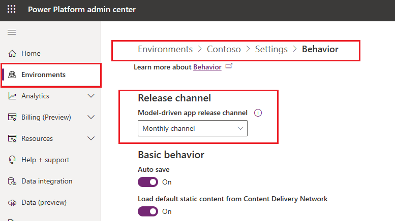
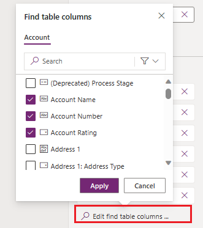

[This topic is pre-release documentation and is subject to change.]

Copilot for app users in model-driven apps is a next-generation AI assistant that provides data insights on Dataverse tables through natural language conversation. Copilot helps app users boost productivity through AI-powered insights and intuitive app navigation. More information:[Copilot for app users in model-driven apps](https://learn.microsoft.com/en-us/power-apps/maker/model-driven-apps/add-ai-copilot).

# Enable Copilot for end users in model driven apps
Makers who are Environmental Administators can enable Copilot in model-driven apps for all the users in their environments in [Power Platform admin center](https://admin.powerplatform.microsoft.com).

1. Sign in to the Power Platform admin center at https://admin.powerplatform.microsoft.com.

2. In the navigation pane, go to **Environments** and select the enviornment where you want to enable Copilot for app users in model-driven apps in. Click on "**Settinngs** for this environment in the top menu.

  > [!div class="mx-imgBorder"]
  > 
 
3. In **Settings** for the seleceted environment, navigate to **Product** section and select **Features** option.

  > [!div class="mx-imgBorder"]
  > 

4. In **Features** section, set the value for **Allow users to analyze data using an AI-powered chat experience in canvas and model-driven apps** to **On** in the dropdown control.
   
  > [!div class="mx-imgBorder"]
  > 

 
5. Go back to **Product** section and select **Behavior** option.  Set **Release channel** for model-driven apps to **Monthly channel** in the dropdown control. More information: [Behavior settings](/power-platform/admin/settings-behavior#settings) and [Changing release channels for model-driven apps](channel-change.md).
   
  > [!div class="mx-imgBorder"]
  > 
   
6. Configure Dataverse tables that you want Copilot to use for the responses. You must choose both the tables and the columns of importance for Copilot to search accross to produce relevant, high quality data inisghts. More information: [Configure tables to use Copilot](https://learn.microsoft.com/en-us/power-apps/maker/data-platform/table-settings-for-copilot).

For every Dataverse table to be used by Copilot, do these 2 Steps in Power Apps to index your tables and columns for Copilot:

* Select a Dataverse table and go to table **Properties > Advanced options** in top menu and enable **Track Changes** and **Appear in search results** settings for the table and **Save**. More information: [Enable table indexing](https://learn.microsoft.com/en-us/power-apps/maker/data-platform/table-settings-for-copilot#enable-indexing).
* Open this table and select **Views** option from **Data experiences** section and open **Quick Find [table name]** view. Select **Edit find table columns** option at the bottom of the right hand pane. Select the columns of importance and click **Apply** to add them to the list. Next, **Save and publish** your changes. More information: [Enable column indexing]([https://learn.microsoft.com/en-us/power-apps/maker/data-platform/table-settings-for-copilot#enable-indexing](https://learn.microsoft.com/en-us/power-apps/maker/data-platform/table-settings-for-copilot#configure-columns).

  > [!div class="mx-imgBorder"]
  > 

## See also

[FAQ for Copilot in model-driven apps](../common/faqs-copilot-model-driven-app.md)  
[Responsible AI FAQs for Power Apps](../common/responsible-ai-overview.md)  
[Add Copilot control to a canvas app (preview)](../canvas-apps/add-ai-copilot.md)
