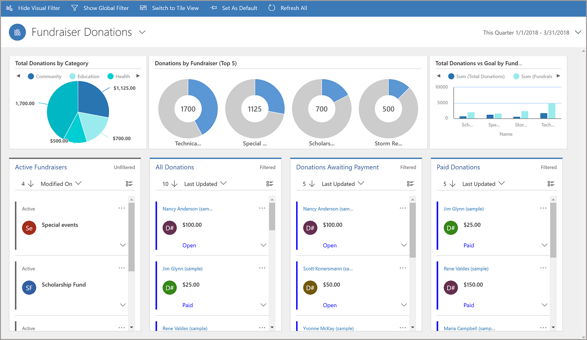
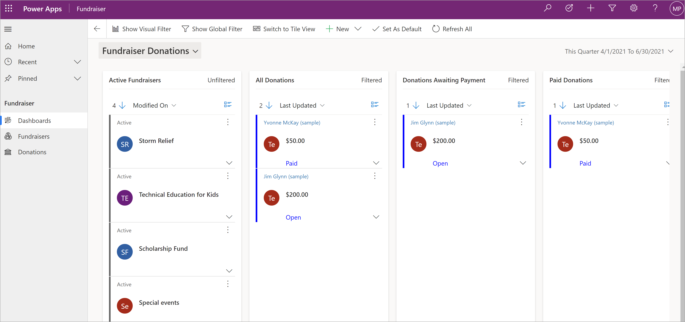

# Model-driven sample apps

In [Power Apps](https://make.powerapps.com), use a sample app to explore design possibilities and discover concepts that you can apply as you develop your own apps. Each sample app uses fictitious data to showcase a real-world scenario. 

<!-- Be sure to check out documentation specific to each sample app for more details. -->

> [!div class="mx-imgBorder"]
> 

## Get sample apps

The availability of sample apps depends on how an environment database was provisioned.

> [!IMPORTANT]
> In order to play or edit model-driven sample apps, the apps must first be provisioned in a Microsoft Dataverse database by an administrator that has the Environment Admin role.

To install the sample apps and data, create a trial environment and database, and then be sure to select **Deploy sample apps and data**.

  

This option installs the sample apps and data into your database. Sample apps are for educational and demonstration purposes. We don't recommend installing sample apps in production databases. More information: [Create an environment with a database](/power-platform/admin/create-environment#create-an-environment-with-a-database)

## Sample apps available
After you provision an environment with a database that include sample apps, the following model-driven apps are available in the environment.
- [Asset Checkout](#asset-checkout)
- [Innovation Challenge](#innovation-challenge)
- [Fundraiser](#fundraiser)

### Asset Checkout
Asset Checkout provides self-service capabilities to reserve the tools and equipment your teams need to do their jobs, while accurately calculating available inventory and much more.

#### Solution components included in this sample app

|Display name  |Name  |Component type  |
|---------|---------|---------|
|Asset Checkout   | msdyn_AssetCheckout   | Model-driven app        |
|Asset Checkout   | msdyn_AssetCheckout   | Site map        |
|Asset Checkout App Image   | msdyn_AssetCheckoutApp    | Web resource      |
|Product   | sample_product    | Table    |
|Product Icon  | sample_product_icon    | Web resource    |
|Reservation   | sample_reservation    |  Table    |
|Reservation Icon  | sample_reservation_icon     | Web resource    |
|Review   | sample_review    | Table     |
|Review Icon | sample_review_icon    |  Web resource       |
|Set Rating Category based on Rating   | Set Rating Category based on Rating     | Process    |

### Innovation Challenge

Start a companywide innovation challenge. Ideas are submitted, reviewed, voted on, and the best ideas get funded for new projects.

#### Solution components included in this app

|Display name | Name  | Component type |
|---------|---------|---------|
|Activate Challenge if Launch Challenge = Complete  | Activate Challenge if Launch Challenge = Complete    | Process    |
|Challenge Management Process  | Challenge Management Process    | Process    |
|Contact   | Contact    | Table    |
|Idea to Project Business Process  | Idea to Project Business Process   | Process   |
|Innovation Challenge  | Innovation Challenge  | Dashboard    |
|Project Start < Project End  | Project Start < Project End  | Process   |
|Challenge  | sample_challenge   | Table   |
|Challenge 32x32  | sample_Challenge32    | Web resource     |
|Challenge Management Process  | sample_challengemanagementprocess   | Table    |
|Idea  | sample_idea    | Table    |
|Idea  | sample_Idea   | Web resource    |
|Idea32   | sample_Idea32    | Web resource    |
|Innovation Challenge  | sample_InnovationHub    | Model-driven app    |
|Innovation Hub  |  sample_InnovationHub    | Web resource    |
|Innovation Hub   | sample_InnovationHub    | Site map   |
|Team Project     | sample_teamproject        | Table       |
|Team Project     | sample_TeamProject        | Web resource        |
|Team Project 32     | sample_TeamProject32   | Web resource     |
|Set Status Reason = Closed     | Set Status Reason = Closed    | Process    |
|User  | systemuser    | Table     |

### Fundraiser

Fundraiser provides employees the opportunity to donate time and money towards causes they're passionate about. Start a fundraiser for your favorite cause, set goals, and track performance towards goals.

#### Solution components included in this app

|Display name | Name  | Component type  |
|---------|---------|---------|
|Fundraiser Donations   | Fundraiser Donations    |  Interactive Dashboard       |
|Donation     |  sample_donation     | Table     |
|Donation Icon    |  sample_DonationIcon       | Web resource     |
|Donations Icon    | sample_DonationsIcon        | Web resource     |
|Fundraiser     |  sample_fundraiser       | Table        |
|Fundraiser     |  sample_Fundraiser       | Site map     |
|Fundraiser     |  sample_Fundraiser       | Model-driven app     |
|Fundraiser App Icon     |  sample_FundraiserApp       | Web resource     |
|Fundraiser Icon   | sample_FundraiserIcon        | Web resource    |

## Customize a sample app

1. Sign in to [powerapps.com](https://powerapps.com)  

2. Select **+ Create** from the left navigation pane, select the sample app, and then select **Create**.

> [!div class="mx-imgBorder"]
> 

3. The App designer will open providing multiple options for customizing the app.

4. For additional customization options, select **Advanced** from the left navigation pane.

## Remove sample apps and data

- Deleting a sample app requires deleting the corresponding  [managed solution](/dynamics365/customer-engagement/developer/uninstall-delete-solution).
- Deleting the solution also deletes any sample data specific to the custom tables for the app.
- If customizations were made to the sample app, there may be [dependencies](/dynamics365/customer-engagement/developer/dependency-tracking-solution-components), which must be removed before deleting the solution.

## Delete a solution

To delete a solution, follow the steps in this topic: [Delete a model-driven app](delete-model-driven-app.md#delete-a-model-driven-app-that-was-installed-as-part-of-a-managed-solution)

## Install or uninstall Sample Data

To remove sample data, follow the steps in this topic: [Add or remove sample data](/power-platform/admin/add-remove-sample-data)

## Next Steps

[Learn about the model-driven app design tools](model-driven-designers.md)

[Building a simple model-driven app](build-first-model-driven-app.md) is a great way to start.  You may wish to [Create a solution](../../maker/data-platform/create-solution.md) before you do so.

If you are new to Power Apps, and want to learn about how to convert your ideas into a fully working solution using Power Apps, start with [Planning a Power Apps project](../../guidance/planning/introduction.md).

[Understand model-driven app components](model-driven-app-components.md) will help you to understand some of the elements that make up a model-driven app.

[!INCLUDE[footer-include](../../includes/footer-banner.md)]
