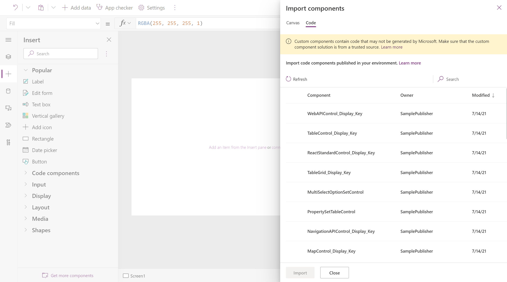
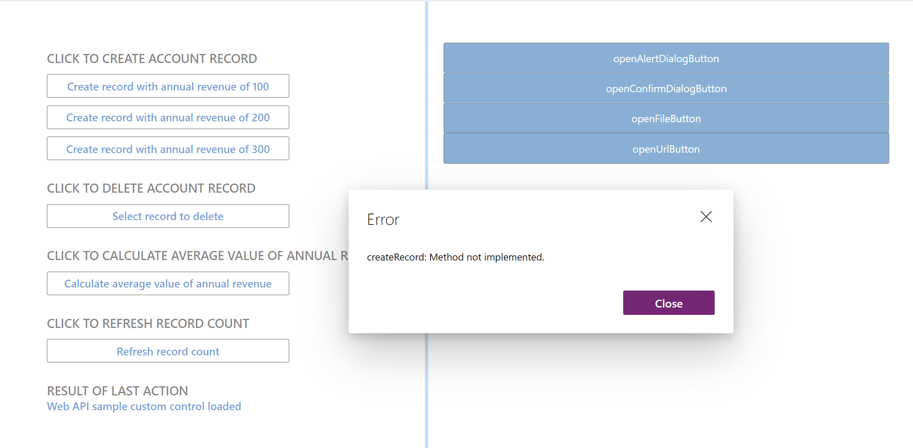
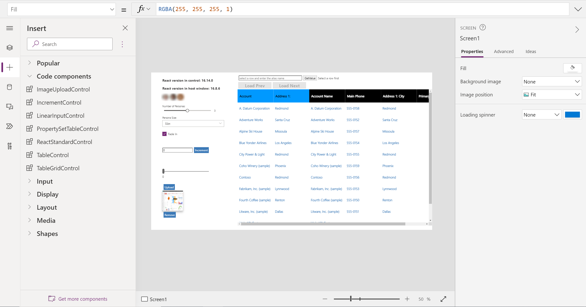

# Add code components to a custom page for your model-driven app (preview)

[!INCLUDE [cc-beta-prerelease-disclaimer](../../includes/cc-beta-prerelease-disclaimer.md)]

This article outlines the use of code components, which are built by professional developers using Power Apps component framework within a custom page. For low-code custom UX extensibility, see [add canvas components to a custom page for your model-driven app.](/powerapps/maker/model-driven-apps/page-canvas-components) 

  > [!IMPORTANT]
  > - This is a preview feature, and may not be available in all regions.
  > - [!INCLUDE[cc_preview_features_definition](../../includes/cc-preview-features-definition.md)]

  > [!NOTE]
  > Custom pages support all component framework APIs that are currently supported with canvas apps. Additionally certain model-driven app only APIs like Web API and navigation have published app support for custom pages. These APIs can be used in the code component for use with custom pages and function on the final published app. For individual API support status on each platform, see: [Power Apps component framework API reference](/powerapps/developer/component-framework/reference/)

Code components provides professional developers the ability to create custom code components for use within an app. This pro-code extensibility mechanism provides a first-class application lifecyle management (ALM) supported way to seamlessly extend the control-set available to all makers across the organization. These components can not only then be reused across custom pages, canvas and model-driven apps but also can be centrally updated, packaged, and moved using standard Microsoft Dataverse solutions. More information: [Power Apps component framework overview](/powerapps/developer/component-framework/overview) 

## Enabling support for Power Apps component framework for custom pages

In order to use code components inside a custom page, the Power Apps component framework feature, which is off by default for canvas apps, must be enabled. More information: [Enable the Power Apps component framework feature](/powerapps/developer/component-framework/component-framework-for-canvas-apps#enable-the-power-apps-component-framework-feature) 

## Create code components for use in a custom page

This section describes how to create, import, and test code components.

### Creating and importing code components in Dataverse

Code components for custom pages follow the same pattern as they do with canvas app pages. Code components are a code first approach. Therefore, they need to be implemented before they can be added to a custom page. To create a code component, see [Create your first component](/powerapps/developer/component-framework/implementing-controls-using-typescript).

You can also [try OOB sample components](/powerapps/developer/component-framework/use-sample-components#try-the-sample-components) to jump start. Once the code component is coded, it can be packaged into a solution and added to Dataverse, which makes it available for use in all custom pages inline with model-driven and canvas apps. You can find more details on this process at [Code components application lifecycle management (ALM)](/powerapps/developer/component-framework/code-components-alm).

### Importing and using code component in the custom page

In an environment, custom pages can use all the code components that were previously imported into Dataverse using solutions. Select **Get more components** at the bottom of the add control left navigation area. You will see a code tab on the **Import components** pane showing all code components present in the environment.

  > [!NOTE]
  > If the code tab doesn't show up in the **Import component** pane, verify that the Power Apps component framework feature setting for canvas apps is enabled. More information: [Enable Power Apps component framework feature](../../developer/component-framework/component-framework-for-canvas-apps.md#enable-power-apps-component-framework-feature) 
  > 
  > Also ensure that you are working on the latest canvas app studio authoring version. 

The newly added code component is now available under the **Code components** section and can be added to a custom page.

### Testing the code component inside studio and published app

Like canvas apps, code components are interactive and can be tested in the custom page studio authoring environment. However, certain APIs like Web APIs and `Navigation`, which only have the custom page runtime support when invoked, will show the error message "Method not implemented."

You can dismiss this error and publish the custom page. Then, add this custom page to the model-driven app and publish the app to see the custom page web API in action.

The image below shows the standard [Web API sample control](/powerapps/developer/component-framework/sample-controls/webapi-control) and [Navigation API control](/powerapps/developer/component-framework/sample-controls/navigation-api-control) added to custom page working inside a published model-driven app.

### Additional code component resources

You can also use other [sample components](/powerapps/developer/component-framework/use-sample-components#try-the-sample-components) from Microsoft.

Or try some from the [Power Apps community gallery](/powerapps/developer/component-framework/community-resources).

 

### See also

[Model-driven app custom page overview](model-app-page-overview.md)

[Add a custom page to your model-driven app](add-page-to-model-app.md)

[Using PowerFx in custom page](page-powerfx-in-model-app.md)

[Overview of Power Apps connectors](../canvas-apps/connections-list.md)

[Add data connection in canvas designer](../canvas-apps/add-data-connection.md)
