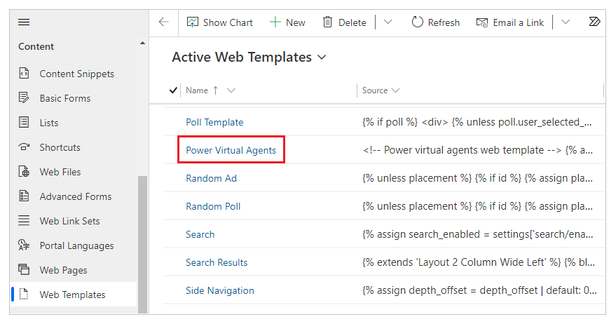

# Add chatbot to a page (Preview)

[This article is pre-release documentation and is subject to change.]

Power Apps portals allows you to add a [Power Virtual Agents chatbot](https://docs.microsoft.com/power-virtual-agents/fundamentals-what-is-power-virtual-agents) to answer questions posted by a visitor on your portal page. A chatbot (bot) configured with different topics, and trigger phrases, can automatically respond to questions posted by a visitor in a chat conversation.

> [!IMPORTANT]
> - This is a preview feature.
> - [!INCLUDE[cc_preview_features_definition](../../includes/cc-preview-features-definition.md)]

## Prerequisites

Before you add a Power Virtual Agents bot to a Power Apps portals page, you must create a bot first. If you don't have any available bots, you'll have the option in portals to go to Power Virtual Agents to create a bot. To learn about how to create a bot, go to [Create and delete Power Virtual Agents bots](https://docs.microsoft.com/power-virtual-agents/authoring-first-bot).

> [!IMPORTANT]
> This feature requires starter portal package version [9.2.2103.x](versions/package-version-9.2.2103.md) or later. For more information, see [upgrade considerations](#upgrade-considerations).

## Add chatbot component

To add a chatbot component to portal page:

1. Go to [Power Apps](https://make.powerapps.com).

1. Select **Apps** from the left pane.

1. Select your portal.

1. Select **Edit** to open the portals Studio.

1. Select **Components** from the left pane.

1. Select **Chatbot** component.

    

1. Select your bot.

    

    > [!NOTE]
    > If you don't have a bot already created, or want to create a new bot to use in portals, select **Power Virtual Agents**. After you create bot, select **Sync configuration** inside portals Studio to reflect the bot changes.

1. Select whether the bot appears on all pages in your portal, or the selected pages.

1. If you select **Specific pages**, use **Manage bots in pages** to control pages that can use this bot.

You can add more bots from your environment across different pages in a portal. For example, a bot that answers questions related to workplace such as "Back to work" can be added to HR page. Or, a bot that answers to basic queries for payroll, such as "Payroll questions" can be added to Finance page. However, you can't have one page use more than one bot.

## Advanced configuration

Chatbot component is rendered using a web template called **Power Virtual Agents**.

You can change the values for the following parameters inside the "window.PvaEmbeddedWebChat.renderWebChat()" function.

| Parameter | Value |
| - | - |
| width | Uses variable "chatWidth". To change width, update the width in pixel:   `let chatWidth = "320px";` |
| height | Uses variable "chatHeight". To change height, update the height in pixel:   `let chatHeight =  "480px";` |
| headerText | Title of the bot. By default, uses the bot's name. To change, add "headerText" parameter with the bot header value:   `"headerText": 'Contoso chatbot';` | 
| webChatHeaderStyleOptions | Determines header style for the chatbot component, such as the color of font, and background. To change, update "webChatHeaderStyleOptions" parameter with the values for "fontColor", and "backgroundColor" properties:   `"webChatHeaderStyleOptions": {"fontColor":'black',"backgroundColor":'white',}`

After changing the web template, ensure you select **Sync configuration** to update the configuration in open Studio session and reflect the changes.

> [!NOTE]
> Any changes to the Power Virtual Agents web template other than the parameters explained above are not supported.

## Upgrade considerations

If your portal template isn't upgraded to add support for chatbot component, you'll see following message when you try to add the component.

"Portal upgrade required"  
"An upgrade is required to use this feature on your portal. If you upgrade the portal, ensure you Sync Configuration to refresh your current portals Studio session with new portals package."

When this message appears, upgrade your portal package. More information: [Update portals solution](admin/update-portal-solution.md)

> [!NOTE]
> Upgrading starter portal package will enable any additional portals in your environment with the capability to use chatbot component. More information: [Starter portal package updates](release-updates.md#starter-portal-package-updates)

### See also

- [Add the bot to your live website](https://docs.microsoft.com/power-virtual-agents/publication-connect-bot-to-web-channels)
