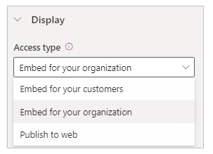
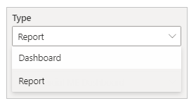
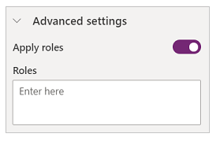
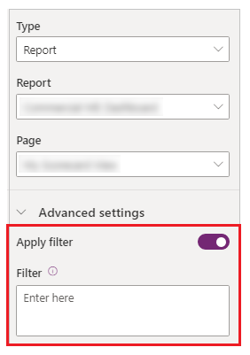
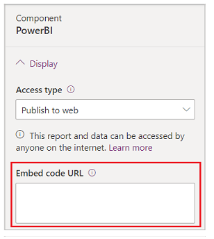
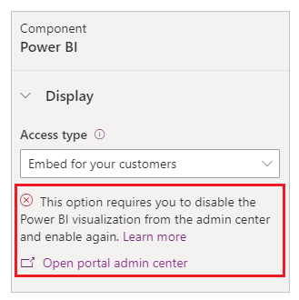

# Add Power BI

[!INCLUDE [cc-portals-studio-deprecation](../../includes/cc-portals-studio-deprecation.md)]

You can add a Power BI component on a page to display Power BI dashboards and reports on your portal.

Before you begin, read [Power BI access type considerations](#power-bi-access-type-considerations) and [general Power BI considerations](#general-power-bi-considerations) to get familiar with important Power BI terms and considerations for Power Apps portals.

To add a Power BI component to a webpage:

1. [Edit the
    portal](../portals/manage-existing-portals.md#edit).

1. Select the page you want to add the component to.

1. Select an editable element on the canvas.

1. Select **Components** from the left side of the screen.

1. From the Portal components section, select **Power BI**. The Power BI placeholder is added to the canvas.

1. In the properties pane on the right side of the screen, enter the following information:

    1. **Access type**: From the drop-down, select the appropriate option for your business requirements.

        

        1. **Embed for your customers** - Allows you to securely share the Power BI dashboards or reports to external users without a Power BI license or Azure Active Directory authentication setup. This option uses Power BI Embedded services to integrate Power BI dashboards or reports into your portal.
            > [!NOTE]
            > Ensure [Power BI Embedded service is enabled](../portals/admin/set-up-power-bi-integration.md#enable-power-bi-embedded-service) and respective Power BI workspaces are selected and shared with the maker or the logged-in user.

        1. **Embed for your organization** - Allows you to securely share the Power BI dashboards or reports with Azure Active Directory authenticated users.

            > [!NOTE]
            > Ensure you've shared Power BI workspaces with the maker and target portal users.

        1. **Publish to web** - Allows you to share Power BI dashboards or reports to anyone on the internet.

        For more information about access types, go to [Power BI access type considerations](#power-bi-access-type-considerations).

    1. **Workspace**: Select the Power BI workspace from the list.

    1. **Select type**: Select type as *Dashboard* or *Report* from the list.

        

        - **Dashboard** - Allows you to choose a **Dashboard**, and then a **Tile** from the selected dashboard to display on the webpage.
        - **Report** - Allows you to select a **Report**, and then a **Page** from the report to display on the webpage.

    1. **Apply roles**: If you have defined roles in Power BI and assigned them to reports, you must enter the appropriate roles in this field.

        
    
        - You can enter multiple roles separated by a comma (for example, `role_1,role_2`). For more information on defining roles in Power BI, go to [Row-level security (RLS) with Power BI](/power-bi/service-admin-rls).  
        - This option is only available for the access type **Embed for your customers**.

    1. **Apply filter**: Allows the user to load the report with pre-filtered values. The user can provide a filter condition in the field. 
        
        

        - The filter parameter must be without the `?filter=''` prefix. For example, `Table/Field eq 'value'`.
          For more information, go to [filter parameter details](/power-bi/service-url-filters).
        - This option is only available for **Reports** with access types **Embed for your customers** and **Embed for your organization**.

    1. **Embed code URL**: Enter the embed code URL.
    
        

        - To learn how to create and manage embed codes, go to [Publish to web from Power BI](/power-bi/service-publish-to-web)
        - This option is only available for the access type **Publish to web**.

### Power BI access type considerations

The following list explains Power BI access types in brief and lists access type considerations for Power Apps portals. For more information about Power BI access types, go to [The difference between Power BI service and Power BI Embedded](/power-bi/developer/embedded/embedded-faq#how-is-power-bi-embedded-different-from-power-bi-the-service).

- **Embed for your customers**:
    - Shows the list of workspaces shared to a user currently logged in and enabled for [Power BI Embedded service](../portals/admin/set-up-power-bi-integration.md#enable-power-bi-embedded-service).
    - Uses Power BI Embedded service.
    - If you've used Power BI Embedded service with Power Apps portals before, you'll see the following error when you select **Embed for your customers**:

        
    
        When this message appears, ensure you [disable](../portals/admin/set-up-power-bi-integration.md#disable-power-bi-visualization) and then [enable](../portals/admin/set-up-power-bi-integration.md#enable-power-bi-visualization) Power BI visualization again.
    - If you add Power BI with **Embed for your customers** on a portal page that's available **anonymously**, anyone can view the dashboard. To secure this page, read [webpage access control in Power Apps portals](../portals/configure/webpage-access-control.md).

- **Embed for your organization**:

    - Shows the list of workspaces shared with a logged-in user.
    - Uses Azure Active Directory authentication.

- **Publish to web**: Anyone on the internet can view your published report or visual. This option requires no authentication and includes viewing detail-level data that your reports aggregate. Before publishing a report, make sure you can share the data and visualizations publicly. Don't publish confidential or sensitive information. Refer to your organization's policies before publishing.

### General Power BI considerations

- [Portals Studio](../portals/portal-designer-anatomy.md) performance can degrade while working with Power BI workspaces because of the following reasons:
    - A high number of workspaces shared with a logged-in user.
    - Power BI workspaces are shared with many users.
- [The capture Liquid variable](../portals/liquid/portals-entity-tags.md#powerbi) isn't supported in portals Studio while working with a Power BI component.
- If you [reset a portal](../portals/admin/reset-portal.md) and provision a new portal, you must add the portal application ID of the new portal to the **Portal Power BI Embedded service** Azure AD security group. For more information, go to [Set up Power BI integration](../portals/admin/set-up-power-bi-integration.md#create-security-group-and-add-to-power-bi-account).
- If you make a change in the Power Apps portals admin center, you must reload the portals Studio if you already have it open.
- Adding users to Power BI dashboards and reports may take a while to reflect in the portals Studio.
- Power BI dashboards and reports connected to a shared dataset present on a different workspace aren't supported.
- Paginated Power BI reports aren't supported.
- If you're using Power BI **Embed for your customers** access type to provide reports and dashboards for your customers, refer to the [powerbi-client JavaScript library](/admin/add-powerbi-report.md#how-to-use-powerbi-client-javascript-library-in-portals) for advanced customizations. 
- If you're using the Power BI **Embed for your organization** access type and want to hide the filter pane, refer to [hide filter pane in reading mode](/power-bi/create-reports/power-bi-report-filter?tabs=powerbi-desktop#hide-the-filters-pane-in-reading-mode) in the Power BI documentation.  

### Power BI performance and optimization considerations

Embedding multiple Power BI workspaces may need extra considerations. Refer to the following resources for Power BI Embedded troubleshooting, optimization, and best practices:

- [Troubleshooting Power BI Embedded application content rendering](/power-bi/developer/embedded/embedded-troubleshoot#content-rendering)
- [Power BI Embedded performance best practices](/power-bi/developer/embedded/embedded-performance-best-practices)
- [Power BI optimization guide](/power-bi/guidance/power-bi-optimization)

### See also

[Set up Power BI integration](admin/set-up-power-bi-integration.md)  
[Add a Power BI report or dashboard to a web page in portal](admin/add-powerbi-report.md)  
[Power Apps portals Studio](portal-designer-anatomy.md)  
[Create and manage webpages](create-manage-webpages.md)  
[WYSIWYG editor](compose-page.md)

[!INCLUDE[footer-include](../../includes/footer-banner.md)]
