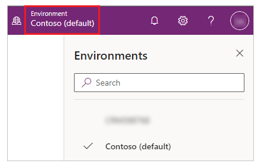
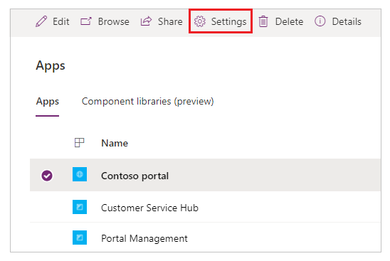
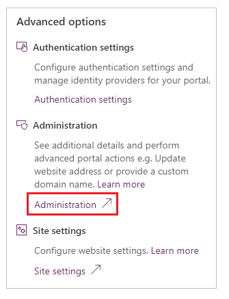
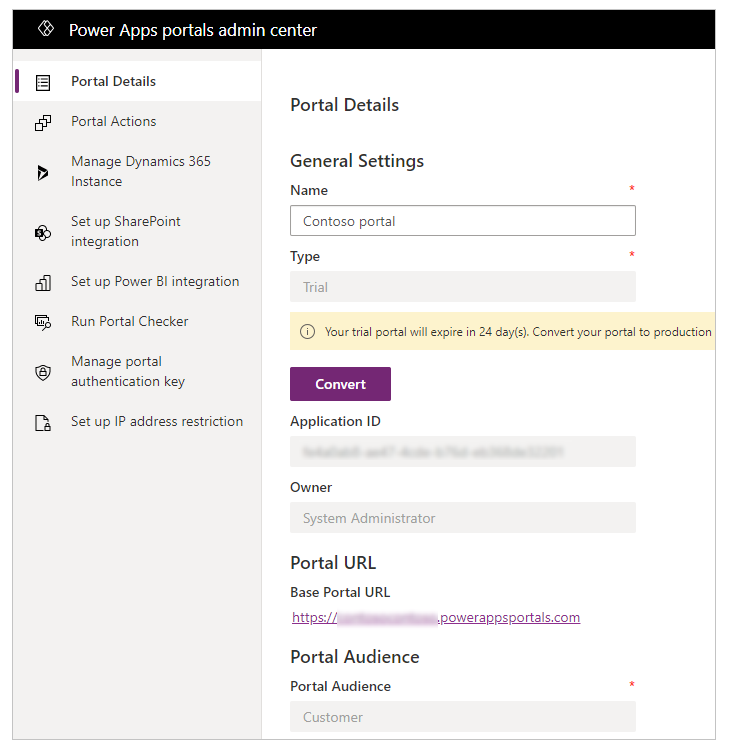
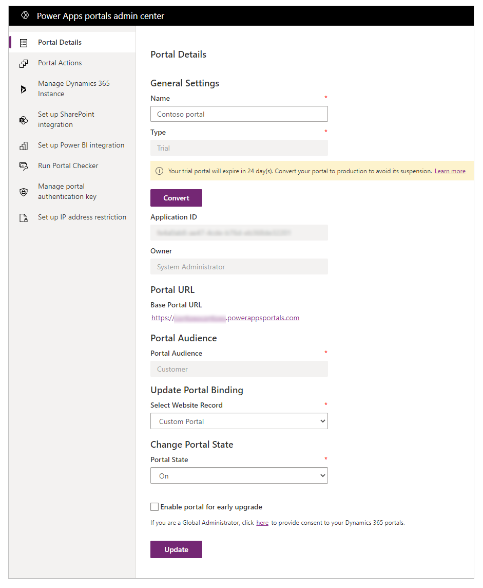

# Power Apps portals admin center

> [!NOTE]
> Based on the [terminology changes in Dataverse](https://go.microsoft.com/fwlink/?linkid=2147247), customer feedback, and data from user research, effective March 2021, we're updating some terminology in Power Apps portals to be more intuitive and make its usage more productive. More information: [Terminology changes in Power Apps portals](../terminology-changes.md)    
> We're in the process of rolling them out across Microsoft Power Platform. Power Apps portals articles will be updated soon to reflect the latest terminology.

The Power Apps portals admin center allows you perform advanced administrative actions on portals. The admin center is available when a portal is provisioned successfully.

## Open Power Apps portals admin center

1. Sign in to [Power Apps](https://make.powerapps.com). 

1. From the right-upper corner, select the **Environment** drop-down to verify, or choose the environment for your portal.

    

1. From the left pane, select **Apps**.

1. Select your portal from the list of apps.

1. Select **Settings**.

    

1. In the **Portal settings** pane, select **Administration**.

    

Power Apps portals admin center is now open.

## Add yourself as an owner of the Azure AD application

If you are not a global administrator and you try to manage a portal that has already been provisioned, or you resubmit the provisioning if it failed, you must be the owner of the Azure Active Directory (Azure AD) application connected to your portal.

1. Go to the Power Apps portals admin center and open the **Portal Details** tab.

2. Copy the value from the **Application ID** field.

    > [!div class=mx-imgBorder]
    > 

3. Go to Azure AD associated with your tenant. [!include] [Take over an unmanaged directory as administrator in Azure Active Directory](https://docs.microsoft.com/azure/active-directory/active-directory-manage-o365-subscription)

4. In Azure AD, search for the app registration by using the application ID you copied. You might need to switch from **My apps** to **All apps**.

5. Add users or groups as owners of this app registration. [!include] [Managing access to apps](https://docs.microsoft.com/azure/active-directory/active-directory-managing-access-to-apps)

    > [!Note]
    > This task can be performed either by a global administrator of your organization or the existing owner of this application.

6. After you've added yourself as an owner, reopen the Power Apps portals admin center page.

### See also

- [Microsoft Learn: Administer Power Apps portals](https://docs.microsoft.com/learn/paths/administer-portals/)
- [Microsoft Learn: Power Apps portals architecture](https://docs.microsoft.com/learn/modules/portals-architecture)

[!INCLUDE[footer-include](../../../includes/footer-banner.md)]